# 23.1 估计波动率

定义σn为第$`n^-1`$天末所估计的市场变量在第n天的波动率，第n天波动率的平方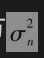为方差率(variance rate)。在第15.4节中，我们曾描述了如何从历史数据估计σn的标准处理方法。假定市场变量在i天末的值为Si，变量ui定义为在第i天（第i-1天末至第i天末）连续复利收益率

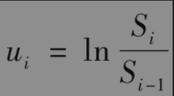

利用ui在最近m天的观察数据，日方差率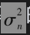的无偏估计为

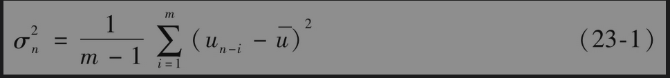

其中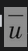为这些ui的平均值

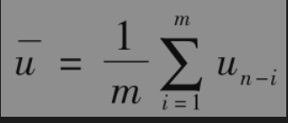

为了监视日方差率的变化，式(23-1)中的公式通常会有一些变动：

(1)ui定义为市场变量值在第i-1天末到第i天末的百分比变化

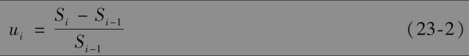

(2)假设为0。

(3)用m代替m-1。

以上三个变化对计算结果影响不大，但这些变化会使方差公式简化成

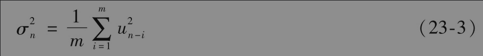

其中$`u_i`$由式(23-2)给出。

选择权重的方式在式(23-3)中，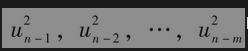中的所有项都有相同的权重。我们的目标是估计当前波动率σn的水平，因此将较大的权重用在最近的数据更有意义。这样模型的一种形式为

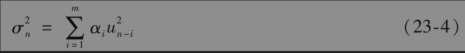

变量αi为之前i天观察值所对应的权重（这些α都取正值）。当选择这些变量时，如果对i＞j选择αi＜αj，也就是对于较旧的数据我们设定较小的权重。权重之和必须为1，即

对于式(23-4)可以做以下推广。假定存在某一长期平均方差，并且应当给予该方差一定权重，这将导致以下形式的模型

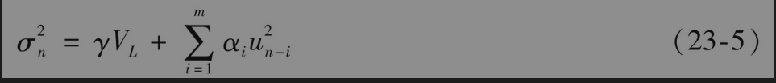

其中$`V_L`$为长期方差率，γ为$`V_L`$所对应的权重。因为权重之和仍为1，我们有

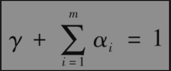

这一模型就是最先由Engle提出的ARCH(m)模型。方差的估计值是基于长期平均方差以及m个观察值，观察数据越陈旧所对应的权重就越小。令ω=γVL，我们可以将式(23-5)写为

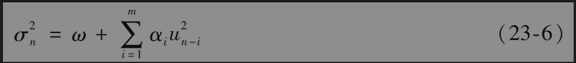

在接下的两节中，我们将讨论两种观察波动率的重要方法，这两种方法均采用了式(23-4)及式(23-5)中的想法。