# 23.2 指数加权移动平均模型

指数加权移动平均模型(EWMA)是式(23-4)的一个特殊形式，其中权重αi随着时间以指数速度递减。具体地讲，在这里$`α_i+1=λα_i`$，其中λ是介于0于1之间的常数。

在以上假设下可以发现更新波动率公式具有非常简单的形式

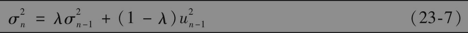

变量在第n天的波动率估计值（在第n-1天末估计）σn由第n-1天的波动率估计值σn-1（在第n-2天末估计）和变量在最近一天内变化的百分比un-1决定。

为了说明式(23-7)中的权重以指数速度下降，我们将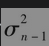代入公式之中

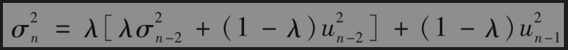

即

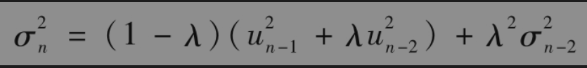

代入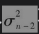项，我们进一步得出

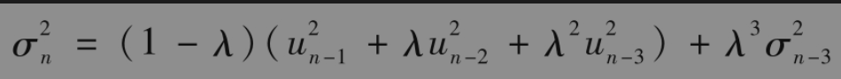

依此类推，我们得出

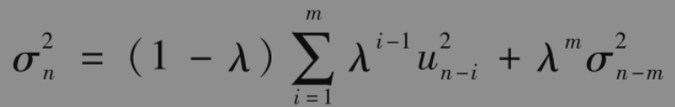

当m很大时，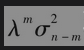项小到可以忽略，所以当αi=(1-λ)λi-1时，式(23-7)与式(23-4)相同。对应于ui的权重以λ的速度随时间推移而递减，每一项的权重是前一项权重与λ的乘积。

【例23-1】 假如λ为0.90，市场变量的波动率在第n-1天的估计值为每天1%。在第n-1天，市场变量增长了2%，这意味着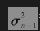=$`0.01^2`$=0.0001以及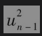=$`0.02^2`$=0.0004 ，由式(23-7)我们得出

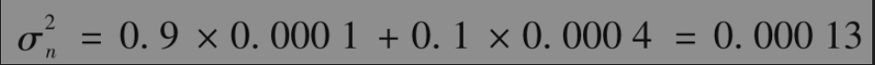

因此，第n天波动率σn的估计为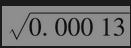，即每天1.14%。注意，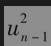的期望值为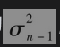，也就是0.0001。在本例中，变量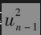的实际值比期望值要大，因此我们对波动率的估计也会增加。当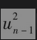的实际数值小于期望值时，我们对波动率的估计值将会减小。

EWMA模型的优点是这一方法仅需要存储相对较少的数据。在任何时刻，我们只需要记忆对当前波动率的估计值以及市场变量的最新观察值。当得到市场变量的最新观察值后，我们可以计算当天价格变化的百分比，然后利用式(23-7)更新对方差的估计。旧的方差估计值与旧的市场变量值可以被丢掉。

EWMA模型的目的是对波动率变化进行跟踪监测。假定市场变量在n-1天有一个较大的变化，即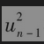很大，由式(23-7)可以看出，这时对当前变化率的估计将会增加。数值λ决定了日波动率估计对于最新市场变量百分比变化的反应。在计算$`σ^n`$时，较低的λ将会给较大的权重，这时每天所估计的日波动率本身的变化也会很大。较大的λ（接近于1.0）将会使日波动率的估计对市场变量每天百分比变化所提供的信息有较慢的反应。

最初由J.P.摩根建立并于1994年公开的RiskMetrics数据库中采用了λ=0.94的EWMA模型更新对日波动率的估计。摩根大通发现对应于许多市场变量，这样选定的λ所对应的方差预测与方差最接近，这里的实际方差是在随后25天内所观察的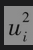数值的等权平均值（见练习题23.19）。