# 23.3 GARCH(1，1)模型

我们现在讨论由Bollerslev在1986年提出的GARCH(1，1)模型。GARCH(1，1)模型和EWMA模型之间的区别与式(23-4)和式(23-5)之间的区别类似。在GARCH(1，1)中，是由长期平均方差VL、$`u_n-1`$和$`σ_n-1`$计算得出的。GARCH(1，1)表达式为

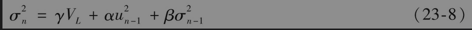

其中γ为对应于VL的权重，α为对应于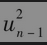的权重，β为对应于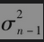的权重。

因为权重之和为1，我们有

                   γ+α+β=1EWMA

模型是GARCH(1，1)模型对应于γ=0,α=1-λ及β=λ的特例。

GARCH(1，1)模型的(1，1)表示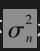是由最新的$`u^2`$观察值和最新的方差率估计而得出的。在更广义的GARCH(p,q)模型中，是由最新的p个$`u^2`$观察值和最新的q个方差率估计而得出的。GARCH(1，1)是迄今最流行的GARCH模型。

令$`ω=γV_L`$，我们也可以将GARCH(1，1)模型写成

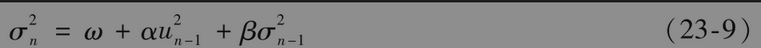

在估计模型的参数时，通常会采用这种形式。一旦估计出ω、α和β后，我们可由$`γ=1_α-β`$计算γ，而长期方差$`V_L=ω/γ`$。为了保证GARCH(1，1)模型的稳定，我们需要α+β＜1，否则对应于长期方差的权重会为负值。

【例23-2】 假设一个通过日观测数据估计出的GARCH(1，1)模型为

这对应于α=0.13，β=0.86和ω=0.000002。这时γ=1-α-β=0.01。由ω=γVL，我们得出VL=0.0002。换句话讲，由模型隐含的长期日方差平均值为0.0002，对应的波动率为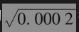=0.014，即每天1.4%。

假设对于第n-1天的日波动率估计为1.6%，因此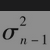=$`0.016^2`$=0.000256，又假设在第n-1天内市场变量降低了1%，即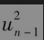=$`0.01^2`$=0.0001，因此

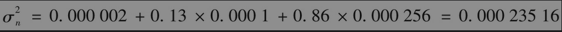

对于波动率的最新估计为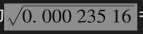=0.0153，即每天1.53%。

## 23.3.1 权重

将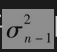的表达式代入式(23-9)中，我们可得

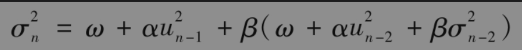

即

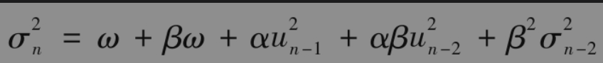

代入的表达式

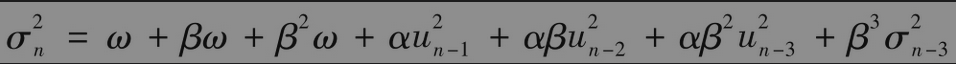

以这种形式继续下去，我们可以看到对应于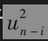的权重为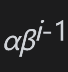。权重以β指数速度下降：参数β可解释为衰减率(decay rate)，这与EWMA模型中的λ系数近似。在决定最新方差时，此系数决定了u观察值的相对重要性。例如，β=0.9说明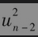的重要性只是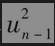的90%；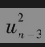的重要性只是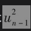的81%，等等。GARCH(1，1)模型与EWMA模型类似，其不同之处是除了对过去的u2权重按指数下降外，GARCH(1，1)模型对于长期平均波动率赋予了一定的权重。

## 23.3.2 均值回归

随着时间的变化，GARCH(1，1)模型中的方差率会被拉回到其长期平均水平VL。对应于VL的权重为γ=1-α-β。GARCH(1，1)模型与以下关于V的随机过程等价

$`dV=a(V_L-V)dt+ξVdz`$

其中时间是以天数为计量，a=1-α-β，以及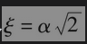（见练习题23.14）。以上模型具有均值回归的特性：方差以a的速度被拉回到VL。当V＞VL时，方差的漂移项为负；当V＜$`V_L`$时，方差的漂移项为正。模型在漂移项上附加了波动率ξ。第27章进一步讨论了这种模型。
