# 23.5 极大似然估计法

我们现在讨论如何由历史数据估计以上所讨论模型中的参数。这里将要讨论的是极大似然估计法(maximum likelihood method)。在参数估计过程中，这一方法会涉及选择使数据发生的概率达到最大的参数。

我们用一个很简单的例子说明这种方法。在某一天我们随机地抽取10个股票的价格，发现其中一个股票价格在这一天下跌了，而其他9个股票的价格没有变化或有所上涨。这时，对随机选取的一个股票，其价格在今天下跌的概率的最好估计是什么？很自然的答案是0.1。让我们看一下这一结果是否就是极大似然估计所给出的结果。

将股票价格下降的概率计为p，对应只有一种股票价格下降，而其他股票价格不下降的概率为$`p(1-p)^9`$。应用极大似然估计方法，最好的估计值p会使得$`p(1-p)^9`$取得最大值。将以上表达式对p求导，并令导数为0，我们得出p=0.1时会使得表达式取得最大值，这说明极大似然估计值为0.1，正是所期望的结果。

## 23.5.1 估计常数方差

在下一个有关极大似然方法的例子中，我们考虑如何由服从正态分布并且期望值为0的变量X的m个观察值估计这一变量的方差。我们假定观察值为u1，u2,…,um，将方差记为v，将观察值出现在X=ui的概率定义成X的概率密度函数在ui的取值，即

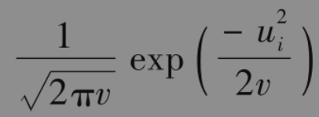

m个观察值按$`u_1，u_2,…,u_m`$顺序出现的概率为

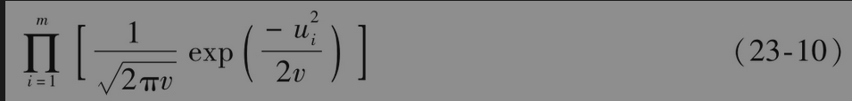

应用最大似然方法，v的最好估计是使得以上表达式达到最大值。

以上表达式的最大化与其对应的对数最大化等价，对式(23-10)取对数并且忽略常数项后可以得出我们想最大化的目标函数

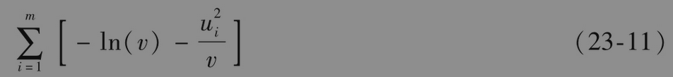

或

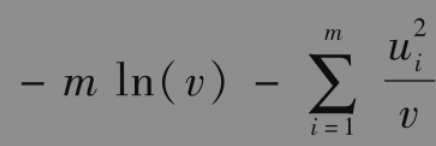

将以上表达式对v求导，并令导数为0，我们可以得到v的极大似然估计

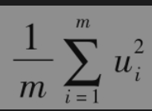

## 23.5.2 估计EWMA或GARCH(1，1)模型中的参数

我们现在考虑如何用极大似然方法估计EWMA模型，GARCH(1，1)模型或其他更新波动率方法中的参数，定义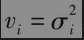为第i天方差的估计值。假设在给定方差的条件下，ui的概率分布为正态。与上面类似，我们得出的最佳参数应使得以下表达式达到最大

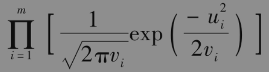

取对数后，我们可以看到这与对下面表达式求最大值是等价的

除了v被代替为vi，这一表达式与式(23-11)相同。我们可以采用迭代法求取使得式(23-12)达到最大的解。

表23-1中所示的计算表给出了估计GARCH(1，1)模型中参数的过程。这个表格分析了2015年7月10日～2020年7月19日标准普尔500指数的数据。表中第1列对应日期；第2列对应天数；第3列显示了标准普尔500指数在第i天结束时的值Si；第4列显示了由第i-1天结束时至第i天结束时标准普尔500指数的百分比变化，即ui=(Si-Si-1)/Si-1。我们首先将初始值记录在表中，然后利用迭代的方式使这些值逐渐趋于最优。第5列显示了第i-1天结束时对第i天方差率的估计，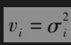。从第3天开始，我们将方差设为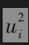，在接下去的每一天，应用式(23-9)时使用参数ω、α和β的最新值。第6列记录的是似然性测度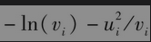。通过迭代搜索，可以选取使第6列中数值的和达到最大值的ω、α和β。在我们的例子中，参数的最优解为

              ω=0.0000039818,α=0.223793,β=0.747577

式(23-12)的最大值为10837.4227。在表23-1中所显示的数字对应于参数ω、α及β的最终迭代解。

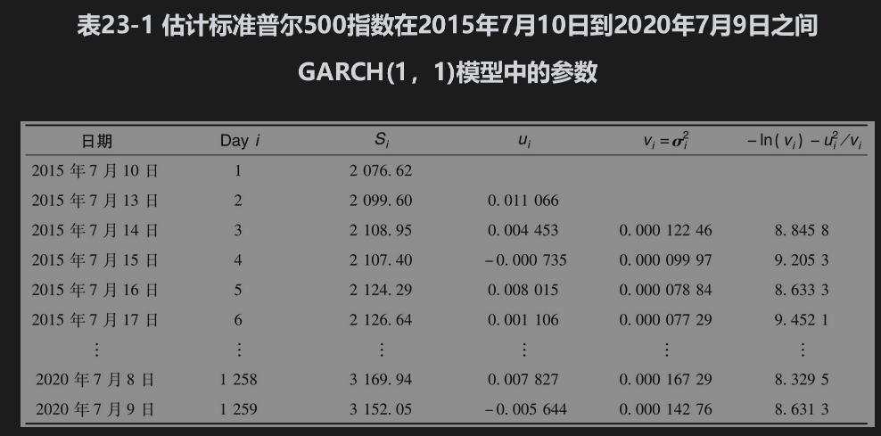

在我们的例子中，长期方差$`V_L`$为

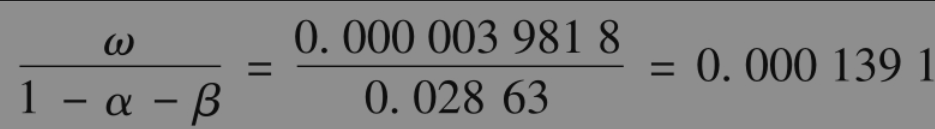

长期波动率为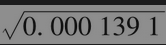，也就是每天1.179%。

图23-1和图23-2展示了标准普尔500指数与它的GARCH(1，1)波动率在数据所覆盖的5年内的变化。在大多数时间里波动率小于2%，但在2020年3月波动率经历了高达每天8%的情形。

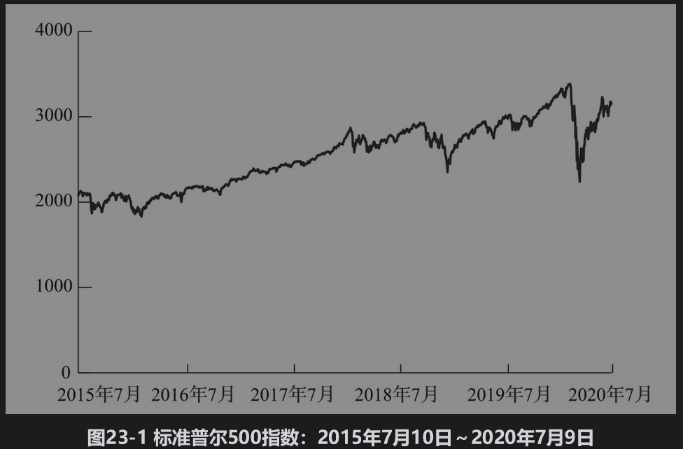

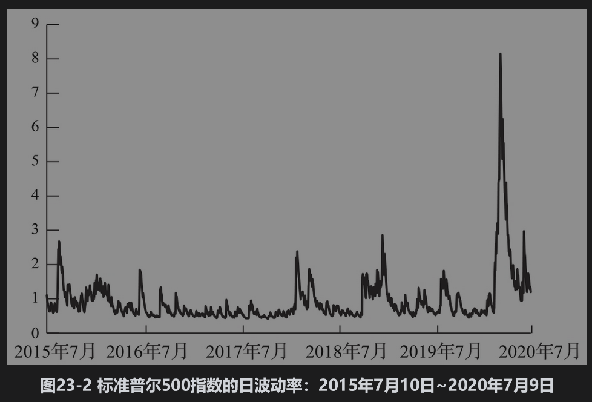

另一种有时会更可靠的估计GARCH(1，1)参数的做法是所谓的方差目标法(variance targeting)。这种方法将长期平均方差VL设定为由数据计算出的样本方差（或其他合理的估计），因为ω等于VL(1-α-β)，因此在模型中只需要估计两个参数，表23-1中的数据所对应的样本方差为0.0001490，对应的日波动率为1.2208%，令VL等于样本方差，我们可以找出使得目标函数式(23-12)达到最大化的α和β分别为0.22636和0.74704，相应的目标函数值为10837.4047，这一数字只是稍稍低于前面计算的极值10837.4227。

当使用EWMA模型时，参数的估计过程就相对简单一些。因为ω=0、α=1-λ和β=λ，因此我们只需要估计一个参数，使用表23-1中的数据，我们可以求得使目标函数式(23-12)取得极大值的λ为0.9182，对应的目标函数取值为10692.6213

对GARCH(1，1)模型和EWMA模型，我们都可以通过Excel软件中的Solver程序找到使得似然函数达到最大的参数值。当计算表格的结构使得寻求的参数值大体在同一级别时，Solver程序的表现会令人满意。例如，在GARCH(1，1)模型中，我们可以将计算表中的单元A1、A2、A3与数据$`ω×10^5`$、10α和β相对应。然后我们可以使单元B1=A1/100000、B2=A2/10以及B3=A3，我们通过B1、B2、B3计算似然函数。我们可以让Solver计算A1、A2、A3上使似然函数得到最大的值。因为有时Solver会给出一个局部解，所以我们应当对于参数设定一些不同的初始值。

## 23.5.3 模型表现如何

在GARCH模型中所做的假设是波动率随时间变化：在某些时间里波动率会相对较高，而在其他时间里会相对较低。换一种形式讲，当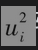较高时，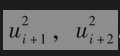,…,会有增大的趋势；当较低时，,…,会有降低的趋势，我们可以通过检验自相关结构(auto-correlation structure)来检验这些结论的正确性。

我们假定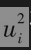确实具有自相关性，如果GARCH模型是有效的，自相关性就会被清除。我们可以通过计算变量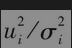的自相关系数验证这一结论。如果它们的自相关系数很小，那么我们可以说σi模型确实解释了中的自相关性。

表23-2给出的是关于上面所用的标准普尔500指数的数据结果。第1列显示了计算自相关系数所用的时滞(time lag)；第2列对应于自相关系数；第3列展示了的自相关系数。表中结果显示对应于1与15之间的所有时滞，的自相关系数均为正值。而对于，有些自相关系数为正，有些为负，而且它们的幅度比原来的自相关系数要小得多。

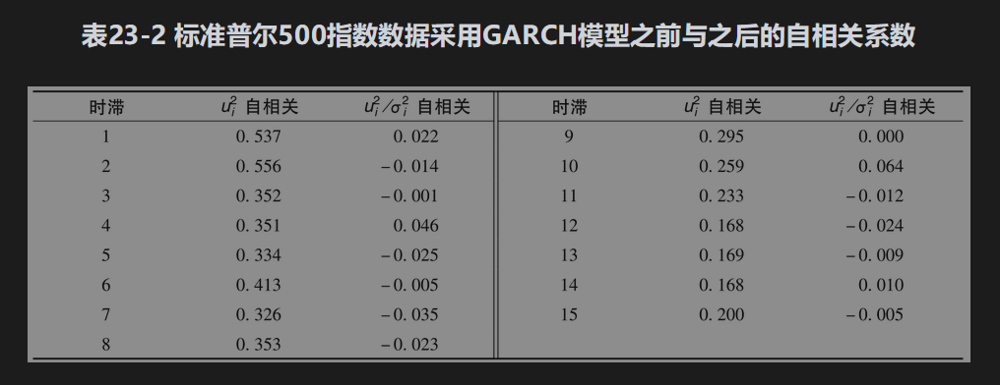

看来GARCH模型对于解释这些数据确实很有效。我们可以采用所谓的Ljung-Box统计量做更为科学的检验。如果一个数列中有m个观察值，Ljung-Box统计量定义为

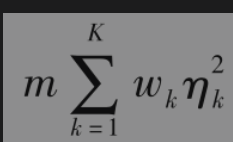

其中ηk对应于时滞为k的自相关系数，K为所考虑时滞的数量，以及

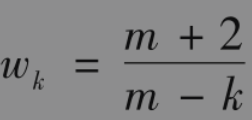

对于K=15，当Ljung-Box统计量大于25时，我们可以有95%的把握拒绝自相关系数为0这一假设。

在表23-2中，关于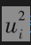数列的Ljung-Box统计值大约为2170，这说明确实存在很强的自相关性。关于数列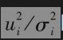的Ljung-Box统计值为13.2，这说明GARCH模型确实清除了数据中的大部分自相关性。