# 23.6 利用GARCH(1，1)模型预测波动率

当使用GARCH(1，1)模型时，在n-1天末所估计的第n天方差率为

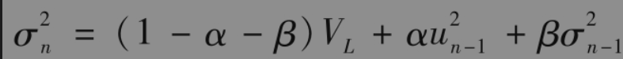

因此

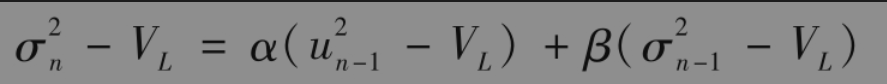

在将来第n+t天，我们有

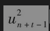的期望值为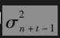，因此

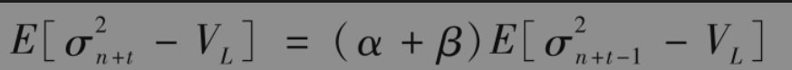

其中E表示期望值。重复应用这一方程，我们得出

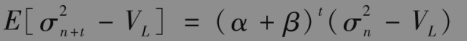

或

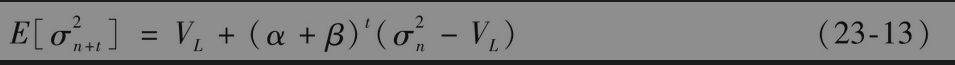

以上方程采用了在n-1天末所有可以利用的数据以预测第n+t天的波动率。在EWMA模型中，α+β=1，式(23-13)说明将来方差率的期望值与目前方差率相等。当α+β＜1时，方程中的最后一项随时间的推移而逐渐减小。图23-3展示了当目前方差率与$`V_L`$不同时，方差率在将来的预期路径。如前面所述，方差率具有均值回归的性质：均值回归水平为$`V_L`$，回归速度为1-α-β。我们对将来方差率的预测会随着持有时间的延长而逐渐趋向于$`V_L`$。这一分析强调了为保证GARCH(1，1)模型的稳定性，我们必须有α+β＜1这一条件。当α+β＞1时，对应于长期平均方差的权重为负，这时方差不具备均值回归性质，事实上此时的模型是“均值逃离”(mean fleeing)的。

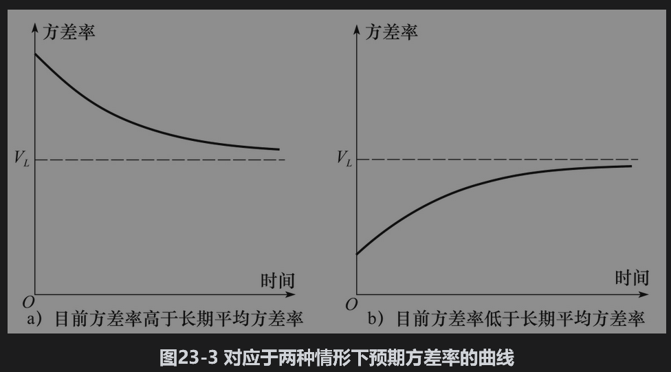

在我们之前考虑的标准普尔500指数数据中，α+β=0.9714，VL=0.0001391。假定我们对于当前方差率的估计为每天0.0003（这对应于每天1.732%的波动率），10天之后的方差率期望值为

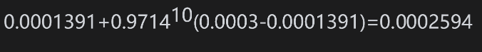

波动率的期望值为每天1.61%，这仍然远远高于长期波动率(1.18%)，但是100天后的预期方差

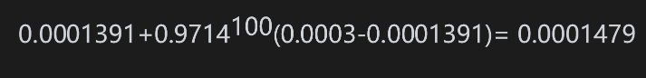

波动率的期望值为每天1.22%，这同长期波动率已经非常接近。

## 23.6.1 波动率期限结构

假定今天为第n天，定义

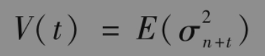

与

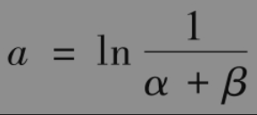

式(23-13)变为

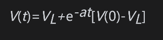

这里的V(t)为第t天瞬时方差率(instantaneous variance rate)的估计值。介于今天与时间T之间的方差率平均值为

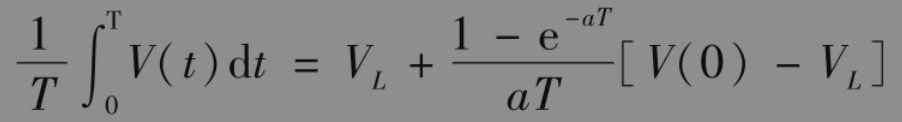

T越大，这个数值越接近$`V_L`$。定义σ(T)为利用GARCH(1，1)模型对一个期限为T天的期权定价时所采用的年波动率，假定每年中有252天，$`σ(T)^2`$是每天方差平均值的252倍，因此

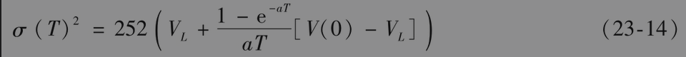

如在第20章中的讨论，对于同一标的资产，我们常常采用不同期权的市场价格计算波动率期限结构(volatility term structure)，这一期限结构就是期权隐含波动率与期限之间的关系。式(23-14)可以用来估计基于GARCH(1，1)模型的波动率期限结构。由此所估计的期限结构同实际的期限结构往往是有区别的。但这种方法确实常常用来预测隐含波动率期限结构随波动率变化的形式。

当目前波动率高于长期波动率时，GARCH(1，1)模型预测的波动率结构为下降形式，而当目前波动率低于长期波动率时，GARCH(1，1)模型预测的波动率期限为上升形式。对于前面的标准普尔500指数数据，a=ln(1/0.97137)=0.02905和$`V_L`$=0.0001391。假定目前的每天方差率估计为V(0)=0.0003，由式(23-14)得出

其中时间T以天计算，表23-3给出了对应于不同时间T的年波动率。

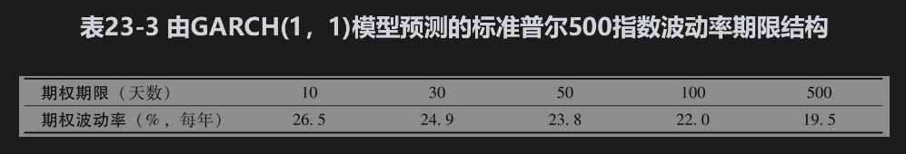

## 23.6.2 波动率变化的影响

式(23-14)可以写为

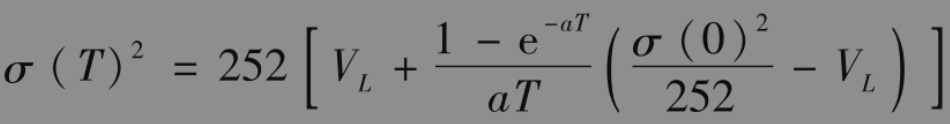

当σ(0)的变化量为Δσ(0)时，σ(T)的变化量大约为

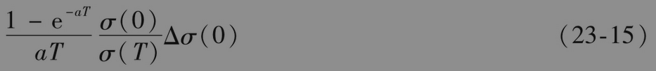

对于上面所考虑的标准普尔500指数数据，表23-4显示了波动率的变化对于不同期限期权的影响。与前面一样，我们假设V(0)=0.0003，因而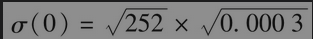=27.50%。表中考虑的情形为瞬时波动率由每年27.50%变为每年28.50%，即100个基点的变化，这意味着Δσ(0)=0.01，即1%。

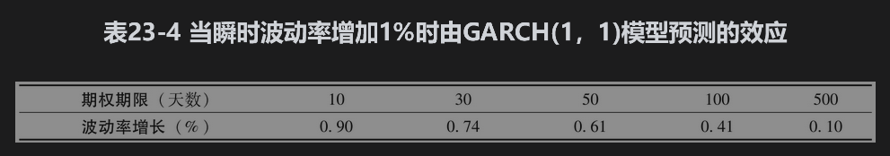

当确定交易组合对波动率变化的风险敞口时，许多金融机构采用与此类似的分析方法。在计算vega时，与其考虑将所有期限的隐含波动率都增加1%，不如将波动率的变化量与期限联系起来。在表23-4中，10天期权的波动率增加量为0.90%，30天期权的波动率增加量为0.74%，50天期权的波动率增加量为0.61%，等等。