# 23.7 相关系数

迄今为止，我们是围绕对波动率的估计与预测进行讨论。如第22章所示，在计算VaR时，相关性也起着很重要的作用。在这一节里，我们将说明如何采用一种类似于对波动率进行更新的方法估计相关系数。

两个变量X和Y之间的相关系数可以定义为

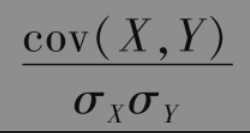

其中σX和σY分别为X和Y的标准差，cov(X,Y)为X和Y之间的协方差。X和Y之间协方差的定义为

              E[(X-μX)(Y-μY)]

其中μX和μY分别为X和Y的均值，E代表期望值。虽然直观上我们更容易理解相关系数，但协方差才真正是我们需要分析的基本变量。

定义xi和yi分别为变量X与Y在第i-1天与第i天之间的百分比变化

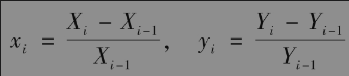

Xi和Yi分别为变量X和Y在第i天结束时的值。我们同时定义以下变量

σx,n：在第n天对变量X日波动率的估计值；

σy,n：在第n天对变量Y日波动率的估计值；

$`cov_n`$：在第n天对变量X日变化量与变量Y日变化量之间协方差的估计值。

在第n天，变量X与变量Y之间相关系数的估计值为

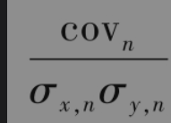

采用同样的权重，并假定$`x_i`$和$`y_i`$的均值都为0，从式(23-3)我们可以得出由最近m个观察值计算出的变量X和Y之间的方差分别为

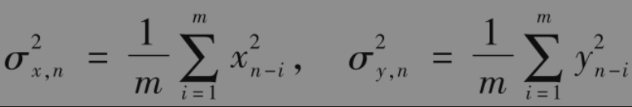

类似地，变量X和Y之间协方差的估计式为

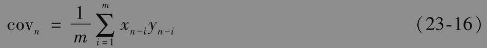

另外一种更新协方差的方法是类似于式(23-7)中的EWMA模型，这时对协方差估计的更新公式为

$`cov_n=λcov_n-1+(1-λ)x_n-1y_n-1`$

与EWMA模型中的分析相似，我们可以证明对应于数据xiyi的权重随着时间向后推移而逐渐降低。λ的值越小，给予近期数据的权重越大。

【例23-3】 假设λ=0.95，在n-1天变量X与Y之间相关系数的估计值为0.6，同时我们假设变量X与Y在n-1天的波动率估计分别为1%和2%。由协方差和相关系数的关系式可以得出在第n-1天X与Y之间协方差的估计为

                  0.6×0.01×0.02=0.00012

假设变量X和Y在n-1天的百分比变化分别为0.5%与2.5%，在第n天方差与协方差的估计应当被更新为

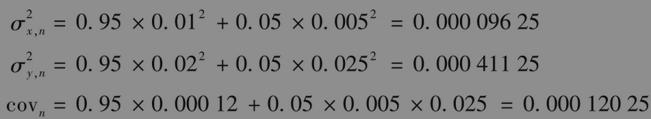

变量X的最新波动率估计为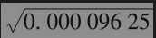=0.981%，变量Y的最新波动率估计为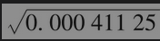=2.028%，X及Y之间的最新相关系数为

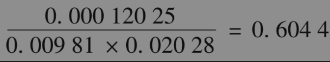

GARCH模型可用于对协方差进行更新，以及对未来协方差进行预测。例如，对协方差更新的GARCH(1，1)模型为

$`cov_n=ω+αx_n-1y_n-1+βcov_n-1`$

其中长期协方差平均值为ω/(1-α-β)。我们可以推导出与式(23-13)和式(23-14)类似的方程以预测未来的协方差以及计算期权期限内的平均方差。

## 协方差的一致性条件

当计算出所有的方差和协方差之后，我们可以生成一个方差-协方差矩阵。当i≠j时，矩阵的(i,j)个元素对应于变量i与变量j之间的协方差；当i=j时，(i,j)个元素对应于变量i的方差。

并不是所有的方差-协方差矩阵都是内部一致的。一个N×N方差-协方差矩阵Ω满足内部一致性的条件是：对于所有的N×1向量w

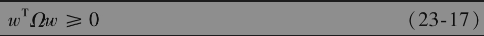

其中$`w^T`$是w的转置。满足以上条件的矩阵称为半正定(positive-semidefinite)矩阵。

为了理解为什么不等式(23-17)必须成立，我们假定$`w^T=[w_1，w_2,…,w_n]`$，表达式$`w^TΩw`$为变量$`w_1x_1+w_2x_2+…+w_nx_n`$的方差（其中xi代表变量i的值），因此自然不能为负。

为了保证矩阵的半正定性，我们在计算方差及协方差时必须保持一致性。例如，如果我们采用最新的m个历史数据并以均等的权重计算方差，那么我们在计算协方差时也应当采用同样的数据与权重。如果在更新方差时采用了λ=0.94的EWMA模型，那么在更新协方差时也应该采用同样的方式。

以下方差-协方差矩阵是不满足内部一致性条件的例子

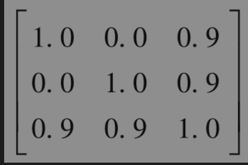

这时每个变量的标准差均为1.0，协方差与相关系数相等。第1变量同第3变量高度相关，第2变量同第3变量也高度相关，但是第1变量同第2变量之间没有相关性。这看起来有些奇怪。令w=(1，1，-1)，我们可以验证式(23-17)不成立，从而证明了矩阵不满足半正定条件。