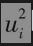
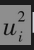

# 小结

大多数流行的期权定价模型里（例如布莱克-斯科尔斯-默顿模型）都假定标的资产的波动率为常数。这一假定绝非完美。在实际中，波动率就如同标的资产本身一样，也是一个随机变量。但是与标的资产不同，这一变量并不能在市场上直接观测到。本章里描述的方法就是关于如何跟踪目前的波动率大小。

我们定义ui为第i-1天末到第i天末市场变量的百分比变化，市场变量的方差率（即波动率的平方）为的加权平均。这里所讨论模型的一个关键特征是对应于不同的，模型赋予不同的权重：数据越新，所对应的权重越大。在EWMA模型和GARCH(1，1)模型中，权重随着数据变旧而以指数比例下降。GARCH(1，1)模型与EWMA模型的不同之处在于GARCH(1，1)模型给长期平均方差也赋予了一定的权重。EWMA模型与GARCH(1，1)模型的结构都使我们能够比较容易地预测将来方差的水平。

极大似然法通常利用历史数据估计EWMA模型、GARCH(1，1)模型以及其他类似模型中的参数。这些方法采用数值迭代找到使历史数据得以重现的可能性达到最大的参数。当参数确定之后，我们可以通过检验模型是否可以清除的自相关性判断GARCH(1，1)的效果。

对应于每个跟踪方差的模型都会有一个相应的模型跟踪协方差。本章所描述的方法可用于更新计算风险价值度的完整方差-协方差矩阵。