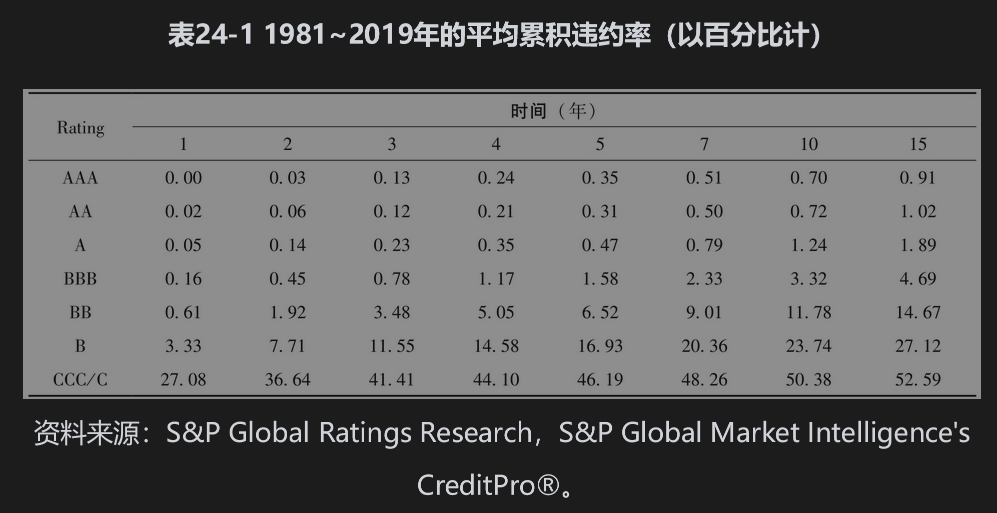
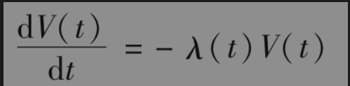
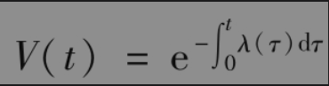
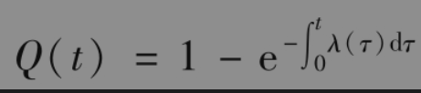
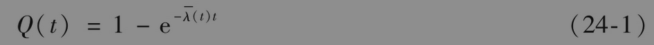
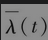

# 24.2 历史违约概率

表24-1是由评级公司公布的一组典型数据，这些数据显示了最初为某个级别的债券在今后15年内的违约情况。例如，初始信用级别为BBB的债券有0.16%的概率在1年内违约，有0.45%的概率在两年内违约等。债券在一个指定年份违约的概率可由这一表格计算得出。例如，初始信用级别为BBB的债券在期限中第2年违约的概率为0.45%-0.16%=0.29%。

## 违约率

由表24-1我们可以计算出CCC/C债券在第3年内的违约率为41.41%-36.64%=4.77%。我们将其称为无条件违约概率(unconditional default probability)。该概率是今天（即在0时刻）所观察的在第3年内违约的概率。CCC/C债券一直到第2年年底都不会违约的概率为100%-36.64%=63.36%，因此我们得出在前两年没有违约的条件下，公司在第3年内违约的概率为0.0477/0.6336=7.53%。

这里计算出的7.53%是对应于1年观察期的条件概率。假设我们考虑一个很短的时间段Δt，定义在时间t的违约率λ(t)为在之前没有违约的条件下，违约发生在时间t与t+Δt之间的概率为λ(t)Δt。

如果V(t)是从今天到时间t公司仍然生存的累积概率（即在时间t之前没有违约），那么在时间t与t+Δt之间违约的条件概率为[V(t)-V(t+Δt)]/V(t)，由于这个概率等于λ(t)Δt，我们有

                V(t+Δt)-V(t)=-λ(t)V(t)Δt

取极限后得出

因此

定义Q(t)为在时间t之前违约的概率，因此Q(t)=1-V(t)，我们得出

或者

其中为介于时间0与时间t之间违约率的平均值，条件违约概率被称为违约密度(de-fault intensity)。

