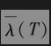
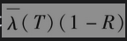
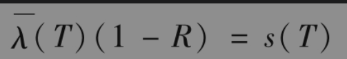
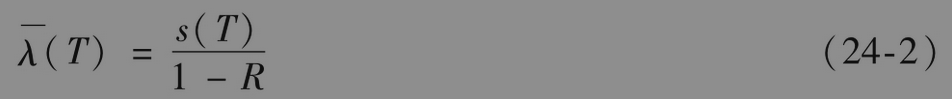
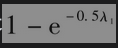
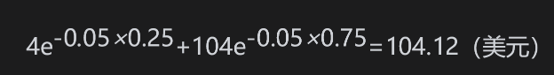
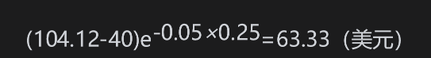
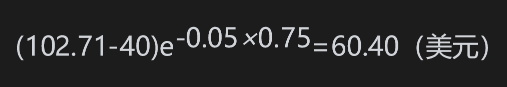
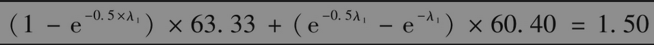

# 24.4 由债券收益率溢差估计违约概率

像表24-1中这样的数据提供了一种估计违约概率的方法。另一种方法是利用债券收益率溢差。债券收益率溢差是所许诺的收益率高出无风险利率的部分。通常的假设是这部分多出的收益率是对所承受违约风险的补偿。

假设一个T年期债券的收益率溢差是每年要s(T)。这说明在时间0到T之间债券的平均损失率大概是每年s(T)。假设在这段时间里违约率的平均值是。而对平均损失率的另一种估计是，其中R是所估计的回收率。因此近似地会有关系式

或

在很多情况下，这个逼近式都很有用处。【例24-1】 假设一家公司所发行的1年期、2年期和3年期债券的收益率比无风险利率分别高出150个基点、180个基点和195个基点。如果预估的回收率是40%，由式(24-2)给出的1年平均违约率为0.0150/(1-0.4)=0.025，即每年2.5%。类似地，前两年的平均违约率是0.0180/(1-0.4)=0.030，即每年3.0%。对所有3年的平均违约率是0.0195/(1-0.4)=0.0325，即每年3.25%。这些结果表明第2年的平均违约率是2×0.03-1×0.025=0.035，即3.5%，而第3年的平均违约率是3×0.0325-2×0.03=0.0375，即3.75%。

## 24.4.1 匹配债券价格

为了使计算更加精确，我们可以选择违约率使其与债券价格匹配，这种方式与在第4.7节里计算零息利率曲线的做法类似。假设使用的是期限为ti的债（ti满足t1＜t2＜t3＜…）。用最短期限的债券计算直到t1的违约率，用下一个债券计算介于t1与t2之间的违约率，等等。

【例24-2】 假设所有期限的无风险利率均为每年5%（连续复利），1年期、2年期和3年期债券的收益率分别为6.5%、6.8%和6.95%（也是连续复利，这与例24-1里的数据是一致的）。我们假设每个债券的面值都是100美元，券息都是每年8%（每半年支付一次，而且刚刚付过一次券息）。由债券的收益率可以计算出它们的价格分别为101.33美元、101.99美元和102.47美元。假如债券是无风险的话，它们的价格应当分别是102.83美元、105.52美元和108.08美元（由5%的收益率计算）。这说明一年期债券的违约损失期望值的现值应当是102.83-101.33=1.50美元。类似地，2年期与3年期债券的违约损失期望值应当是3.53美元和5.61美元。假设第i年的违约率为λ1(1≤i≤3)，回收率为40%。

考虑1年期债券，在前6个月内违约的概率是，在接下来的6个月内违约的概率是。假设违约只可能发生在6个月时间段的中间，那么违约可能发生的时间是3个月后和9个月后。在3个月时债券的无风险（远期）价格是

由上一节里回收率的定义，我们知道如果违约发生的话，债券将会值40美元，所以当3个月后违约发生时所受损失的现值等于

在第9个月的时间点上，债券的无风险价值为104e-0.05×0.25=102.71美元，而如果有违约的话，债券的价值将为40美元，所以当9个月后违约发生时所受损失的现值等于

因此违约率λ1必须满足

这个方程的解（可以利用Excel里的Solver）为λ1=2.46%。

接下来考虑2年期债券，这个债券在3个月与9个月时的违约概率可以从上面关于1年期债券的分析中得到，而对2年里违约率的计算可以通过使违约损失期望的现值等于3.53美元完成。对3年期债券可以由类似的方法处理。通过这些计算，我们可以得到在第2年与第3年的违约率分别是3.48%与3.74%［注意，这里所估计的违约率与在例24-1中通过式(24-2)所得的结果非常相似］。在网页www-2.rotman.utoronto.ca/~hull/ofod里的一个工作表中有这个例子的具体计算。

## 24.4.2 无风险利率

无风险利率的选择对我们刚刚介绍的计算违约概率方法有重要的影响。例24-1中的溢差是债券收益率与无风险利率之差，而如何计算无风险债券价格对例24-2中计算由债券价格所隐含的违约损失期望值有关键影响。债券交易员所用的参考无风险利率通常是某种国库券利率。例如，交易员对一个债券的报价也许是国库券上溢差250个基点。但是如第4.3节所述，由于国库券利率太低，将其当成无风险利率没有太多用处。

信用违约互换合约(CDS)溢差（在第7.11节里有过简单的讨论，在第25章里将有更详细的论述）提供了不依赖所选择无风险利率的信用溢差估计。有些研究人员试图通过将债券溢差与CDS溢差相比较，从而估计所隐含的无风险利率。他们的结果表示，在正常市场条件下所隐含的无风险利率更接近OIS利率。