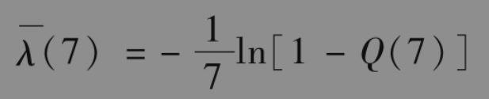
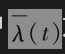
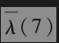
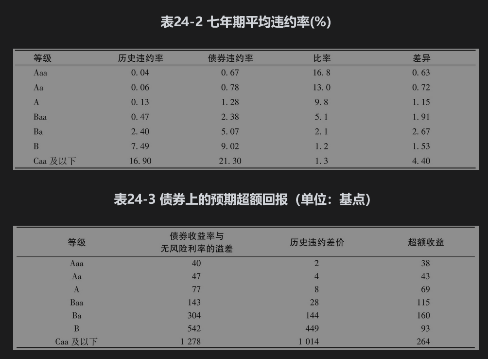

# 24.5 违约概率估计的比较

由历史数据所估计的违约概率通常要远远小于从债券价格中所隐含的违约概率，在2007年年中开始的信用危机期间，两者的差别尤为突出。在危机期间发生了所谓的“安全投资转移”现象，这时所有的投资人都想持有像国库券这样的安全证券。这种现象造成了公司债券价格下跌，从而收益率上涨。这些债券的信用溢差增大，因此像式(24-2)中的计算将会给出很高的违约率估计值。

表24-2取自2005年使用穆迪数据发表的研究结果。它将历史违约率与不同评级债券收益率所隐含的违约率进行比较，结果表明后者比前者要大得多。历史违约率采用与表24-1类似的数据计算。债券收益率所隐含的违约率采用式(24-2)计算，回收率为40%，所使用的债券收益率溢差是历史平均水平。从信用违约互换市场估计，无风险利率比美国国债高出43个基点。可以看出，由债券价格所计算出的违约概率与由历史数据所计算出的违约概率的比率很大，但这些比率随着信用级别降低而有所下降。与此相比，两种违约概率的差随着信用级别的降低而有所增加。（B级债券并不完全符合这种模式。）

使用最近的数据提供的结果与表24-2中的结果相似。例如，考虑Baa（或BBB）级别的债券在7年期限的累计违约概率，根据表24-1为2.33%，式(24-1)给出了以下公式：

其中为截至时间t的平均违约率，Q(t)为截至时间t的累积违约概率。设定Q(7)=0.0233时，我们得到=0.0034（即0.34%或34个基点）。2019年前几年，Baa（或BBB）级别的公司债券收益率与无风险利率的溢差约为1.8%。式(24-2)给出债券收益率隐含的违约率的估计值为0.018/(1-0.4)=0.03（约为表24-1估计值的9倍）。

表24-3显示了表24-2中结果的另一种解释。第2列给出了投资者在不同信用级别的债券上所得收益溢差，补偿历史违约率所需的溢差显示在第3列中。（例如，对于Baa级别的债券，0.47%×0.6=0.28%）预期超额回报将显示在该表的最后一列中。

由表24-2可以看到，虽然两种方式所估计的违约率差别很大，但对应的债券上的额外预期收益却相对较小。对于Aaa级别的债券，两种违约率的比率为16.8，但额外预期收益只有仅仅38个基点。额外预期收益随着信用级别的降低而有所增加。

24.5.1 现实世界概率与风险中性概率的比较

由债券收益率隐含的违约概率或违约率均为风险中性估计值。当存在违约风险时，我们可以用这些结果计算现金流在风险中性世界里的期望值，然后利用风险中性定价方法将现金流的期望值按无风险利率贴现，即可得到现金流的价值。例24-2是这种方法用在计算违约费用的例子。在下一章中，我们将会看到更多的应用。

与此相比，由历史数据计算出的概率或违约率都是在现实［有时也被称为真实(physical)］世界里的估计值。表24-2说明风险中性违约概率要比现实世界违约概率高出很多，表24-3中的额外期望收益直接来自现实世界与风险中性世界里违约概率的差别。假如没有额外期望收益的话，现实世界违约概率将会等于风险中性违约概率，反之亦然。

为什么现实世界违约概率与风险中性世界违约概率会有如此大的差别呢？就像我们刚刚讨论的那样，这一问题等同于为什么企业债券交易员的平均收入要高于无风险利率。

一种解释是企业债券的流动性较差，因此它们要提供足够高的回报才能对此进行补偿。尽管事实确实是这样的，但研究结果表明这并不能完全解释表24-3中的结果。另外一种可能的原因是债券交易员的主观违约率假设也许比表24-1中给出的违约率要高得多，而交易员所假想的经济萧条情形可能要比历史数据中所有发生过的情形更差。但是，超额收益的很大一部分仍然很难用以上观点解释。

到目前为止，人们发现造成表24-2和表24-3中结果的最主要原因是债券违约并不相互独立：在有些时间段内违约率较低，而在其他的时间段内违约率较高。观察不同年份的违约率会将证明这个结论。标准普尔的统计结果表明，自1981年以来，美国非投资级评级公司每年的违约率分别从1981年的0.63%到2009年的11.81%不等。年与年之间的违约率变化会导致系统风险（即不能通过风险分散而消除的风险），债券交易员因承担这种风险自然会得到超额收益（这与由资本资产定价模型所计算的股权持有者超额收益是类似的，见第3章附录A）。年与年之间违约率的不同可能归因于整体的经济状况，或者某公司的违约会触发其他公司的违约（这一现象常称为信用蔓延(credit contagion)）。

除了我们刚刚讨论的系统风险，每个债券都具有非系统风险。对于股票交易组合，我们可以认为当投资者选择适当的组合（例如组合含有30只股票）时，非系统风险可以被分散，因此当投资者持有非系统风险时就不应索取超额收益。但对于债券组合，以上观点就没有那么明显。债券收益具有很高的偏态性，同时投资收益的升势有限（例如，一个债券在1年内有99.75%的可能收益率为4%，同时有0.25%的可能收益率为-60%。第一种情形对应于没有违约出现，第二种情形对应于出现违约）。债券投资的这种风险很难分散，因为如果我们要想进行风险分散的话，需要持有成千上万的债券。在实际中，许多债券组合的风险远远没有达到完全分散，因此债券交易员可能对自己所承担的非系统风险也会像对所承受的系统风险一样索取额外的回报。

## 24.5.2 应当使用哪种违约概率估计

现在我们自然会问，在信用风险分析中我们是应该采用现实世界里的违约率还是风险中性世界里的违约率？答案取决于我们分析的目的：当我们对信用衍生产品定价或者分析违约对产品价格的影响时，我们应该采用风险中性违约概率，这是因为在分析中会涉及计算将来预期现金流的贴现值，在计算中会不可避免（直接或间接）地采用风险中性定价理论。当我们采用情景分析法估计因违约而可能触发的损失时，应该采用现实世界里的违约率。