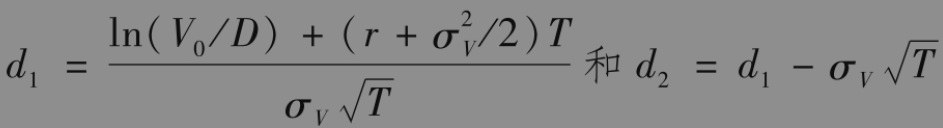
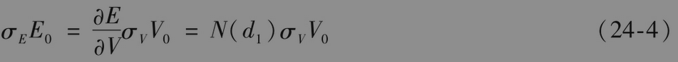

# 24.6 利用股价估计违约概率

当我们利用类似于表24-1中的数据估计公司在现实世界里的违约概率时，我们必须依赖公司的信用评级。不幸的是公司信用评级的更新较慢，因此许多分析人员认为在估计违约概率时，股票价格可以提供更及时的信息。

默顿在1974年提出了一种将公司股票当成公司资产上期权的模型。[插图]为了便于讨论，假设公司仅发行了一个零息债券，债券到期时间为T。定义

$`V_0`$：公司资产的当前价值；

$`V_T`$：公司资产在时间T的价值；

$`E_0`$：公司股票的当前价值；

$`E_T`$：公司股票在时间T的价值；

D：公司债券在时间T的本金；

σV：资产波动率（假设为常数）；

σE：股票的瞬时波动率。

当$`V_T`$＜D时，公司会对自己发行的债券违约（至少从理论上讲），此时公司股票的价值为0；当$`V_T`$＞D时，公司会支付自己在时间T时应偿还的债务，这时股票价值为$`V_T`$-D。因此在默顿模型中，在时间T时公司的股票价值为

$`E_T=max(V_T-D,0)`$

这表示公司的股票可以看作公司资产上的看涨期权：期权的执行价格为应偿还债券本金的总量。布莱克-斯科尔斯-默顿公式给出了这一期权的当前价值

其中

债券在今天的价值等于$`V_0-E_0`$。

公司在时间T时违约的风险中性概率为N(-d2)。为了计算这一数量，我们需要$`V_0`$与σV，而这两个变量都不能从市场上直接观察到。但是如果公司是一家上市公司，我们可以观察到$`E_0`$，这意味着式(24-3)给出了一个$`V_0`$与σV必须满足的等式。我们也可以通过历史数据或期权价格估计σE。由伊藤引理，我们得出

以上方程是V0与σV必须满足的另一个等式。式(24-3)与式(24-4)给出了一组关于V0和σV的方程，由这两个方程我们可以求得V0及σV。

【例24-3】 某家公司的股权价值为300万美元，股权价值的波动率为80%，公司在1年后必须支付的债务总额为1000万美元，无风险利率为每年5%。在以下计算中的数量以百万计。对应这一情形E0=3，σE=0.80,r=0.05，T=1和D=10。对式(24-3)和式(24-4)求解，我们得出V0=12.40与σV=0.2123，参数d2=1.1408，因此公司违约的概率为N(-d2)=0.127，即12.7%。债券的当前市价为V0-E0，即9.40。债券面值的贴现值为10e-0.05×1=9.51，因此债券的预期损失为(9.51-9.40)/9.51，即无违约可能时价值的1.2%左右。

我们可以将上面的默顿模型基本形式在几个方面加以推广。例如，一种形式是假设一旦资产价格低于一定的障碍值时，就会触发违约。另一种推广是允许使债券需要多次进行偿还支付的情形。

由默顿模型及其推广形式所产生的违约概率与实际违约概率有多么接近呢？这一问题的答案是默顿模型及其推广对于违约概率提供了较好的排序功能（风险中性或现实世界）。这意味着通过某种单调变换，我们可以将由默顿模型产生的违约概率转换成对现实世界里或风险中性世界里违约概率的估计。利用理论上的风险中性违约概率N(-d2)（因为这是由期权定价模型估计的）估计现实世界里的违约概率，这种做法看上去比较奇怪，但在对上面的模型进行校准的过程中，我们假设了对不同公司的风险中性违约概率排序与其现实世界里违约概率的排序是一样的。