# 24.7 衍生产品交易中的信用风险

在本节中，我们将考虑如何量化双边清算衍生产品交易中的信用风险。一般来讲，两家公司之间的双边清算衍生产品交易服从国际互换与衍生产品协会(ISDA)的主协议(master agreement)中的规定。对金融机构之间的交易，合约中必须指明将缴纳初始保证金与追加保证金。初始保证金须包括10天内99%的损失。

在主协议里还定义了违约事件(event of default)发生的情形。例如，当一方没有能够履行衍生产品交易所指明的支付，没能按要求交付抵押品，或者宣布破产时，就会发生违约事件。交易对手有权利终止所有与其之间尚未平仓的交易。在下面两种情况下，这些结果很可能会给非违约方造成损失：

(1)对非违约一方，所有未平仓交易的总值是正的，而且高于违约方所交付的抵押品（假如有的话）价值。对于交易中没有抵押品的部分，非违约方成了无抵押债权人(unsecured creditor)。

(2)对违约的一方，所有未平仓交易的总值是正的，但是低于非违约方所交付的抵押品价值。为了要回自己已经交付的多余抵押品，非违约方成了无抵押债权人。

为了简化讨论，我们忽略由于需要更换与违约方之间所做的交易，非违约方由买卖差价而带来的费用。

## 24.7.1 CVA与DVA

在第9章里，我们曾介绍过CVA（信用价值调节）与DVA（债务价值调节）的概念。一家银行对其交易对手的CVA调节值等于由于对手违约所产生的预期费用的贴现值，而DVA调节值等于银行自己违约而给对手造成的预期费用的贴现值。银行违约的可能性对银行自己有利，因为银行有可能不需要按衍生产品的要求向对方支付。因此，作为对手的费用，DVA是对银行有益的。

未平仓交易的无违约价值(no-default value)是当假设交易的双方都不违约情况下的价值（像布莱克-斯科尔斯-默顿这样的衍生产品定价模型所给出的都是无违约价值）。如果fnd表示与某个交易对手之间未平仓交易对于银行的无违约价值，那么在考虑可能的违约情况后，未平仓交易的价值是

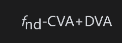

假设在银行与交易对手之间未平仓衍生产品交易中期限最长的是T年，如第9章所述，将0和T之间分成N个区间，CVA和DVA的估计值为

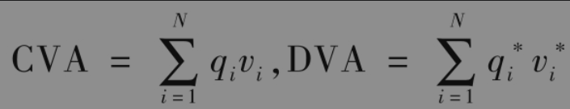

其中qi是对手在第i个区间里违约的风险中性概率；vi是当对手在第i个区间的中间时间点上违约时，给银行造成损失的预期值的贴现值；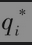是银行在第i个区间里违约的风险中性概率；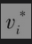是当银行在第i个区间的中间时间点上违约时，给对手造成损失（对银行有利）的预期值的贴现值。

首先考虑如何计算qi。因为我们是在利用风险中性方法对未来现金流定价，所以$`q_i`$（隐含的）应当是风险中性违约概率（参见第24.5节）。假设ti是第i个区间的终点，那么qi是交易对手在时间ti-1和ti之间的风险中性违约概率。我们首先采用一些不同的期限估计对手的信用溢差，然后利用插值法，可得到对应每个期限$`t_i`$(1≤i≤N)，交易对手的信用溢差估计值$`s(t_i)`$。由式(24-2)可知，对手在时间0和$`t_i`$之间的平均违约率估计值是$`s(t_i)`$/(1-R)，其中R是当对手违约时的回收率期望值。由式(24-1)可知，对手在直到ti仍未违约的概率是

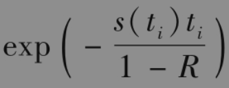

这说明

是对手在第i个区间里违约的概率。可以利用类似的方法通过银行的信用溢差估计概率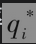。

接下来，我们考虑在假设没有缴纳抵押品的情况下如何计算vi，这里的计算常常需要花大量时间利用蒙特卡罗模拟法完成。从时间0到T，在风险中性世界里对一些市场变量进行模拟，而这些市场变量决定了银行与对手之间所有未平仓交易的无违约价值。在每次模拟试验中，在每个时间区间的中间点上计算银行关于对手的风险敞口，这里的风险敞口等于max(V,0)，其中V是交易对于银行的总值（对银行来讲，总价值是负值时没有风险敞口，而价值为正时，风险敞口等于这个值）。计算在所有模型实验中这项风险敞口的平均值，将其贴现值乘以1减收益率即可得到变量vi的估计值。采用类似的方法，利用对手对于银行的风险敞口可以计算变量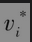。

当银行与对手之间有抵押协议时，vi的计算会更复杂。在每次模拟实验中，在第i个区间的中间点上如果有违约事件发生，我们需要估计双方所持抵押品的价值。在这样的计算中，通常假设从违约发生的c天前开始，对方就不再缴纳抵押品，也不再归还超量的抵押品。参数c通常被称为补救期(cure period)，或风险边缘期(margin period of risk)，一般等于10天或20天。为了知道在区间中间点上违约发生时都持有什么抵押品，需要计算所有交易在c天前的价值。下面的例子展示了计算风险敞口的方法，预期损失vi的贴现值是按所有实验中风险敞口的平均值计算的（这与无违约的情形一样）。考虑交易对手关于银行的风险敞口时，利用类似的方法可以得到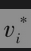。

【例24-4】 在银行与（非金融机构）交易对手之间有双边零槛(zero-threshold)抵押协议，这说明每方都需要向对手提交价值max(V,0)的抵押品，这里V代表未平仓交易对于对手的价值。假设补救期为20天，τ是在银行的CVA计算中所用的一个时间区间的中间点：

(1)在一次模拟实验中，在时间τ，未平仓交易对银行的价值是50，而20天之前的价值是45。在这种情况下，通常假设如果在时间τ违约发生的话，银行所持有的抵押品价值是45，银行的风险敞口是衍生产品价值中没有抵押品的部分，即5。

(2)在一次模拟实验中，在时间τ，未平仓交易对银行的价值是50，而20天之前的价值是55。在这种情况下，通常假设如果在时间τ违约发生的话，银行持有足够的抵押品，从而风险敞口是0。

(3)在一次模拟实验中，在时间τ，未平仓交易对银行的价值是-50，而20天之前的价值是-45。在这种情况下，通常假设如果在时间τ违约发生的话，银行所交付的抵押品价值不超过50，从而风险敞口是0。

(4)在一次模拟实验中，在时间τ，未平仓交易对银行的价值是-50，而20天之前的价值是-55。在这种情况下，通常假设如果在时间τ违约发生的话，对手仍持有价值为55的抵押品，银行的风险敞口是5，即多余的抵押品部分。

除了计算CVA外，银行通常还计算每个区间中间点上的暴露高峰(peak exposure)，这是在蒙特卡罗模拟中风险敞口的某个高百分位数。例如，如果百分位等于97.5%，在1万次模拟实验中，一个区间中间点上的暴露高峰等于第250个最高的风险敞口。最大的暴露高峰等于所有区间中间点上暴露高峰的最大值。

通常银行会保存在模拟中所有市场变量的样本路径，以及所计算的所有价值，这样可以加快有关新交易的CVA和DVA计算：这是因为在计算新交易对CVA和DVA的影响时，只需要在每个样本路径上计算新交易的价值。如果新交易的价值与已有的交易具有正相关性，这时很可能将会增加CVA和DVA，然而如果新交易的价值与已有的交易具有负相关性（比如完全或部分退出现存交易），这时很可能将会降低CVA和DVA。

在上面有关计算CVA方法的讨论中，我们假设对手违约的概率与银行的风险敞口之间相互独立。在许多情形下，这种假设比较合理。交易人员常常用错向风险(wrong-way risk)描述当对手违约概率与风险敞口具有正相关性时的情形，而用正向风险(right-way risk)描述当对手违约概率与风险敞口具有负相关性时的情形。为了描述违约概率与风险敞口之间的依赖性，人们提出了许多比上面所述方法更复杂的模型。

对每个交易对手，银行都会有一个CVA和一个DVA，而这些CVA和DVA都可以当成衍生产品：其价值会随着市场变量变化、对手信用溢差变化以及银行信用溢差变化而变化。对CVA和DVA风险的管理方式与对其他衍生产品风险的管理方式一样，可以计算希腊值、进行情景分析等。

## 24.7.2 信用风险的缓释

有许多种方法可以用来减少双边清算交易中的信用风险。其中之一是我们已经讲过的净额结算。假设银行与某个对手之间有3笔没有抵押的交易：价值分别为+1000万美元、+3000万美元和-2500万美元。如果将它们都作为独立交易的话，银行在这些交易上的风险敞口分别是为+1000万美元、+3000万美元和0美元，总共为4000万美元。利用净额结算的话，将3笔交易放在一起作为一笔价值为1500万美元的交易，这样风险敞口从4000万美元降到了1500万美元。

抵押协议是减少信用风险的一种重要方式。抵押品可以是现金（一般会计算利息）或在市场上可以交易的证券（为计算抵押品数量，在计算后者的现金等价值时会打折扣）。目前，金融机构之间的抵押协议由监管规则决定。在违约事件发生时，衍生产品交易将会被优先考虑。非违约方有权扣留对方交付的所有抵押品，因此没有必要为此走既耗财力又耗精力的司法程序。

金融机构用来降低信用风险的另一种方法是使用降级触发(downgrade trigger)策略。在ISDA总协议里有一项条款指明，如果对手的信用评级低于某个水平（比如BBB），银行有权对所有未平仓交易按市价平仓。但是当信用级别跳动幅度很大时（比如由A跳到违约），降级触发策略并不能提供多少帮助，而且只有当使用这种策略不是很多时，其效果才会相对较好。如果一家公司与许多对手之间都有降级触发协议的话，对其对手而言，这种策略起不了什么保护的作用（见业界事例24-1）。

## 业界事例24-1

## 降级触发与美国国际集团(AIG)

美国国际集团提供了一个降级触发如何运作的例子。截至2008年，美国国际集团承约了许多保证具有AAA信用级别的ABS CDO份额表现的衍生产品（见第8章中有关ABS CDO的描述）。许多美国国际集团的交易里都含有降级触发条款：只要美国国际集团的信用评级高于AA，美国国际集团就不需要缴纳抵押品。2008年9月15日，穆迪、标准普尔，以及惠誉都将美国国际集团降到了AA之下。由于它所保证的份额表现很差，所以马上收到了许多交易对手催付抵押品的通知。美国国际集团无法满足这些抵押品的抵押品催缴通知，在美国政府的大力援助下，才避免了破产。

## 24.7.3 特殊情形

在本节里，我们将考虑两个不需要蒙特卡罗模拟就可以计算CVA的特殊情形。

第一个特殊情形是当银行与对手之间只有一笔无抵押的衍生产品交易，而且交易只是在时间T向银行提供收益（例如，银行向对手购买了剩余期限为T的欧式期权）。银行在将来时间的风险敞口等于期权在那个时间的无违约价值，因此风险敞口的现值等于衍生产品在将来时刻价值的贴现值，而这正是衍生产品在今天的无违约价值。因此，对所有i

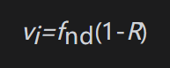

其中fnd代表衍生产品在今天的无违约价值，R为回收率。这意味着

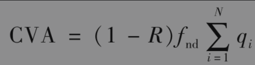

在这种情形下，DVA=0。因此在考虑信用风险后，衍生产品的价值为

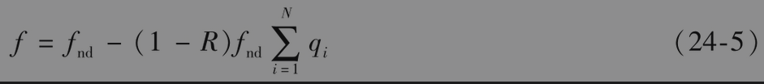

我们现在考虑的衍生产品是由对手发行的T年期零息债券。假设债券的回收率与衍生产品回收率一样，债券的价值等于

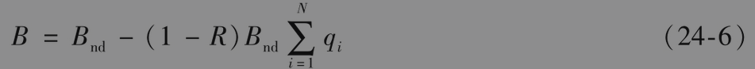

其中Bnd为债券的无违约价值。由式(24-5)和式(24-6)

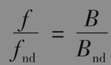

如果y是由交易对手所发行的T年期债券的收益率，ynd是类似的无风险债券收益率，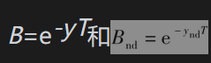，我们得到

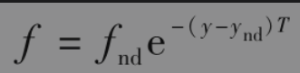

这说明在对衍生产品定价时，贴现率可以取成对风险中性世界里收益用来贴现的利率加上对手的T年期信用溢差。

【例24-5】 某个无抵押2年期期权的布莱克-斯科尔斯-默顿价格是3美元，由卖出这个期权的公司所发行的零息债券收益率比无风险利率高1.5%，当考虑违约风险后，期权的价值是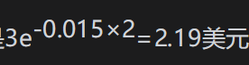。在这里我们假定当违约事件发生时，这个期权不与别的衍生产品进行净额结算。

对第二个特殊例子，我们考虑如下情形：银行与交易对手签订了远期合约，银行在时间T按价格K购买某种资产并与交易对手无其他交易。将在时间T交付的远期合约在时间t的远期价格定义为Ft，由第5.7节知道，交易在时间t时的价值为

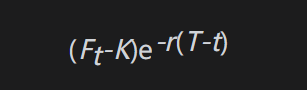

其中r为无风险利率（假设为常数）。

因此银行在时间t的风险敞口等于

$`F_t`$在风险中性世界里的期望值等于F0，InFt的标准差为，其中σ为Ft的波动率。由式(15A-1)，在时间t风险敞口的期望值等于

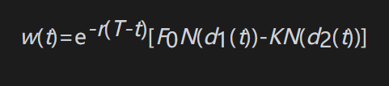

其中

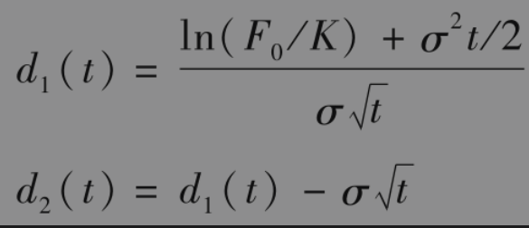

这样可以得到

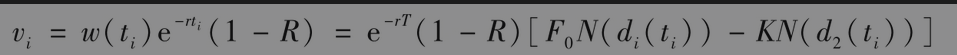

【例24-6】 一家银行与一家矿业公司签订了一项远期合约，合约是在2年后银行按每盎司1500美元的价格向矿业公司购买100万盎司的黄金。目前的2年期黄金远期价格是每盎司1600美元。在计算CVA时，我们假设只考虑长度为1年的两个时间区间，公司在第1年内违约的概率是2%，在第2年内违约的概率是3%。无风险概率是每年5%，在违约发生时，预计有30%的回收率。黄金远期价格的波动率是20%。

在本例中，q1=0.02，q2=0.03，$`F_0`$=1600,K=1500,σ=0.2，r=0.05，R=0.3，$`t_1`$=0.5，$`t_2`$=1.5，从而

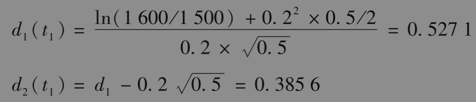

于是

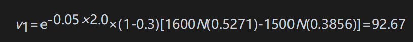

类似地，$`v_2`$=130.65。

违约的预期费用为

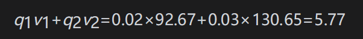

远期合约的无违约价值是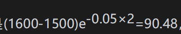，在考虑对手违约的可能性后，价值降低到了90.48-5.77=84.71。我们可以将这里的计算推广到公司可能在更多时间点上违约的情形（见练习题24.28）。DVA将会使衍生产品的价值增加，对它的计算与CVA类似（见练习题24.29）。
