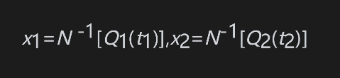
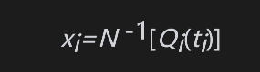
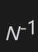
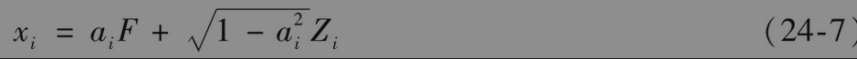
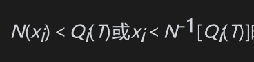
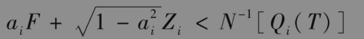
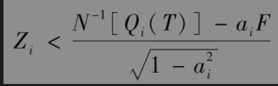
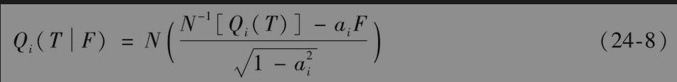
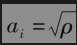
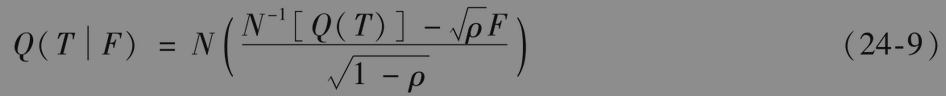

# 24.8 违约相关性

违约相关性(default correlation)用来描述两家公司同时违约的倾向。违约相关性的存在有许多原因：处于同一行业或位于同一地域的公司往往会受同样的外界因素影响，因此这些公司可能会同时遭遇财政困难。经济状况一般会造成在某些年份内的平均违约率高于其他年份。一家公司的违约可能会引起另一家公司的违约，即产生信用蔓延效应。违约相关性的存在意味着信用风险不能得到完全分散，这一点正是造成风险中性违约率远远大于现实世界违约率的重要原因（见第24.5节）。

当资产组合与多家交易对手有关时，违约相关性是决定组合违约损失概率分布的重要因素。[插图]研究人员提出了两种描述违约相关性的模型，一种是简化模型(reduced form model)，另外一种是结构模型(structural model)。

在简化模型中，假定不同公司的违约率服从与一些宏观经济变量相关的随机过程。当公司A的违约率很高时，公司B的违约率往往也会很高，这样就带来了公司之间的违约相关性。

简化模型的数学形式很吸引人，并反映了经济循环周期会带来违约相关性的倾向。其主要缺点是它所能取得的违约相关性的范围很有限。即使两家公司的违约率具有完美的相关性，它们在很短的时间区间里同时违约的概率通常也会很低。在某些情形下，这会产生问题。例如，当两家公司在同一行业和同一国家运作，或者出于某种原因，一家公司的财政状态与另一家公司的财政状态息息相关时，我们往往希望能够产生较高的违约相关性。一种解决这个问题的方式是通过在违约率中引入跳跃性推广模型。

结构模型是基于一种类似默顿模型的形式（见第24.6节）。当资产价值低于一定水平时，公司就会违约。公司A和B之间的违约相关性是通过公司A的资产价值所服从的随机过程与公司B的资产价值所服从的随机过程之间的相互关系描述的。结构模型的主要优点是该模型可以产生任意的相关系数，其主要缺点是计算速度很慢。

## 24.8.1 违约时间的高斯Copula模型

对于违约时间，一种越来越流行的实用工具是高斯Copula（关联结构）模型。我们可以证明，它与默顿结构模型类似：模型假设所有的公司最终都会违约，并试图量化两家或更多家公司违约时间概率分布的相关性。

高斯关联结构模型既可以用在现实世界里，也可以用在风险中性世界里。在现实世界里，一家公司违约时间概率分布的左端尾部可由如表24-1中所示的评级公司数据进行估计；在风险中性世界中，违约时间概率分布的左端尾部可由第24.4节里描述的债券价格信息进行估计。

定义t1为公司1的违约时间，t2为公司2的违约时间。如果t1和t2服从正态分布的话，我们可以假设t1和t2的联合分布为二元正态分布，但事实上，公司的违约时间连近似服从正态分布都不是。这正是引入高斯Copula模型的原因。我们将t1和t2用以下变换来转换为两个新的变量x1和x2

其中Q1和Q2分别为t1和t2的累积概率分布，N-1代表累积正态分布的逆函数［即当v=N(u)时，u=N-1(v)］。以上变换为分位数与分位数之间(percentile-to-percentile)的映射，t1概率分布上5%的分位数被映射到x1=-1.645，这正是标准正态分布上5%的分位数；t1概率分布上10%的分位数被映射到x1=-1.282，这正是标准正态分布上10%的分位数，等等。t2与x2之间的映射与此类似。

由构造过程可知x1和x2均服从均值为0、方差为1的正态分布。模型中假设x1和x2的联合分布服从二元正态分布，我们将这一假设称为采用了高斯Copula模型。使用这一假设会很方便，因为t1和t2的联合概率分布完全由t1和t2的累积违约分布Q1、Q2与一个相关参数定义。

高斯关联结构模型的诱人之处在于这一模型可以被推广到多个公司的情形。假如我们考虑n家公司，第i家公司的违约时间为ti，我们将ti转换为一个新的服从标准正态分布的变量xi，这里采用的映射为百分位数与百分位数之间的映射

其中Qi为ti的累积概率分布。然后我们假设这些xi服从多元正态分布，ti与tj之间的违约相关性由xi与xj之间的相关性定义。这一相关性被称为关联结构相关系数(copula correla-tion).

高斯关联结构模型常常被用于描述不服从正态分布的随机变量之间的相关性结构，这一模型允许将相关结构的估计与变量的边际（无条件）分布分开。虽然这些变量本身并不满足多元正态分布，但对每一个变量进行变换后，所有这些被变换后的变量满足多元正态分布。

【例24-7】 假定我们希望对10家公司在今后5年内的违约进行模拟。每两家公司之间的Copula违约相关系数为0.2。每家公司在今后1年、2年、3年、4年和5年内的累积违约概率分别为1%、3%、6%、10%和15%。在应用高斯Copula模型时，我们从多元正态分布中进行抽样从而得到xi(1≤i≤10)的样本，在这里每两个变量之间的相关系数都是0.2。然后我们将xi转换为违约时间ti。当从正态分布得出的样本小于(0.01)=-2.33时，违约发生在第1年；当样本介于-2.33和(0.03)=-1.88之间时，违约发生在第2年；当样本介于-1.88和(0.06)=-1.55之间时，违约发生在第3年；当样本介于-1.55和(0.10)=-1.28之间时，违约发生在第4年；当样本介于-1.28和(0.15)=-1.04之间时，违约发生在第5年；当样本大于-1.04时，在5年期间没有违约。

## 24.8.2 基于因子的相关性结构

在高斯Copula模型中，为了避免对每两个变量xi与xj之间都定义不同的相关系数，我们可以采用单因子模型，其假设为

在以上方程中，F为影响所有公司违约状态的共同因子；$`Z_i`$为只影响公司i的因子。F与$`Z_i`$服从独立标准正态分布；参数$`a_i`$是介于-1与1之间的常数；$`x_i`$与$`x_j`$之间的相关系数为$`a_ia_j`$。

假定公司i在T时刻之前违约的概率为$`Q_i(T)`$。在高斯Copula模型下，当满足条件时，违约在T时刻之前发生。由式(24-7)得出以上条件的等价形式

或

因此，在给定F值的条件下，违约概率为

单因子高斯Copula模型的一种特殊形式是当所有公司的违约概率分布都一样，并且所有不同的i和j之间的相关系数也都相同的情形。假定对所有i，Qi(T)=Q(T)，共同的相关系数为ρ，即对所有的i，。这时式(24-8)变为

