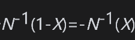
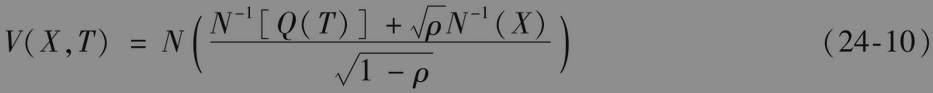
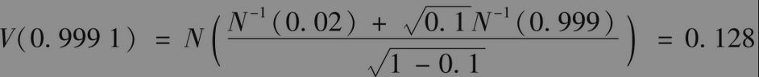
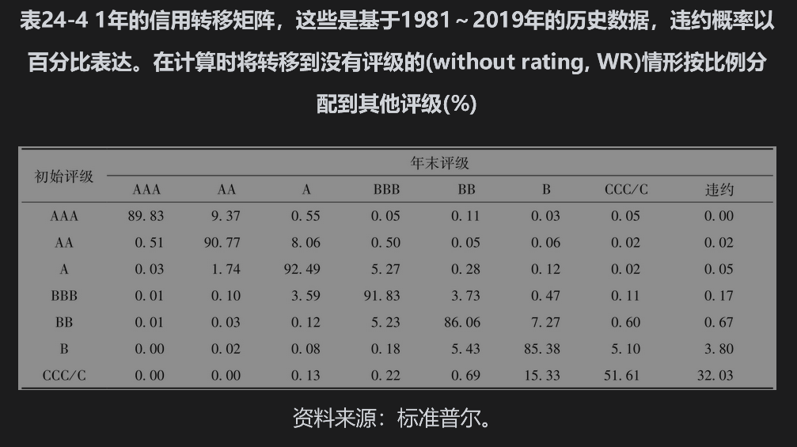
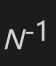

# 24.9 信用VaR

信用风险价值度的定义与市场风险价值度类似（见第22章）。例如，1年持有期的99.9%信用VaR表示在今后1年内有99.9%的把握信用损失将不会超出这个数量。

考虑一家持有一个很大贷款组合的银行，组合中的贷款比较相似。作为近似，假设每笔贷款的违约概率都相等，并且贷款之间的相关系数也都相等。当采用违约时间的高斯Copula模型时，式(24-9)的右端项是对截至时间T、违约量占整体交易组合百分比的一个很好的估计，该估计值为F的函数，其中F服从标准正态分布。我们有X%的把握肯定其价值大于。因此，我们有X%的把握肯定，在今后的T年内，违约概率不会超出V(X,T)，其中

以上结果是由Vasicek最先给出的。如式(24-9)所示，Q(T)为在时间T之前违约的概率；ρ为任意两个贷款之间的Copula相关系数。

当采用X%置信度时，持有期为T的信用VaR可以近似地估计为L(1-R)V(X,T)，其中L为贷款组合的大小，R为回收率。每笔规模为Li的贷款对整体VaR的贡献是Li(1-R)V(X,T)。这个模型是监管部门在计算信用资本金时所用的一些公式的基础。

【例24-8】 假定一家银行持有价值1亿美元的零售贷款，每笔贷款的年违约概率均为2%，违约时贷款的平均回收率为60%，Copula相关系数估计值为0.1，这时

这说明我们有99.9%的把握肯定违约率不会高于12.8%，1年持有期的99.9%信用VaR为100×0.128×(1-0.6)，即513万美元。

## 信用计量

了计算信用VaR，许多银行都开发了供自己内部使用的程序，其中最流行的方法是信用计量。该系统通过对所有交易对手的信用评级变化进行蒙特卡罗模拟以估计信用损失的概率分布。假定我们想确定一年后的损失概率分布。在每次模拟中，我们通过抽样决定每个交易对手在一年内的信用评级变化与违约，然后对每个尚未平仓的合约重新估价以计算整体组合在本年内的信用损失。通过大量的模拟实验，我们可以得出信用损失的概率分布，并且可以用此计算信用风险价值度。

信用计量方法的计算速度非常缓慢，但计算结果既体现了由违约所带来的损失，也体现了由于信用降级所带来的损失，同时也可以将第24.7节里所描述的信用风险缓解条款的作用反映在分析之中。

表24-4是由信用评级机构所提供的关于信用转移历史数据的典型例子。这种数据可以作为信用计量系统中蒙特卡罗模拟法的基础。表中数据显示债券在1年时间内由一种信用评级转变为另一种信用评级的概率。例如，一个当前信用评级为A的债券有92.49%的可能在第1年年底时的信用评级仍为A级，有0.05%的可能在第1年内违约，有5.27%的可能在第1年内降级为BBB级债券，等等。

在确定信用损失的抽样过程中，我们不应该将不同交易对手的信用评级变化假设为相互独立。与上一节里用来描述违约时间联合分布类似，可以用高斯Copula模型构造信用评级变化的联合概率分布。两个公司信用评级转移的Copula相关性一般设定为等于股票收益的相关性，处理方式是使用类似于第24.8节里所讨论的因子模型。

为了说明信用计量模型，假定我们采用表24-4所示的信用转移矩阵来对一家AAA级公司和一家BBB级公司在1年内的信用评级变化进行模拟。假设两家公司股票收益之间的相关系数为0.2。在每一次模拟试验中，我们对于两个服从标准正态分布的变量xA和xB进行抽样，并保证xA和xB之间的相关系数为0.2，变量xA决定AAA级公司新的信用评级，变量xB决定BBB级公司新的信用评级，因为（0.8983)=1.2719，当xA＜1.2719时，AAA级公司的级别保持不变；因为（0.8983+0.0937)=2.4089，当1.2719≤xA<2.4089时，AAA级公司信用级别变为AA级；因为(0.8983+0.0937+0.0055)=2.8070，当2.4089≤xA<2.8070，AAA级公司信用级别变为A级，并依此类推。考虑BBB级公司，因为（0.0001)=-3.7190，当xB<-3.7190时，BBB级公司的信用评级变为AAA；因为（0.0001+0.0010)=-3.0618，当-3.7190≤xB<-3.0618时，BBB级公司的信用评级变为AA；因为（0.0001+0.0010+0.0359)=-1.7866，当-1.7866<xB<-3.0618时，BBB级公司的信用评级变为A。AAA级公司在1年内不会违约，BBB级公司在xB>（0.9983)时违约，这对应于xB>2.9290。