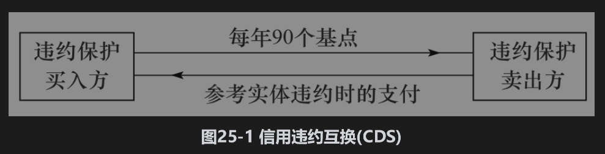

# 25.1 信用违约互换

最流行的信用衍生产品是信用违约互换(CDS)。第7.11节曾讨论过这种合约。这种合约是对某一特定公司违约的风险所提供的保险。这里所涉及的公司称为参考实体(reference entity)，而这个公司的违约定义为信用事件(credit event)。在信用事件发生时，保险的买入方有权将违约公司的债券以面值的价格卖给保险的卖出方，而保险的卖出方则同意按面值的价格买进债券。能够被卖出的债券总面值称为CDS的名义本金(notional principal)。

CDS的买入方定期向卖出方付款，直到CDS到期或信用事件发生。在标准合约中，定期付款通常是在每个季度末，但也有些交易规定付款的时间是在每月末、每半年末或者每年末，甚至可以提前付款。在违约事件发生后，合约的交割方式一般是现金支付。

下面例子可以帮助我们理解CDS的结构。假如某两家公司在2020年3月20日签订了一份5年期的信用违约互换，名义本金为1亿美元。为获得对某参考实体违约的保护，买入方同意每年付90个基点，每季度末付款一次。

CDS的结构如图25-1中所示。如果参考实体没有违约（也就是没有信用事件发生），CDS的买入方不会得到任何收益，并且需要在2020年6月20日和以后的每个季度末向卖方支付1亿美元的22.5个基点（90个基点的1/4），直到2025年3月20日。每个季度所支付的数量为0.00225×100000000，或225000美元。但是，当信用事件发生时，卖出方很可能需要向买入方支付一笔可观的赔偿。假设在2023年5月20日（在4年2个月后）买入方通知卖出方有信用事件发生。如果合约指定的交割方式为实物交割，买入方有权以1亿美元的价格向卖出方出售面值为1亿美元、由参考实体所发行的债券。如果合约指定以现金形式交割（目前一般是这种方式），在信用事件发生后的几天内将会由国际互换与衍生产品协会(ISDA)组织的拍卖过程确定最便宜可交割债券(cheapest deliverable bond)的市场中间价。假如通过拍卖确定了每100美元本金的股票只值35美元，这时CDS卖出方必须向买入方支付6500万美元现金。

当信用事件发生后，信用保护买入方向卖出方的定期付款就会终止。但是，因为付款时间是期尾，通常买入方在最后仍然需要向卖出方支付应计付款(accrual payment)。在我们的例子中，由于违约事件发生在2023年5月20日，买入方需要向卖出方支付由2023年3月20日到2023年5月20日之间的应计付款（大约为150000美元）。在这一次付款之后，买入方不再需要支付任何其他费用。

为了买入信用保护，买入方每年所付的名义本金的百分比称为CDS的互换溢差(CDS spread)。CDS市场的做市商是几家大银行。对于某公司5年期CDS的报价，做市商可能会给出250个基点的买入价与260个基点的卖出价，这意味着做市商将以每年250个基点（每年支付本金的2.5%）买入这家公司的信用保护，同时也将以每年260个基点（每年收入本金的2.6%）卖出这家公司的信用保护。

许多不同的公司和国家都可以成为市场上交易的CDS合约参考实体。付款频率通常为每季度一次，付款时间为期尾。5年期的CDS在市场上最为流行，但在市场上其他像1年、2年、3年、7年和10年期的CDS也较为常见。合约的到期日通常是以下标准日期：3月20日、6月20日、9月20日和12月20日。这种约定的结果是：在最初签订时，合约的真正期限年数与合约里所说的年数可能比较接近，但并不一定完全一致。假定你在2021年11月18日通知交易商要买入对某家公司5年期的信用保护，合约的有效期很有可能是到2026年12月20日。因此你的第一次付款日为2021年12月20日且金额是基于2021年11月18日～2021年12月20日这一段时间。CDS合约的关键是对违约事件的定义。违约事件通常为应当付款时未能支付、债务重组或破产。在北美的合约中，有时债务重组不算违约事件（尤其是在公司债务有很高收益率的情形下）。业界事例25-2里有更多关于CDS市场的内容。

## 业界事例25-2

## CDS市场

1998年和1999年，国际互换与衍生产品协会为在场外市场上交易的CDS建立了标准合约。从此，这个市场飞速发展。在许多方面，CDS合约与保险合约都很相似，但它们之间有一个关键区别：保险合约所保护的是买入方已经拥有资产的损失，而对CDS来讲，买方并不一定要拥有标的资产。

在2007年和2008年信用市场动荡期间，监管机构非常关心系统风险（见业界事例1-2）。他们认为CDS是使金融市场动荡的原因之一。这些产品的危险之处在于一家金融机构的违约可能会给予其有CDS交易的对手带来巨大损失，从而会进一步引起其他金融机构的违约。保险巨头AIG的麻烦更加重了监管机构的担忧。这家公司是对由按揭贷款生成的AAA-信用级别份额提供保险的大卖主（见业界事例24-1）。事实证明，这些保险对AIG来讲是非常昂贵的，并且需要美国政府对其进行援助。

在2007年和2008年这两年中，虽然许多信用衍生产品都停止了交易，但CDS交易仍然很活跃（尽管购买保护的费用大幅度上涨）。相对其他信用衍生产品而言，CDS的优点是结构简单明了，而其他信用衍生产品（像由住房按揭贷款证券化所生成的产品，见第8章）却缺乏透明度。

一家公司的CDS合约规模超过其债务总额的情况并不罕见。这时候显然需要对合约进行现金交割。当雷曼在2008年9月违约时，雷曼债务上的CDS合约总量是4000亿美元，而雷曼公司尚未平仓的债务却只有1550亿美元。对CDS合约买入方支付的（通过ISDA拍卖确定）现金额为面值的91.375%。

与本书中的其他场外交易衍生产品相比，CDS有一个很大的区别：其他衍生产品价值所依赖的是利率、外汇兑换率、股指以及商品价格，等等。对于这些市场变量，我们没什么理由去假设一个市场参与者会比另一个拥有更多的信息。信用违约互换溢差所依赖的是一家公司在某个特定时间段里违约的概率。对估计违约概率而言，一个市场参与者很有可能会比别人有更多信息。

为一家公司提供咨询、贷款、处理发行新证券业务的金融机构会比另一家与这个公司之间没有业务来往的金融机构更了解该公司的信用状况。经济学家将这种现象称为信息不对称(asymmetric information)。金融机构常常会强调，做出购买对某家公司信用风险保护决定的是风险管理人员，而不是基于和该公司之间有业务来往的其他部门所拥有的特殊信息。

## 25.1.1 CDS与债券收益率

CDS可以用来对冲企业债券头寸的风险。假定某投资者按面值的价格买入一个5年期、收益率为每年7%的企业债券，同时又签订了一份5年期，溢差为200个基点（或者2%）的CDS以获得对债券发行者违约时的保护，CDS起到的作用是（至少在近似意义上）将企业债券转换成无风险债券。如果债券发行人没有违约，投资者收益率为每年5%（企业债券收益率减去CDS溢差）；如果债券发行人违约，投资者在违约发生前的收益率为5%，然后根据CDS合约的条款投资者可以用债券换回债券的本金。投资者在收到本金后可以在剩余时间内将资金以无风险利率进行投资。

这说明一家公司的n年期CDS溢差应该大约等于这家公司的n年期债券收益率与无风险利率的差价。如果CDS溢差远低于这个差价，那么投资者通过买入企业债券并购买信用保护而得出的收益率（近似于无风险）会大于无风险利率；如果CDS溢差远高于这个差价，投资者可以卖空企业债券并卖出信用保护而得到小于无风险利率的借款利率。

CDS债券基点的定义是

             CDS债券基点=CDS溢差-债券溢差

其中债券溢差在传统上计算为债券收益率超过相关LIBOR/互换利率的部分。上面的无套利论证说明CDS-债券基点应当接近0。但事实上在有些时间段里这个值倾向于取正值（比如在2007年之前），在另一些时间段里会倾向于取负值（比如在2007~2009年）。在信用危机之后，CDS基点的正负取决于所依赖的参考实体。

## 25.1.2 最便宜可交割债券

如第24.3节解释的那样，债券的回收率等于债券在刚刚违约后的价格与面值的比率，这意味着CDS的收益等于L(1-R)，其中L为面值，R为回收率。

CDS合约通常指定在违约时可以选择几种不同的债券用于交割。这些债券的优先级别往往相同，但可能不同的是在违约发生后债券的卖价与本金的比率。这样一来，CDS给信用保护的买入方提供了选取某种最便宜可交割债券的期权。我们在前面已经提到过，最便宜交割债券的价值通常会由ISDA组织的拍卖程序决定，从而就确定了信用保护买入方的收益。

