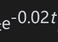
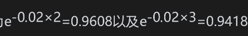
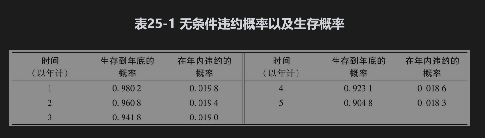
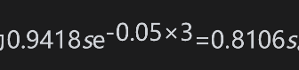
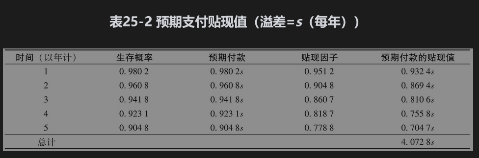
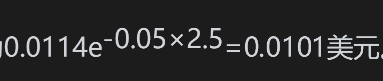
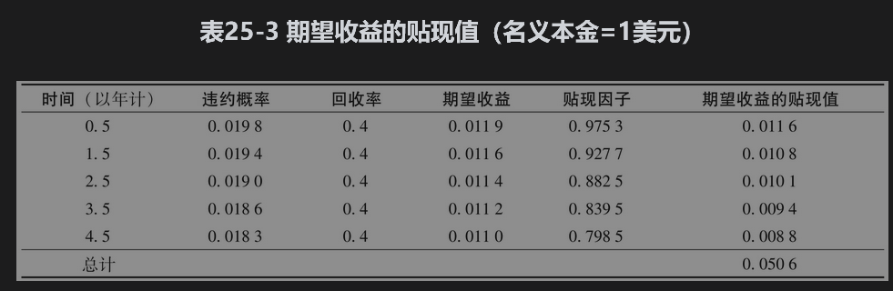
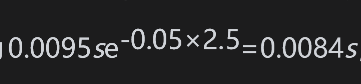
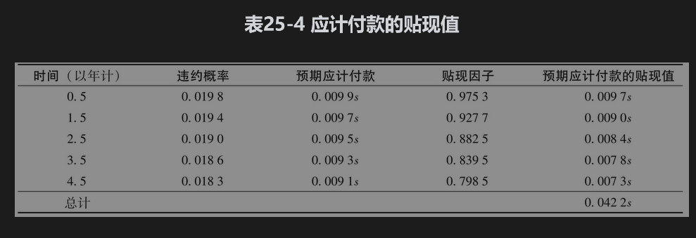
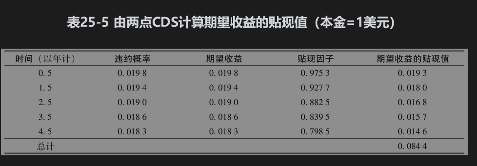

# 25.2 CDS定价

我们可以利用违约概率计算关于给定参考实体的CDS溢差。下面的简单例子可以说明这一点。

假设参考实体在CDS的整个5年期限内违约率为每年2%，表25-1给出了生存概率与无条件违约概率。如式(24-1)所示，假设生存到时间t的概率是，那么1年内违约的概率即为在年初生存的概率减去在年底生存的概率。例如，生存2年和生存3年的概率分别为，那么在第3年内违约的概率则为0.9608-0.9418=0.0190。

我们接下来假设违约只会发生在每年的中间，并且在CDS中信用保护的付款时间在每年的年底。我们还假定无风险利率为每年5%（连续复利），回收率为40%。我们将计算过程分为三部分，计算结果显示在表25-2、表25-3和表25-4中。

表25-2给出了CDS预期支付的贴现值，在这里我们假定溢差为s（每年），名义本金为1美元。例如，假设发生第3次金额为s的付款的概率为0.9418，那么预期付款金额则为0.9418s，贴现值为。依此类推，所有预期付款的贴现总和即为4.0728s。

表25-3给出了对应于名义本金为1美元的期望收益贴现值。在前面我们已经假设违约事件总是在年中发生。例如，收益发生在第3年年中的概率为0.0190，因为回收率为40%，所以对应于第3年年中的期望收益为0.0190×0.6×1=0.0114美元，贴现值为。期望收益贴现值的总和为0.0506美元。

最后一步，（如表25-4所示）我们需要计算在违约时的应计付款。例如，继续假设违约发生在第3年年中的概率为0.0190，此时对应的累计应计付款的期限为半年，所以应计付款的数量为0.5s。相对应地，这一时间段的预期应计付款为0.0190×0.5s=0.0095s，贴现值为，以及预期应计付款贴现值的总和为0.0422s。

结合表25-2和表25-4，预期支付的贴现值应为

               4.0728s+0.0422s=4.1150s

如表25-3所示，由于期望收益的贴现值为0.0506美元，由等式

               4.1150s=0.0506

得出s=0.0123。因此我们所考虑的5年期CDS溢差的市场中间价为0.0123乘以名义本金，或每年123个基点。这个结果也可以通过DerivaGem里的CDS计算表得出。在以上的计算里我们假设违约事件只可能发生在两个付款日中间。尽管在一般情况下这个简单假设就可以给出较好的结果，但我们仍可以很容易地将结果推广到违约可能发生在更多时间点上的情形。

## 25.2.1 对CDS按市值计价

与大多数其他衍生产品一样，CDS每天都会按市值定价。其价值可能是正，也可能是负。假设在我们例子中的CDS是在一段时间之前所签订的，溢差为150个基点，这时，买方所支付费用的贴现值应为4.1150×0.0150=0.0617，期望收益的贴现值则为0.0506。对于信用卖出方来讲，这一CDS的价值为0.0617-0.0506=0.0111，即名义本金的0.0111倍；对于信用保护的买入方而言，这一CDS按市场计价的价值则为本金的-0.0111倍。

## 25.2.2 估计违约概率

在CDS定价中采用的违约概率应该是风险中性违约概率，而不是现实世界里的违约概率（关于这两个概率的差别，见第24.5节中的讨论）。在第24章中，我们曾解释过如何从债券价格或资产互换价格中，估算风险中性违约概率。另外一种方法则是从CDS的报价中隐含违约概率的估计值。这种方式类似于在期权市场上交易商从比较活跃的期权价格中计算隐含波动率，然后用来对其他期权定价的做法。

在表25-2、表25-3和表25-4中的例子中，假设我们并不知道违约概率，但已知市场上5年期CDS的报价为每年100个基点。利用Excel里的Solver求解器，我们可以逆向计算出隐含违约概率为每年1.63%。

利用DerivaGem，我们可以通过信用溢差期限结构计算违约率的期限结构。

## 25.2.3 两点信用互换

两点信用互换(binary credit default swap)与普通的CDS相似，不同之处是它的收益为一个固定的值。假设在表25-1~表25-4的例子中对应的收益为1美元（而不是1-R）以及将两点CDS的溢差记为s。另假设表25-1、表25-2和表25-4中的数值不变，但由表25-5代替表25-3，那么新的两点CDS溢差则为4.1150s=0.0844，即s=0.0205或205个基点

## 25.2.4 回收率有多重要

无论我们是采用CDS溢差还是债券价格估计违约概率，我们都要有一个回收率的估计值。但是如果我们采用同样的回收率估算：①风险中性违约概率；②CDS价格。那么我们得出的CDS价值（或CDS溢差）对回收率的敏感性并不是很强，这是因为隐含违约概率大约同1/(1-R)成比例，而CDS的收益大约同1-R成比例。

以上讨论对两点CDS的定价并不成立。隐含违约概率仍然大约同1/(1-R)成比例，但是两点CDS的收益与R无关。如果已知普通CDS和两点CDS溢差，我们可以同时对回收率和违约概率进行估计（见练习题25.25）。