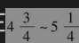

# 25.3 信用指数

信用衍生产品市场的参与者已经构造了一些用于跟踪CDS溢差变化的信用指数。2004年，不同的指数提供者达成了共识，从而使一些指数相互合并。指数提供者使用的两种最重要的标准交易组合如下所示。

(1)CDX NA IG：由北美125家投资级公司组成的组合。

(2)iTraxx欧洲：由欧洲125家投资级公司组成的组合。这些交易组合在每年的3月20日和9月20日更新。在指数中将会除去不再具备投资等级的公司，同时加入新的投资级公司。

假如某做市商对5年期CDX NA IG指数报出的买入价为65个基点，卖出价为66个基点（这称为指数溢差）。粗略地讲，这表示一个交易员可以按66个基点的价格买入125家公司中每家公司的CDS保护。假设一个交易员想对每家公司都取得面值为800000美元的保护，交易员的总费用为0.0066×800000×125，即每年660000美元。类似地，交易员也可以按每年650000美元的价格卖出125家公司中每家面值为800000美元的信用保护。当某家公司违约时，信用保护的买入方会得到像通常一样的CDS收益，并且付款费用每年会减少660000/125=5280美元。指数CDS最流行的期限是5年，但也有期限为3年、7年和10年的CDS指数合约。在指数上，这些类型合约的到期日通常为12月20日和6月20日（这意味着，5年合约的期限实际是在年）。粗略地讲，指数值等于标的资产组合所包含公司的CDS溢差平均值。