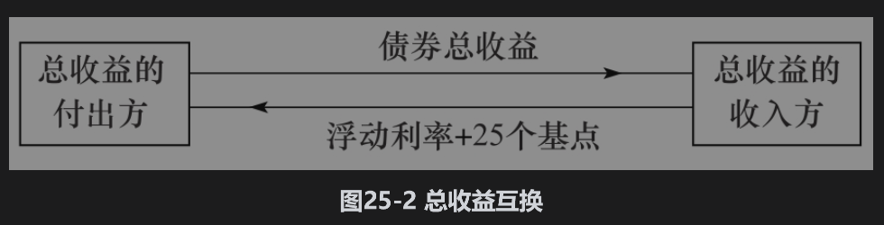

# 25.7 总收益互换

总收益互换(total return swap)是一种信用衍生产品，这是将某个债券（或任何资产组合）的总收益与浮动利率加上一个溢差进行交换的互换合约。资产的总收益包括券息、利息以及在互换期限内资产的盈亏。

例如，一个5年期名义本金为1亿美元的总收益互换，互换的一方将某企业债券的总收益同另一方浮动利率加上25个基点进行交换。如图25-2所示，在券息支付日期，总收益互换付出方将支付1亿美元债券所收入的券息，而收入方将支付1亿美元面值在浮动利率+25个基点下的利息。在互换合约结束时将会有最后一次付款以反映债券价值的变化：如果债券价值在互换期限内增长了10%，在5年末总收益互换的付出方需要向收入方支付1000万美元（1亿美元的10%）；如果债券价值降低了15%，总收益互换的收入方在5年末需要向付出方支付1500万美元。如果债券违约，总收益互换合约将会终止，但是总收益互换的收入方必须向付出方支付债券市场价格与1亿美元的差额。

如果在合约的期限末对双方均加上名义本金，我们可以这样刻画总收益互换：总收益的付出方支付由1亿美元公司债券投资所收入的现金流，总收益的收入方支付由面值为1亿美元、利率为浮动利率+25个基点的债券所收入的现金流，如果付出方拥有公司债券，总收益互换可以将债券的信用风险转让给收入方；如果付出方不拥有债券，总收益互换可以使其达到卖空债券的目的。

总收益互换常常被当作融资工具。以下情形会产生如图25-2所示的总收益互换合约：总收益的收入方为了对参考债券的1亿美元投资进行融资，从而与付出方（可能是金融机构）达成一项总收益互换协议。然后总收益付出方买入1亿美元的债券。对于总收益收入方而言，这样做的结果与按浮动利率+25个基点的利息贷款并买进债券是等价的。在总收益互换协议中，付出方在互换期限内仍然拥有债券的所有权。但对付出方而言，这样做比直接借钱给收入方买入债券，并以债券作为抵押品所面临的对手信用风险要小。如果总收益的收入方违约，付出方不用面临因抵押品的所有权问题而可能带来的法律纠纷。总收益互换与回购协议(repo)（见第4.1节）相似，它们的构造方式是为了减小融资时的信用风险。

在总收益互换中，由于总收益收入方有违约的可能性，在浮动利率之上的溢差是对总收益付出方所承受的这种违约风险的补偿。当参考债券价格下跌时，总收益互换收入方的违约将会给付出方带来损失，因此这一溢差依赖总收益互换收入方的信用质量、债券发行者的信用质量以及两者之间的相关性。

对以上所描述的标准交易还有几种不同形式：有时候在互换结束时，反映债券价格变化的现金付款可以由资产的实际交割代替。在这种情况下，在互换的到期日总收益付出方以标的资产换回名义本金。有时反映债券价格变化的支付会定期进行（而不是全等到互换结束时才支付）。