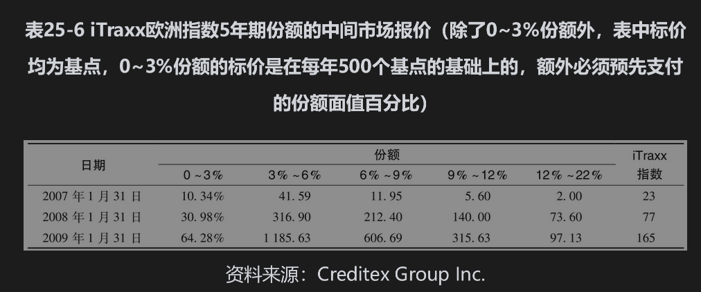

# 25.8 债务抵押债券

在第8章里，我们讨论了资产支持证券(ABS)。图8-1给出了这种产品的一种简单结构。当标的资产为债券时，这样的ABS称为债务抵押债券(CDO)。债券的利息与本金可以用与图8-2相似的瀑布形式定义。尽管瀑布形式的精确规则很复杂，但其设计原则是使高级份额比低级份额更可能收到所许诺的利息和本金。

## 25.8.1 合成CDO

当CDO是按照以上所述形式由债券组合产生时，所得结构被称为现金CDO(cash CDO)。信用产品市场上的一项重要发展是人们意识到在CDS中，如果参考实体是一家发行债券的公司，那么持有该参考实体企业债券的长头寸与持有该参考实体CDS的短头寸具有相似的风险。由此产生了另一种称为合成CDO(synthetic CDO)的产品结构。

合成CDO的发行者首先为该产品结构选取一个公司组合与期限（比如5年），然后出售组合中每家公司的CDS保护（CDS的期限与结构的期限相等）。合成CDO的本金等于其中所有CDS名义本金的总和。发行者收入的现金流等于CDS的溢差，而当组合中的公司违约时将会支出现金流。在构造合成CDO时将会形成不同的份额(tranche)，现金的流入和流出将会分配到设定份额里。相比之下，合成CDO中现金流入与流出分配的规则比现金CDO要更直截了当。假定一只合成CDO只有3个份额：股权份额、中间份额和高级份额，规则可能是以下的形式：

(1)股权份额承担CDS的支付，直到高达合成CDO本金的5%。股权份额收取份额本金剩余数量上每年1000个基点的差价。

(2)中间份额承担超过合成CDO本金5%，但最多不超过20%的支出。该份额收取份额本金剩余数量上每年100个基点的差价。

(3)高级份额承担超过合成CDO本金20%的支出。该份额收取份额本金剩余数量上每年10个基点的差价。

为了理解合成CDO是如何运作的，假设本金为1亿美元。股权份额、中间份额和高级份额的面值分别为500万美元、1500万美元和8000万美元。在刚开始，份额赚取在这些名义本金上预先指定的溢差。假设在一年后，由于该CDO组合中一些公司的违约而导致对CDS有200万美元的支付，那么股权份额持有者应对这些支付负责。与此同时，股权份额的本金则降到了300万美元。因此1000个基点的溢差是基于剩余的300万美元的本金（而不是最初的500万美元）。如果在CDO到期之前，对CDS又有400万美元的支付，那么股权份额的累计支付数目是500万美元，因此其剩余本金为0。这时中间份额将需要支付余下的100万美元。其剩余份额降到1400万美元。

现金CDO在刚开始时需要份额持有者的投资（用于购买标的债券）。与此相反，合成CDO持有者并不需要在开始时做任何投资，他们仅仅需要同意如何计算现金的流入和流出。但是在实际中几乎总是要求他们将最初的份额本金作为抵押。当一个份额要对CDS进行支付时，所需的金额将会从抵押金里扣除。抵押金账户里的余额将会赚取利息。

## 25.8.2 标准组合与单份额交易

在上述的合成CDO里，卖出的单个公司CDS保护组合构成了一个与债券组合等价的产品。当这个市场进一步发展后，人们意识到即使不构造任何标的资产组合，仍然可以交易份额。份额的现金流可以由一个想象中的参考组合决定。保护的买方向保护的卖方支付份额溢差，而保护的卖方向买方支付的数量对应于份额所负责的参考CDS组合的损失。有时，我们称这种交易为单份额交易(single tranche trading)，因为可以在无须交易任何其他份额的情况下只交易其中的一个份额。

在第25.3节里，我们讨论了像CDX NA IG和iTraxx欧洲这样的CDS指数。市场参与者利用这些指数里的标的组合定义标准合成CDO份额，而且这种产品的交易非常活跃。在iTraxx欧洲指数中，6个标准份额分别负责的损失为：0~3%、3%~6%、6%~9%、9%~12%、12%~22%和22%~100%；与之类似，CDX NA IG中的6个标准份额分别负责的损失为：0%~3%、3%~7%、7%~10%、10%~15%、15%~30%和30%~100%。

表25-6显示了2007～2009年金融危机对于iTraxx欧洲指数报价的影响。如第25.3节所述，指数的溢差是对指数中所有公司购买保护所需要的费用（以基点计算）。除了0~3%份额外，其余份额的报价是指购买该份额保护每年所需的费用（同样以基点计算；在前面解释过，当份额经历损失后，计算费用时的本金将会减少）。对于0~3%的股权份额，保护购买方需预先支付一笔费用，然后每年支付剩余份额本金上500个基点。表中的报价是指预先支付的金额作为初始份额本金的百分比。

两年来，信用市场上发生的变化真大！表25-6显示了信用危机导致信用溢差的暴涨：iTraxx指数从2007年1月的23个基点涨到了2009年1月的165个基点。单个份额的报价也显示了巨大幅度的上升。产生这些变化的其中一个原因是市场对投资级公司违约的概率增加了；另外一个原因是在许多情形下保护卖出方也遭遇了流动性危机，因此变得更加小心，从而要求更高的风险溢差以补偿所承受的风险。