# 25.10 合成CDO的定价

DerivaGem软件可以用来对合成CDO定价。假定合成CDO份额的付款时间为τ1，τ2,…,τm和τ0=0，定义Ej为在时刻τj时份额面值的期望值，v(τ)为在时刻τ收取1美元的贴现值，同时假定关于特定份额的溢差（即为了买入信用保护所支付的基点数）为每年s，该溢差是应用于剩余份额面值上。在以上条件下，CDO的预期正常付费贴现值应为sA。其中

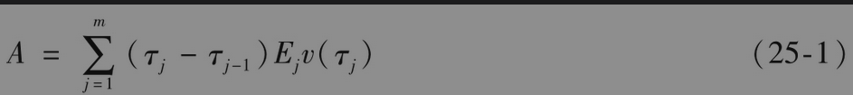

时刻τj-1与τj之间损失的期望值为Ej-1-Ej。假定损失发生在时间段的中间点（即在时刻0.5τj-1+0.5τj），CDO份额的期望收益贴现值则为

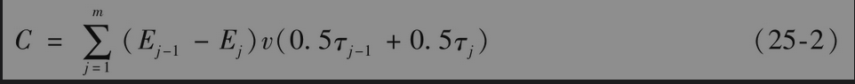

损失发生时的应计付款为sB，其中

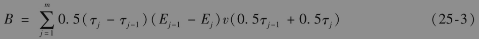

对于信用保护的买入方而言，份额的价值为C-sA-sB。两平溢差(breakeven spread)是指付款贴现值等以收益贴现值时的情形，即

           C=sA+sB

因此，两平溢差满足以下方程

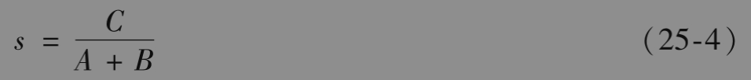

自此，式(25-1)~式(25-3)展示了份额期望面值在计算两平溢差时所起的关键作用。如果我们已知某份额在所有付款日时的期望面值，同时又假定已知零息利率曲线，那么我们可以通过式(25-4)计算盈亏平横溢差。

假如有预先支付与固定溢差s*（像表25-6中的0~3%份额，其中s*为500个基点），预先支付的数量作为面值的百分比为C-s*(A+B)。

## 25.10.1 利用违约时间的高斯Copula模型

在第24.8节中，我们引入了关于违约时间的单因子高斯Copula模型，这是对合成CDO定价的标准市场模型。假定所有公司在时间t内违约的概率均为Q(t)，式(24-9)将到时间t的无条件违约概率转换成在时间t之前及在因子F条件下违约的概率

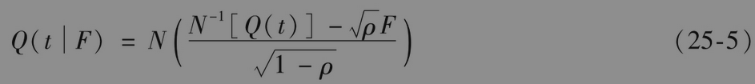

其中ρ是Copula相关系数，且在这里任何两家公司之间的相关系数被假定为相同。

在计算Q(t)时，通常假定公司的违约率为常数，并与指数的溢差一致。通过第25.2节中的CDS定价公式，我们可以求出违约率。但是在求解过程中，我们需要保证求到的违约率与指数的溢差相匹配。假定违约率为λ，由式(24-1)

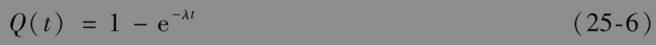

根据二项式分布的性质，在F的条件下，标准市场模型给出了正好有k个公司违约的概率

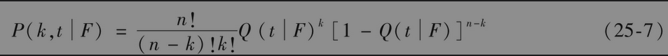

其中n为合成CDO中参考实体的总数量。假定这里考虑的份额所覆盖的资产组合损失范围为αL~αH，其中参数αL称为附着点(attachment point)，参数αH则称为离开点(detachment point)。定义

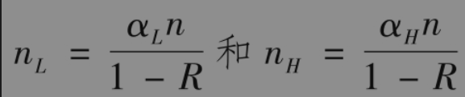

R为回收率；再有，定义m(x)为大于x的最小整数。在不失普遍性的前提下，我们可以假设份额的最初面值为1。当违约数量k小于m(nL)时，份额面值为1；当违约数量k大于或等于m(nH)时，份额面值为0；在其他情形下，份额的面值为

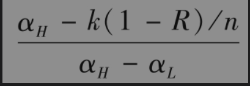

定义Ej(F)为在给定因子F值的条件下，份额面值在时刻τj的期望值，因此

定义A(F)、B(F)和C(F)分别为在F条件下A、B和C的值。与式(25-1)~式(25-3)类似，我们有

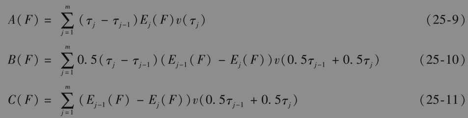

其中变量F服从标准正态分布。为了计算A、B和C的无条件值，我们必须对A(F)、B(F)和C(F)在标准正态分布下进行积分。一旦求得无条件值后，份额上的两平溢差等于C/(A+B)；预先支付等于C-s*(A+B)。

积分的计算最好通过高斯求积公式(Gaussian quadrature)完成。计算过程中涉及以下近似式

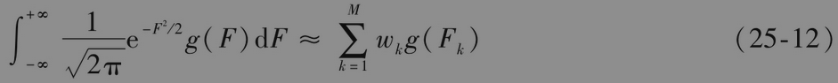

以上公式的精确程度随着M的增大而增大。对于不同的M，可以计算参数wk和Fk的取值。这里的M是DerivaGem里“积分点数”(number of integration points)的2倍。在一般情况下，将积分点数设成20就足够了。

【例25-2】 假设一份5年期的iTraxx欧洲的中间份额Copula相关系数为0.15，回收率为40%。这时αL=0.03，αH=0.06，n=125，nL=6.25以及nH=12.5。我们继续假设利率期限结构呈水平状，为3.5%，付款频率为每季度一次，指数的CDS溢差为50个基点。采用与第25.2节中类似的计算方式可以得到与CDS溢差相对应的常数违约率为0.83%（连续复利）。其他计算的摘要列举在表25-7中：在式(25-12)中M=60，因子Fk和权重wk的取值在表的最上部；在该因子值的条件下，利用式(25-5)~式(25-8)得到的份额的期望面值列在表的第二部分；同样在该因子值的条件下，由式(25-9)~式(25-11)得到的A、B和C的取值列在表的最后三部分。变量A、B和C的无条件值是通过在F概率分布上对A(F)、B(F)和C(F)进行积分而得出的。计算过程是在式(25-12)中轮流将g(F)换成A(F)、B(F)和C(F)。计算结果为

        A=4.2846,B=0.0187,C=0.1496

两平溢差为0.1496/(4.2846+0.0187)=0.0348，即384个基点。

这个结果可以通过DerivaGem得到。通过软件内的CDS工作表可以将50个基点的溢差转换成0.83%的违约率，然后利用CDS工作表与这个违约率并取30个积分点即可得到表中的结果。

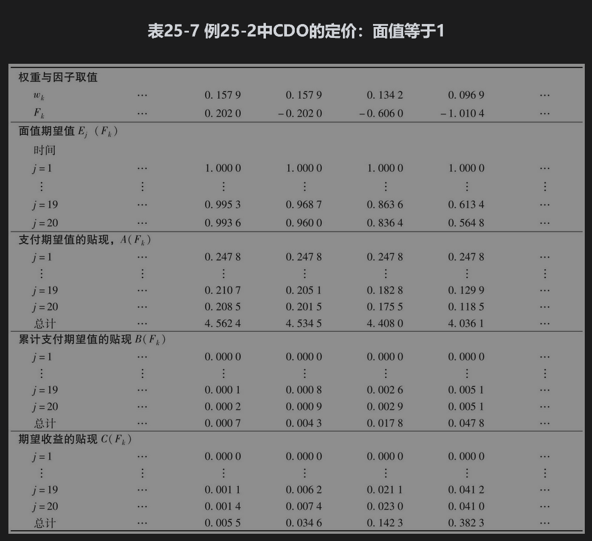

## 25.10.2 第k次违约CDS的定价

第k次违约CDS（见第25.6节）价值也可以通过在因子F条件下用标准市场模型求得。第k次违约发生在介于τj-1和τj之间的条件概率等于到τj时至少有k次违约发生的条件概率减去至τj-1时至少有k个违约发生的条件概率。由式(25-5)~式(25-7)，我们可以得出所求的概率为

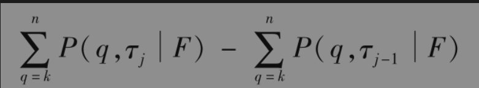

假定介于时间τj-1和τj之间的违约发生在时刻0.5τj-1+0.5τj，这样一来，我们可以在因子F的条件下以一般的CDS收益的计算方式计算收益的贴现值（见第25.2节）。通过在F上积分，我们可以求得费用和收益的无条件贴现值。

【例25-3】 假设一个组合由10个不同的债券组成，且每个债券的违约率为每年2%；假定我们想计算对第3次违约提供保护的CDS价格，并且该CDS的付款时间在每年的年底；假定Copula相关系数为0.3，回收率为40%，所有的无风险利率均为5%。如在表25-7中一样，我们考虑M=60个不同的因子值。债券在第1~5年的无条件累计违约概率分别为0.0198、0.0392、0.0582、0.0769和0.0952。式(25-5)表示在F=-1.0104的条件下，相应的违约概率分别为0.0361、0.0746、0.1122、0.1484和0.1830。通过二项式分布，截至第1~5年，至少有3个债券违约的条件概率分别为0.0047、0.0335、0.0928、0.1757和0.2717。其中，第3个债券在第1~5年中发生违约的条件概率分别为0.0047、0.289、0.0593、0.0829和0.0960。采用与第25.2节里类似的分析，我们可以得出在F=-1.0104的条件下，期望收益贴现值、付款贴现值、应计付款贴现值分别为0.1379、3.8443s和0.1149s，其中s代表溢差。表溢差。对其他的59个因子值可以利用类似的计算方式，然后利用式(25-12)在F上求积分。由此得出收益的无条件贴现值、付款贴现值和应计付款贴现值分别为0.0629、4.0580s和0.0524s。CDS的两平溢差为0.0629/(4.0580+0.0524)=0.0153，即153个基点。

## 25.10.3 隐含相关系数

在标准市场模型中，回收率通常被假定为40%，因此，参数ρ为模型中唯一的未知参数。这一特性与在布莱克—斯科尔斯—默顿模型中波动率是唯一未知参数的情形相同。市场参与者喜欢由份额市场报价来隐含出相关系数，这一点与他们由期权价格隐含出期权波动率的做法是相似的。

假定份额{αL,αH}从低级到高级的排序为{α0，α1}，{α1，α2}，{α2，α3}，…其中α0=0（例如在iTraxx欧洲指数里，α0=0,α1=0.03，α2=0.06，α3=0.09，α4=0.12，α5=0.22，α6=1.00）。通常有两种不同的隐含相关系数度量：一种是复合相关系数(compound correlation)或份额相关系数(tranche correlation)。对于份额{αq-1，αq}，这是使得通过模型得到的份额溢差与市场溢差一致的相关系数ρ，它可以通过迭代的方式进行；另一种相关系数叫基础相关系数(base correlation)。对于任意一个αq(q≥1)，这是使份额{0,αq}的价值与市场价值一致的参数。其计算步骤如下：

(1)计算每个份额的复合相关系数。

(2)利用所得到的复合相关系数，计算每个份额在CDO期限内损失期望值的贴现值占最初份额面值的百分比。这一比率即前面已经定义过的变量C。假定对于份额{αq-1，αq}来讲，相应的C取值为Cq。

(3)计算份额{0,αq}损失期望值的贴现值占整体标的资产组合份额面值的百分比，所得值等于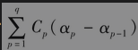。

(4)对应于份额{0,αq}的C值等于第三步求得的数量除以αq。基础相关系数就是与以上C值保持一致的相关系数ρ，这可以通过迭代法求得。

对于表25-6中所提到的2007年1月31日的iTraxx欧洲指数，图25-3显示了上面第三步中对份额损失贴现值占整体资产组合份额面值百分比的计算结果。表25-8给出了这些报价的隐含相关系数。这些结果是通过DerivaGem求到的。其中假设利率期限结构为水平，每年3%，回收率为40%。CDS工作表显示对应于23个基点溢差的违约率为0.382%。隐含相关系数是通过CDO工作表计算的。图25-3所用的值也可以利用上面第3步里的表达式通过这个工作表计算。

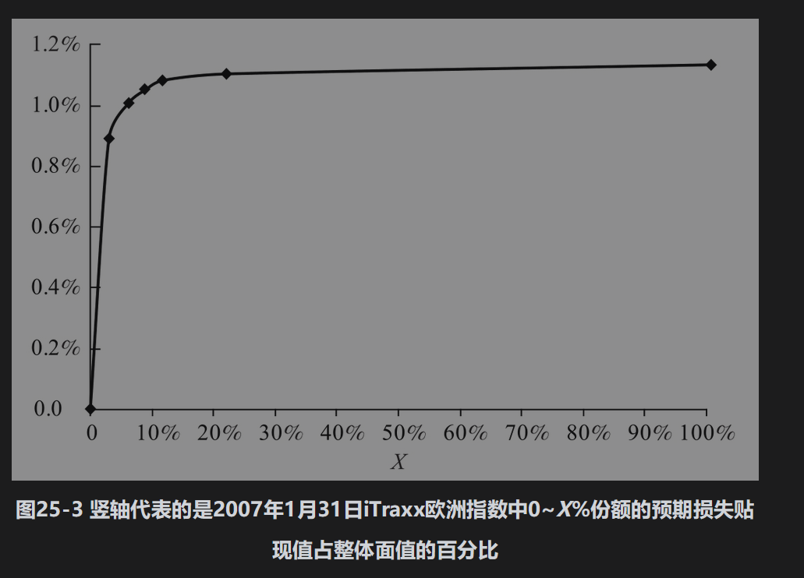

表25-8所示的相关系数规律是在市场上所观察到的相关系数微笑(correlation smile)。当份额级别变得越来越高时，隐含相关系数首先下降，然后又升高。基础相关系数展示相关系数偏态(volatility skew)特性：基础相关系数是份额附着点的递增函数。

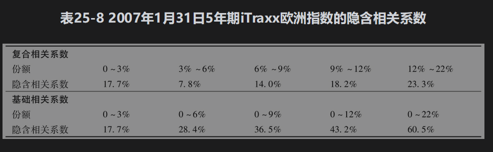

如果市场价格与单因子高斯Copula模型一致，那么对于所有的份额，隐含相关系数（无论是复合相关系数还是基础相关系数）均应相等。但从实际中所观察到的明显的微笑和偏态特性，我们看出市场价格与这种模型并不统一。

## 25.10.4 非标准份额的定价

对iTraxx欧洲指数中标准资产组合，我们并不需要利用模型计算标准份额的溢差，因为我们在市场上就可以观察到这些溢差。但是有时人们需要对标准资产组合中的非标准份额提供报价。比如，你想得到iTraxx欧洲指数中4%~8%份额的报价，一种方法是通过对基础相关系数进行插值得到对应于0~4%份额和0~8%份额的基础相关系数。由这两个相关系数，我们可以计算这些份额预期损失的贴现值（作为整体资产组合面值的百分比）。4%~8%份额预期损失的贴现值（作为整体面值的百分比）可以被估计为0~8%份额与0~4%份额预期损失贴现值之差。由此我们可以隐含出复合相关系数，并得出份额的两平溢差。

现在人们认识到以上的做法并不是最佳的选择。更好的做法是对于每个标准份额，我们计算出相应的预期损失，并产生类似于图25-3的图形。该图形显示了0~X%份额的预期损失随X的变化。在这个图形上进行插值，我们得出0~4%份额和0~8%份额的预期损失。由这两个值的差作为对4%~8%份额预期损失要比通过对基础相关系数进行插值而得到的结果更好。

我们可以证明为了保证无套利条件的成立，图25-3中预期损失的速度必须随着X的降低而递增。如果对基础相关系数进行插值，并由此计算预期损失，无套利条件常常会得不到满足（这里的原因在于0~X%份额的基础相关系数是0~X%份额预期损失的非线性函数）。因此对预期损失直接进行插值要远远优于对基础相关系数进行插值的间接方法，而且这样做可以保证所提到的无套利条件成立。