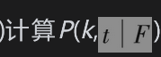

# 25.11 标准模型的替代

在这一节里，我们将简要地讨论一些可以用来代替已经成为市场标准的单因子高斯Copula模型的其他模型。

## 25.11.1 异质模型(heterogeneous model)

市场标准模型是一种同质模型(homogeneous model)。在同质模型中，所有公司的违约时间概率分布相同，而且任意两家公司之间的Copula相关系数也相等。为了采用更为通用的模型，我们可以放宽同质性的假设，但是由此得出的模型会更复杂。因为各家公司在任何时间段内都会有不同的违约概率，因此我们不能再由二项式公式即式(25-7)。这时我们需要使用像Andersen等(2003)以及Hull和White(2004)里所描述的数值方法。

## 25.11.2 其他Copula模型

单因子高斯Copula模型是用于描述违约时间之间相关性的特殊模型。除此之外还有许多其他的单因子模型，其中包括Student t Copula模型、Clayton Copula模型、Archimedean Copula模型以及Marshall-Olkin Copula模型。我们还可以通过假设式(24-7)中的F和Zi服从均值为0、方差为1的非正态分布得出新的模型。Hull和White指明当F和Zi为具有4个自由度的Student t分布时，模型可以与市场达到较好的匹配，他们将相应的模型叫作双重t Copula(double t Copula)模型。

另一种处理方式是增加模型中的因子个数。但是这样做会使模型的运算变得很缓慢，原因是需要在多个（而不是只在一个）正态分布上积分。

## 25.11.3 随机回收率与因子载荷模型

Andersen和Sidenius提出了一种将式(25-5)中的Copula相关系数ρ取成F函数，而且回收率与违约率具有负相关性的模型。

一般来讲，ρ会随F的减小而增大，这意味着当违约率较高时（即当F较低时），违约相关性也会很高。实证结果确实证明了这一点。Andersen和Sidenius发现他们的模型对于市场报价的匹配比标准市场模型更好。

## 25.11.4 隐含Copula模型

Hull和White说明了如何由市场报价计算Copula隐含函数。这种模型的最简单形式是假定在CDO期限内对所有公司均采用某个平均违约率，平均违约率的概率分布可以通过份额的市场价格以隐含的方式得出。在概念上讲，计算隐含Copula的做法同第20章中由期权价格计算隐含概率分布的做法相似。

## 25.11.5 动态模型

到目前为止，我们所讨论的模型均可以归纳为静态模型(static model)。从根本上来讲，这些模型只是在CDO期限内对平均违约环境进行模拟。对5年期CDO所构造的模型与对7年期CDO所构造的模型是不同的，而后者与对10年期CDO所构造的模型也不相同。动态模型(dynamic model)与静态模型有所不同，它试图对资产组合随时间变化的损失进行模拟。动态模型分为以下3种类型。

(1)结构模型(structural model)：这类模型与第24.6节里所描述的模型类似，其不同之处在于需要同时建立描述许多公司资产价值的随机过程。当公司资产的价值达到一定的边界值时就会发生违约。资产价值所服从的过程之间具有相关性。这类模型的缺点是在实现过程中必须采用蒙特卡罗模拟法，所以校正过程比较困难。

(2)简化模型(reduced form model)：这类模型是对公司的违约率进行模拟。为了建立比较切合实际的相关系数，需要在违约率上附加一些跳跃。

(3)自上而下模型(top down model)：这类模型对资产组合的整体损失进行模拟，不考虑单一公司的信用变化。