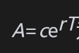

# 26.1 组合期权

组合期权(package)是由标准欧式看涨期权、欧式看跌期权、远期合约、现金以及标的资产所构成的证券组合。我们在第12章里曾经讨论过若干组合期权：牛市差价、熊市差价、蝶式差价、日历差价、跨式组合、异价跨式组合，等等。

交易员经常将组合期权设计成初始成本为0。其中的一个例子是范围远期合约。在第17.2节中我们曾讨论过这种产品：范围远期合约由一个看涨期权的多头寸和一个看跌期权的空头寸组成，或者由一个看涨期权的空头寸和一个看跌期权的多头寸组成，这里的看涨期权执行价格大于看跌期权执行价格，而且执行价格的选取使得看涨期权的价格等于看跌期权的价格。

值得注意的是，通过将衍生产品的付费延迟到到期日，我们可以将任何产品转换为零费用产品。考虑一个欧式看涨期权。如果c为在0时刻支付的期权价格，那么为在到期日，即T时刻支付的费用。期权收益为max($`S_T`$-K,0)-A或max($`S_T`$-K-A,-A)。当执行价格等于远期价格时，延迟付费产品的其他名称为断点远期(break forward)、波士顿期权(Boston option)、可撤远期(forward with optional exit)和可取消远期(cancelable forward)。