# 26.2 永续美式看涨与看跌期权

当标的资产以比率q支付股息时，衍生产品价格所满足的微分方程为式(17-6)

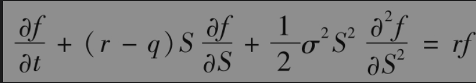

考虑当S=H时支付数量Q的衍生产品。微分方程在S＜H时的边界条件：当S=H时，f=Q；当S=0时，f=0。当α＞0，函数f=Q(S/H)α满足边界条件。如果α满足方程

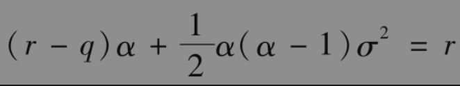

那么f将满足微分方程。这个方程的正解是α=α1，其中

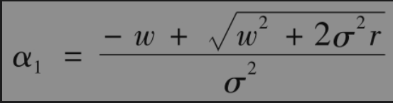

以及$`w=r-q-σ^2/2`$。因为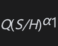既满足边界条件又满足微分方程，所以这肯定是期权的价值。

接下来考虑执行价格为K的永续美式看涨期权。假如当S=H时，期权被行使，收益是H-K。由上面的结果，期权的价值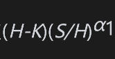时的资产价格H。最优的H值使我们刚计算的价值达到最大。利用标准的微分方法，得出最优的选择是H=H1，其中

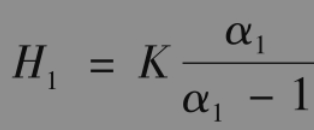

因此如果S＜$`H_1`$，永续美式期权的价格为

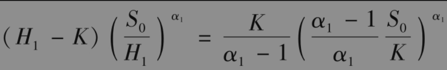

如果S＞$`H_1`$，应当马上执行期权，价值是S-K。

为了对美式看跌期权定价，考虑在S＞H的情形下（以便从上方达到障碍H），当S=H时，收益是Q的衍生产品。在这种情形下，微分方程的边界条件是S=H时f=Q，而当S趋于无限时，f=0。这时如果α＞0，函数f=Q(S/H)-α满足边界条件。与上面相同，当$`α=α^2`$时，函数也满足微分方程，其中

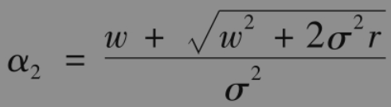

如果美式看跌期权持有人在S=H时选择行使期权，看跌期权的价值(K-H)（S/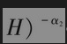。期权持有人将会选择使得价值达到最大的行使水平H=H2，即

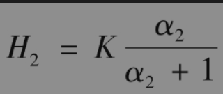

当S＞$`H_2`$时，永续期权的价格是

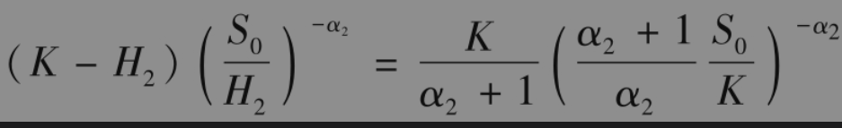

如果S＜$`H_2`$，应当马上行使期权，价值是K-S。

第15.6节与练习题15.31给出了当q=0时这里结果的特殊情形。

