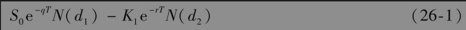
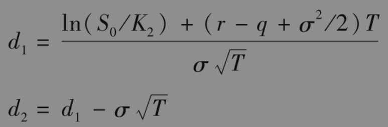
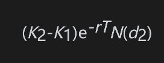
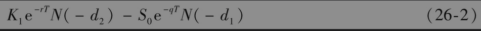

# 26.4 缺口期权

缺口看涨期权是一种欧式期权，当ST>K2时，其收益为ST-K1。缺口看涨期权与具有执行价格K2的普通看涨期权之间的区别是，当ST>K2时，收益增加了K2-K1。当K2＞K1时，这个数量为正；当K2＜K1时，这个数量为负。

对缺口看涨期权定价时，将布莱克-斯科尔斯-默顿公式稍加修改即可。采用常用的记号，这个值等于

其中

这个公式给出的价格比通常的布莱克-斯科尔斯-默顿公式给的执行价格为K2的普通看涨期权价格高出

为了理解这个差别，注意行使期权的概率是$`N(d_2)`$，而当行使期权时，缺口看涨期权持有人的收益比普通看涨期权持有人的收益高出$`K_2-K_1`$。

对缺口看跌期权，当$`S_T＜K_2`$时，其收益为$`K_1-S_T`$。期权的价值等于

其中d1和d2的定义如式(26-1)所示。

【例26-1】 某资产的目前价值为500000美元。在今后1年内，预计其波动率为20%。无风险利率为5%，资产没有任何收入。假如一家保险公司同意在1年年末资产的价值低于400000美元时以400000美元的价格收购该资产，那么只要资产的价值低于400000美元，保险公司就要支付400000-ST。保险公司给投保人提供了一个普通看跌期权：投保人有权在1年年末按400000美元的价格将资产卖给保险公司。这份保险的价值可以由式(15-21)计算，其中$`S_0`$=500000,K=400000,r=0.05,σ=0.2，T=1。价值是3436美元。

以下假定转移资产的费用是50000美元，而这项费用由投保人承担。这时只有当资产的价值低于350000美元时，期权才会被行使。在这种情况下，当$`S_T＜K_2`$时，对保险公司而言费用为$`K_1-S_T`$，其中$`K_2`$=350000,$`K_1`$=400000,$`S_T`$为1年后资产的价格。这里的保险是一个缺口看跌期权，其价值可以通过式(26-2)来计算，其中S0=500000,$`_K_1`$=400000,$`K_2`$=350000,r=0.05，q=0,σ=0.2，T=1。价值是1896美元。在本例中，将索赔时投保人的费用考虑在内后，这项保险对保险公司的费用将会降低大约45%。