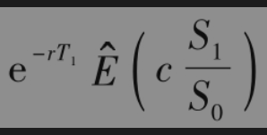
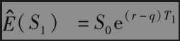
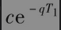

# 26.5 远期开始期权

远期开始期权(forward start option)是在未来某时刻才开始的期权，第16章里所讨论的雇员股票期权可以看成远期开始期权：在一个典型的雇员股票期权计划中，公司（明确或不明确地）向其雇员许下了在将来某时刻向雇员发放平值期权的承诺。

考虑一个远期开始平值欧式看涨期权，期权开始时刻为T1，到期日为T2。假定资产在0时刻的价格为$`S_0`$，在$`T_1`$时刻的价格为$`S_1`$。为了给这一期权定价，我们注意到在第15章和第17章中给出的欧式平值看涨期权的价格与资产价格成比例。因此，在T1时刻，远期开始的期权价格为$`cS_1/S_0`$，其中c为在0时期限为$`T_2-T_1`$的平值期权价格。采用风险中性定价，在时刻0远期开始期权的价格为

其中代表风险中性世界里的期望值。因为c和$`S_0`$为已知，并且，我们得出远期开始期权的价格为。对于无股息股票，q=0，远期开始期权的价格与具有相等期限的普通平值期权价格相等。