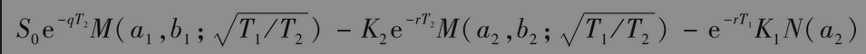
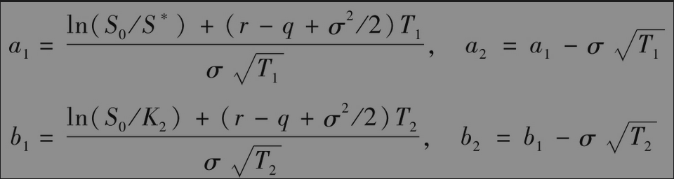
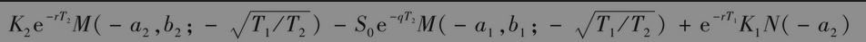
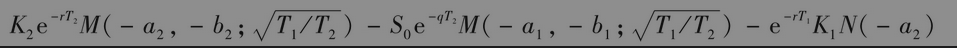
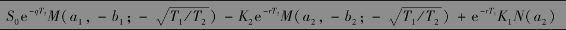

# 26.7 复合期权

复合期权(compound option)是期权上的期权。复合期权主要有四种类型：看涨-看涨期权、看涨-看跌期权、看跌-看涨期权、看跌-看跌期权。复合期权有两个执行价格和两个到期日。例如，考虑如下看涨-看涨期权：在第一个到期日T1，复合期权持有人有权支付K1的执行价格来获得看涨期权，所得看涨期权给期权持有人按第二个执行价格K2在第二个到期日T2买入资产的权利。只有第二个期权在第一个到期日时的价格高于第一个执行价格时，复合期权才会被行使。

在通常的几何布朗运动假设下，欧式复合期权的价格可由涉及二元正态分布积分的解析公式来表达。采用通常的符号，欧式看涨-看涨期权的价格为

其中

其中M(a,b；ρ)代表第一个变量小于a、第二个变量小于b、相关系数为ρ的二元正态累积分布函数。变量S*对应于在时间T1、期权价格等于K1的资产值。在时间T1，如果资产价格大于S*，第一个期权将被行使；如果资产价格小于S*，第一个期权在到期时价值为0。

利用类似的符号，欧式看跌-看涨期权的价格为

欧式看涨-看跌期权的价格为

欧式看跌-看跌期权的价格为

