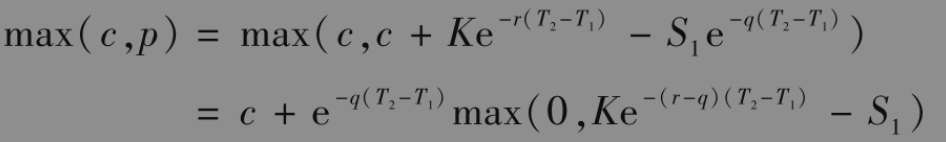
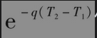
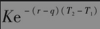

# 26.8 选择人期权

选择人期权(chooser option)有时也被称为任选期权(as-you-like-it option)。该期权具有以下特性：在经过一段指定的时间之后，持有人能够选择所持有的期权是看涨期权还是看跌期权。假定持有人做出选择的时刻为T1，这时选择人期权的价值为

                   max(c,p)

其中c为选择人期权中看涨期权的价格，p为选择人期权中看跌期权的价格。

如果选择人期权的两个标的期权均为欧式期权，并且具有同样的执行价格，那么我们可以通过看跌-看涨期权的平价关系式推导出选择人期权的定价公式。假定$`S_1`$为标的资产在T1的价格，K为执行价格，$`T_2`$为期权的到期日，r为无风险利率，q为标的资产的股息收益率。由看跌-看涨期权的平价关系式得出

以上关系式显示选择人期权是一种组合期权，其构成为

(1)执行价格为K，到期日为$`T_2`$的看涨期权；

(2)份执行价格为、到期日为$`T_1`$的看跌期权。

因此，可以很容易地对选择人期权进行定价。

我们可以定义更复杂的选择人期权，其中看涨和看跌期权的执行价格与期限可以各不相同。这种选择人期权不再是简单的期权组合，其特性在某些方面与复合期权相似。