# 26.9 障碍期权

障碍期权(barrier option)的收益依赖于标的资产的价格在一段指定时间区间内是否达到某个特定水平。

在场外市场里经常交易多种不同的障碍期权。因为它们比相应的普通期权便宜，所以障碍期权颇受投资者的青睐。障碍期权可分为敲出期权(knock-out option)和敲入期权(knock-in option)两类。当标的资产价格达到一定水平时，敲出期权不再存在；当标的资产价格达到一定水平时，敲入期权才开始存在。

式(17-4)和式(17-5)给出了普通欧式看涨期权和看跌期权在0时刻的价格

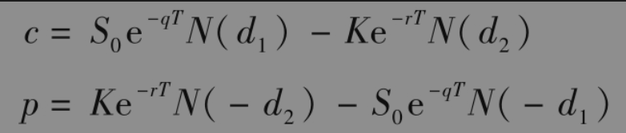

其中

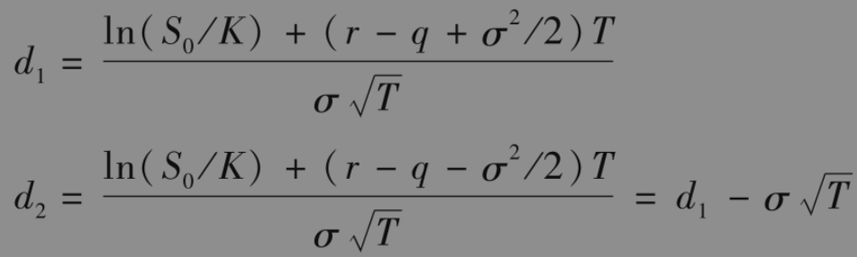

下跌-敲出看涨期权(down-and-out call)是敲出期权的一种，这种期权是一种普通的看涨期权，但当资产价格下跌到一定障碍水平H时，期权自动消失。障碍水平低于初始资产水平。与之相对应的敲入看涨期权为下跌-敲入看涨期权(down-and-in call)，这是一种普通看涨期权，但只有当资产价格下跌到障碍水平H时，这种期权才会生效。

当H低于或等于执行价格K时，下跌-敲入看涨期权在0时刻的价值为

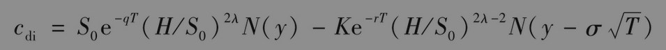

其中

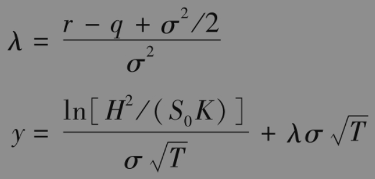

因为一个普通的看涨期权等于一个下跌-敲入看涨期权加上一个下跌-敲出看涨期权，因此，下跌-敲出看涨期权的价格为

              cdo=c-cdi

当H≥K时

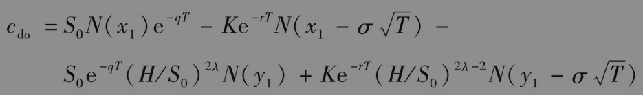

以及

               cdi=c-cdo

其中

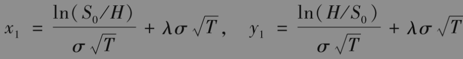

上涨-敲出看涨期权(up-and-out call)是一种普通看涨期权，但当资产价格达到一定障碍水平H时，期权自动消失，H高于目前资产价格。上涨-敲入看涨期权(up-and-in call)是一种普通看涨期权，但只有当资产价格上升到一定水平H时，这种期权才会生效。当H小于或等于K时，上涨-敲出看涨期权价格为0，上涨-敲入看涨期权的价格为c。当H大于执行价格K时，我们有

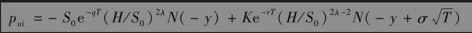

以及

当H小于或等于执行价格K时，我们有

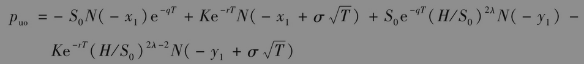

以及

下跌-敲出看跌期权(down-and-out put)是一种看跌期权，但当资产价格下降到一定障碍水平H时，期权自动消失。下跌-敲入看跌期权(down-and-in put)只有当资产价格下降到一定水平H时，这种期权才会生效。当H大于或等于K时，pdo=0和pdi=p。当H小于执行价格K时，我们有

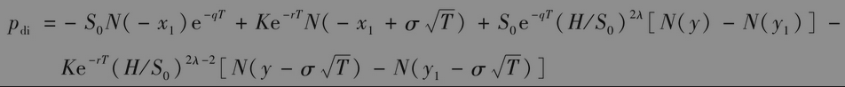

以及

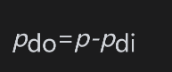

在所有以上的定价公式中均假设了资产价格在将来时刻的分布为对数正态。有关障碍期权的一个重要问题是对资产是否达到障碍值的观察频率。在以上的解析结果里我们假定以连续的形式观察资产是否达到障碍值，有时实际情况确实如此。但在更多的时候，合约会阐明观察S值具有一定的周期性（例如，每天中午12点）。当观察资产的形式为不连续时，Broadie、Galsserman和Kou给出了一种对以上公式进行调整的解析公式，结果如下：对于上涨-敲入和上涨-敲出，障碍水平H被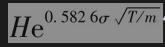代替；对于下降-敲入和下降-敲出期权，障碍水平H被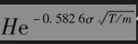代替，其中m为观察资产的次数（因此，T/m为每次观察时间的间隔）。

障碍期权同普通期权有很不一样的性质。例如，有时障碍期权的vega为负值。考虑一个上涨-敲出看涨期权，当标的资产的价格接近障碍水平时，波动率增加会导致标的资产价格达到障碍水平的概率增加，因此波动率的增加会造成障碍期权的价值下降。

到现在为止，我们所考虑的障碍期权的一个缺陷是如果标的资产价格出现“尖峰”，那么这将会导致期权被敲入或敲出。另一种结构是巴黎期权(Parisian option)，这时只有当资产价格高于或低于障碍水平一段时间后，期权才会被敲入或敲出。例如，考虑一个下降-敲出巴黎看跌期权，执行价格为初始价格的90%，障碍水平为初始价格的75%。当资产价格低于障碍水平的天数达到50天时，期权将被敲出。期权可能会指明这里的50天为“连续50天”，或“期权期限内任何50天”。对巴黎期权的定价要比对普通障碍期权的定价更加困难。将蒙特卡罗模拟方法与二叉树方法进行改进后，可以用来对这类期权定价（见第27.5节和第27.6节里的讨论）。