# 26.11 回望期权

回望期权(lookback option)的收益与在期权有效期内标的资产价格所达到的最大值或最小值有关。浮动回望看涨期权(floating lookback call option)收益等于最后的标的资产价格超出在期权有效期内标的资产最低价格的差价。浮动回望看跌期权(floating lookback put option)的收益等于期权有效期内标的资产最高价格超出最后标的资产价格的差价。

欧式浮动回望期权具有解析定价公式。欧式浮动回望看涨期权的定价公式为

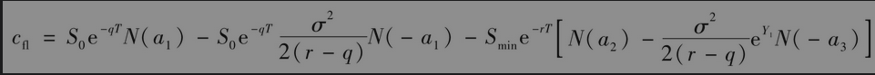

其中

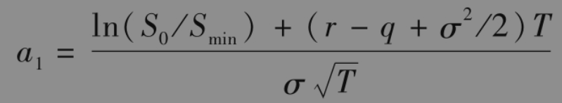

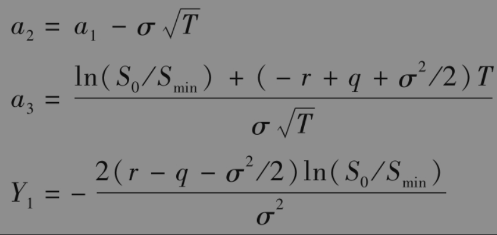

为资产价格到目前为止所取得的最小值（如果回望期权刚刚开始，那么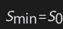）。对于r=q的情形，见练习题26.23。

欧式浮动回望看跌期权的定价公式为

其中

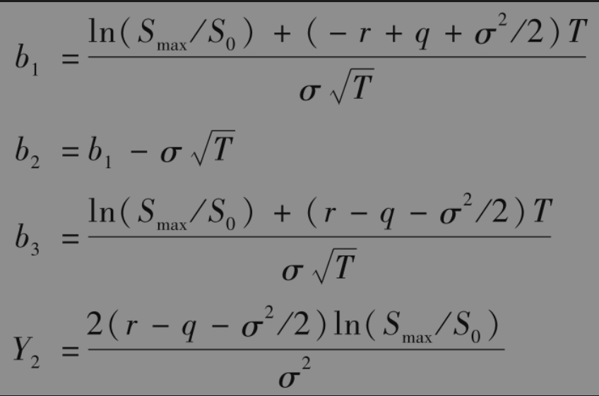

为资产价格到目前所取得的最大值（如果回望期权刚刚开始，那么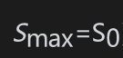）。

浮动回望看涨期权是为了保证期权持有者能以期权有效期内资产能达到的最低价格买入资产。类似地，浮动回望看跌期权是为了保证期权持有者能以期权有效期内资产所达到的最高价格卖出资产。

【例26-2】 考虑某无股息股票上刚刚开始的浮动回望看跌期权，股票价格为50美元，股票价格波动率为每年40%，无风险利率为每年10%，期限为3个月。这时Smax=50,S0=50,r=0.1，q=0,σ=0.4和T=0.25。由以上公式得出b1=-0.025，b2=-0.225，b3=0.025，以及Y2=0。因此，欧式回望看跌期权的价值为7.79。同一股票上刚刚开始的浮动回望看涨期权价值为8.04。

在固定回望期权中，执行价格是指定的。固定回望看涨期权(fixed lookback call option)的收益类似于普通欧式看涨期权，但不同之处是最后的资产价格被期权期限内资产价格的最大值代替；固定回望看跌期权(fixed lookback put option)的收益类似于普通欧式看跌期权，但不同之处是最后的资产价格被期权期限内资产价格的最小值代替。定义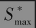=max(Smax,K)，其中Smax为截至目前资产价格的最大值，K为执行价格。同时，定义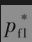为浮动回望看跌期权的价值，这一看跌期权与固定回望看涨期权的期限相同，固定回望看涨期权中截至目前资产所取的最大值Smax被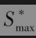取代。采用看跌-看涨期权平价关系中的论证方式，我们可以得出固定回望看涨期权的价格cfix满足以下关系式

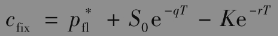

类似地，令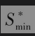=min(Smin,K)，我们可以得出固定回望看跌期权的价格pfix满足以下关系式

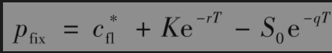

其中为浮动回望看涨期权的价格，这一看涨期权与固定回望看跌期权的期限相同，固定回望看跌期权中截至目前资产所取的最小值Smin被取代。这说明了对以上给出的浮动回望期权的公式进行修改后，我们即可对固定回望期权进行定价。

回望期权对投资者很有吸引力，但与一般期权相比，这种期权的价格非常昂贵。与障碍期权相似，回望期权在计算标的资产价格最大值和最小值时需要设定观察频率，而观察频率的选择对回望期权价格有很大影响。在以上定价公式中，我们假定对资产价格的观察频率是连续的。Broadie、Glasserman和Kou给出了当观察时间为离散情形时，对于以上公式的调整方法。

