# 26.13 亚式期权

亚式期权(Asian option)的收益同标的资产在期权有效期内价格的算术平均值有关。平均价格看涨期权(average price call option)的收益为max(0,Save-K)，平均价格看跌期权(average price put option)的收益为max(0,K-Save)，其中Save为标的资产价格的平均值。平均价格期权比普通期权便宜，并且往往可能更适合公司资金部主管的需求。假设一家美国公司的资金部主管预计在明年内会陆续收到其澳大利亚子公司总额1亿澳元的现金收入，而且每次的数目相同，该主管可能会对一种能够保证该年内平均汇率高于某一水平的某种期权感兴趣，平均价格看跌期权比普通看跌期权会更能有效地满足其需求。

如果假定服从对数正态分布，那么我们可以利用和普通期权类似的公式对平均价格期权定价。但是，我们通常假设标的资产价格服从对数正态分布，这样做是比较合理的.一种比较流行的处理方法是将一个对数正态分布的前两阶矩与的前两阶矩相匹配，然后采用布莱克模型。假定$`M_1`$和$`M_2`$是的前两阶矩。平均价格看涨期权与看跌期权价值由式(18-7)和式(18-8)给出，其中

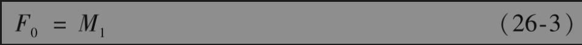

以及

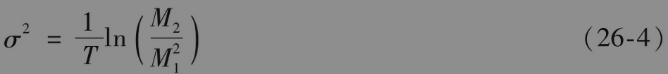

其中的平均值是按连续的方式计算的，r，q和σ均为常数（和DerivaGem的假设一样）

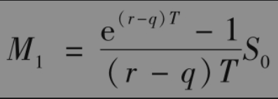

以及

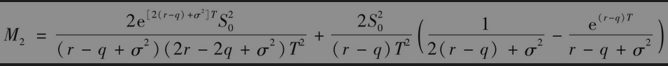

在更一般的情况下，当平均值是由时刻$`T_i(1≤i≤m)`$的价格计算时，

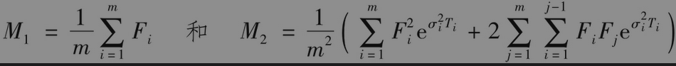

其中$`F_i`$和$`σ_i`$分别为对应于期限$`T_i`$的远期价格和隐含波动率。在网页www-2.rotman.utoronto.ca/~hull/TechnicalNotes里的Technical Note 27是对这个公式的证明。

【例26-3】 考虑一个最新发行的无股息股票上平均价格看涨期权，股票的当前价格为50，执行价格为50，股票价格的波动率为每年40%，无风险利率为每年10%，期限为1年，这时S0=50,K=50,r=0.1，q=0,σ=0.4和T=1。如果平均值是按连续计算得出的，$`M_1=52.59，M_2=2922.76$`。由式(26-3)和式(26-4)得出， $`F_0`$=52.59，σ=23.54%，在式(18-7)中设定K=50,T=1以及r=0.1，得出期权价值为5.62。当假定在计算平均值时对股票价格所观察的次数为12、52和250时，期权的价格分别为6.00、5.70和5.63。

对以上分析进行修改，我们可以将其用在之前发行的期权，而且已经观察到一部分用于计算平均值的股票价格的情形。假定计算平均价格的时间段包括两部分：已经观察到价格的长度为$`t_1`$的时间段、长度为t2的期权剩余期限。假定资产价格在t1时间段的平均值为。期权的收益为

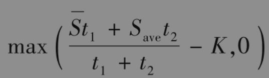

其中为资产价格在剩余期限内的平均值。以上公式等价于

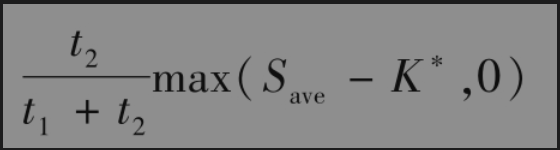

其中

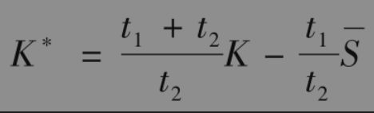

当K*＞0时，可以采用与刚刚开始的亚式期权定价相同的方式来对以上期权定价。在计算中，K被K*代替，最终结果要乘以$`t_2/(t_1+t_2)`$。当K*＜0时，期权肯定被行使，因此可以将期权当作远期合约来定价，结果是

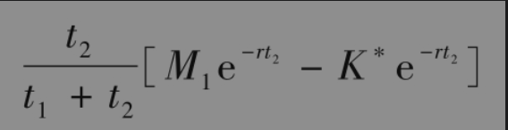

另外一种类型的亚式期权为平均执行价格期权(average strike option)。平均执行价格看涨期权(average strike call option)的收益为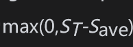，而平均执行价格看跌期权(average strike put option)的收益为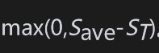。平均执行价格期权可以保证在一段时间内频繁买入标的资产的平均价格不会高于最终价格。另外，平均执行价格期权也可以保证在一段时间内频繁卖出标的资产的平均价格不会低于最终价格。当假定服从对数正态分布时，我们可以将这类期权当作资产交换期权来定价。

