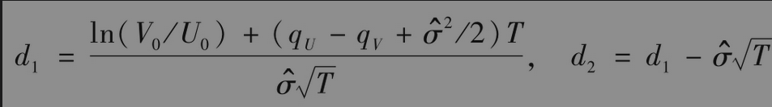
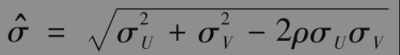
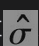

# 26.14 资产交换期权

资产交换期权(option to exchange one asset for another)，也称为交换期权(exchange option)，它有多种形式。从美国投资者的观点来看，用日元购买澳元的期权是把一种外币资产交换成另一种外币资产的期权。

股票要约收购是将一种股票交换成另一种股票的期权。考虑欧式资产交换期权：期权持有者有权在T时刻以价值为UT的资产来交换T时刻价值为VT的资产。期权收益为

$`max(V_T-U_T,0)`$

Margrabe最早给出了资产交换期权的定价公式。假定资产U和V均服从几何布朗运动，波动率分别为σU和σV，进一步假定U和V之间的瞬时相关系数为ρ，U和V的股息率分别为qU和qV。期权在0时刻的价值为

其中

和

其中$`U_0`$和$`V_0`$分别为资产U和V在0时刻的价值。

在第28章中将给出以上公式的证明。有意思的是式(26-5)与无风险利率r无关。这是因为当r增大时，两个资产在风险中性世界的增长率均增大，这刚好造成与贴现率的增长相互抵消。变量为V/U的波动率。与式(17-4)进行比较，我们得出期权公式等价于U0份标的变量为V/U、执行价格为1.0、无风险利率为qU、股息收益率为qV的欧式期权价格。马克·鲁宾斯坦证明了对于美式期权，我们也可以采用以上论点对期权定价。美式期权价值等于U0份标的变量为V/U、执行价格为1.0、无风险利率为qU、股息收益率为qV的美式期权的价格。因此，我们可以采用第21章里的二叉树来对美式期权定价。

获得两个资产中较好或较差资产的期权同资产交换期权密切相关，此类期权等于其中一种资产与资产交换期权的组合

$`min(U-T,VT)=VT-max(V_T-U_T,0)`$

$`max(U_T,VT)=UT+max(V_T-U_T,0)`$