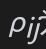

# 26.15 涉及多种资产的期权

涉及两种或更多风险资产的期权有时也称为彩虹期权(rainbow option)。一个例子是在第6章中所描述的在CME交易的债券期货合约，此期货合约允许空头寸方在交割时在大量不同的债券中进行选择。

涉及多种资产的期权最为普遍的例子也许是欧式篮筐式期权(basket option)。该期权的收益同组合（篮筐）资产的价值有关，这里的资产常常为股票、股指和货币。假定篮筐中的资产服从相关的几何布朗运动，我们可以采用蒙特卡罗模拟来对篮筐式期权定价。更为快捷的方法是计算篮筐在期权到期时在风险中性世界里的前两阶矩，然后假定篮筐的价值在期权到期时服从对数正态分布。这时可以利用布莱克模型对篮筐式期权定价，其中相应的参数由式(26-3)和式(26-4)给定。这时

其中n为资产的个数，T为期权的期限，$`F_i`$和$`σ_i`$为第i个资产的远期价格和波动率，为第i个资产与第j个资产之间的相关系数。参见www-2.rotman.utoronto.ca/~hull/TechnicalNotes里的Technical Note 28。