# 26.16 波动率互换和方差互换

波动率互换(volatility swap)是指将一段时间内资产价格所实现的波动率与某一事先约定的波动率进行交换的合约。资产价格所实现的波动率通常是按15.4节里描述的方法计算的：在计算中一般假设资产日收益的均值为0。如果在0与T之间共有n个观察日，资产价格已实现的波动率为

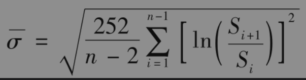

其中Si为资产的第i个观察值（有时会将n-2换成n-1）。

对于固定波动率的支付方而言，波动率互换在时刻T的收益为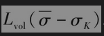，其中Lvol为名义本金，σK为固定波动率。期权对于资产价格和波动率风险敞口的形式很复杂，而波动率互换的形式却比较简单，因为互换只对波动率有风险敞口。

方差互换(variance swap)是指将一段时间0～T的资产价格已实现的方差与某一事先约定的方差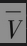进行互换的合约。方差等于波动率的平方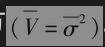。方差互换比波动率互换更容易定价，这是因为我们完全可以采用看涨和看跌期权来复制0～T之间的方差。对于固定方差的支付方而言，方差互换在时刻T的收益为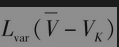，其中Lvar为名义本金，$`V_K`$为固定方差。方差互换的名义本金常常用相应的波动率互换的名义本金来表达，转换公式为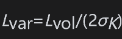。

## 26.16.1 方差互换的定价

网页www-2.rotman.utoronto.ca/~hull/TechnicalNotes里的Technical Note 22证明了对于资产价格的任意值S*，0与T之间平均方差的期望值为

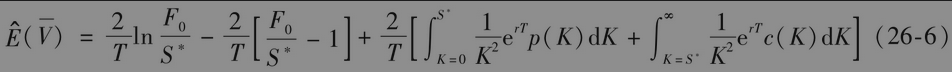

其中$`F_0`$是到期日为T的资产远期价格；c(K)是期限为T、执行价格为K的欧式看涨期权价格；p(K)是期限为T、执行价格为K的欧式看跌期权价格。

以上公式给出了一种对方差互换的定价方法：[插图]收入0～T的已实现方差，并同时支付方差$`V_K`$的合约价值为

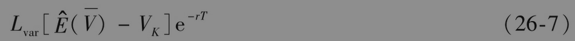

其中Lvar为合约的名义本金。假定已知执行价格为Ki(1≤i≤n)的欧式期权价格，其中$`K_1＜K_2＜…＜K_n`$。一种计算式(26-6)的标准方法是将S*设定为小于F0的第一个执行价格，积分的近似式为

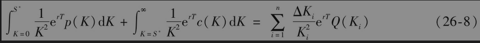

其中当2≤i≤n-1时，$`ΔK_i=0.5(K_i+1-K_i-1)；ΔK_1=K_2-K_1；ΔK_n=K_n-K_n-1`$。当$`K_i`$<S*时，Q(Ki)是执行价格为$`K_i`$的欧式看跌期权价格；当$`K_i`$＞S*时，Q(Ki)是执行价格为Ki的欧式看涨期权价格；当$`K_i`$=S*时，$`Q(K_i)`$是执行价格为Ki的欧式看涨期权和欧式看跌期权价格的平均值。

【例26-4】 考虑一个3个月期限的合约，该合约的持有者收入在3个月内股指已实现的方差率，同时支付的方差率为0.045，合约的面值为1亿美元，无风险利率为4%，股指的股息收益率为1%，股指的当前水平为1020。假定对应于执行价格为800，850，900，950，1000，1050，1100，1150，1200，期限为3个月的隐含波动率分别为29%，28%，27%，26%，25%，24%，23%，22%和21%。这时，n=9，K1=800,K2=850,…,K9=1200,F0=1020e(0.04-0.01)×0.25=1027.68，以及S*=1000。DerivaGem给出的Q(K1)=2.22，Q(K2)=5.22，Q(K3)=11.05，Q(K4)=21.27，Q(K5)=51.21，Q(K6)=38.94，Q(K7)=20.69，Q(K8)=9.44，Q(K9)=3.57。再有，对于所有的i，ΔKi=50，因此

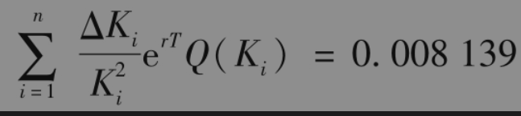

由式(26-6)和式(26-8)得出

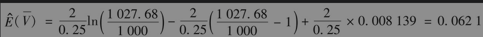

由式(26-7)得出方差互换的价值为（以百万美元计）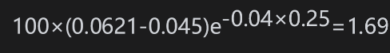。

## 26.16.2 波动率互换的定价

为了对波动率互换定价，我们需要计算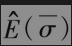，其中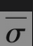为时间0～T的波动率平均值。我们将其写成

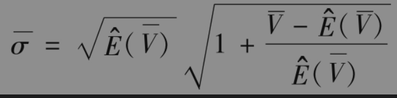

将右端的第二项展开，我们得出

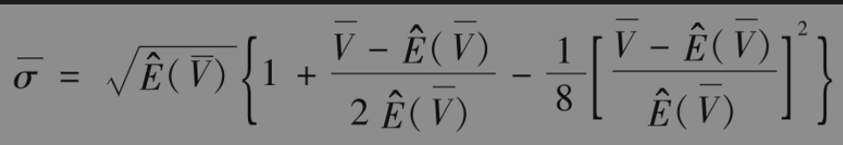

两边取期望值，得出

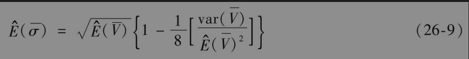

其中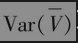为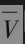的方差。因此，对波动率互换定价时，我们需要估计在合约期限内平均方差率的方差。对于收入0～T的已实现波动率，并同时支付波动率σK的一方而言，合约的价值为

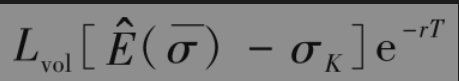

这里假定合约双方的本金均为Lvol。

【例26-5】 对于例26-4的情形，考虑一个波动率互换协议。在互换中收入已实现波动率，支付23%的波动率，本金为1亿美元。这时，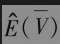=0.0621。假定在3个月内平均方差的标准差为0.01，这意味着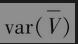=0.0001，式(26-9)给出

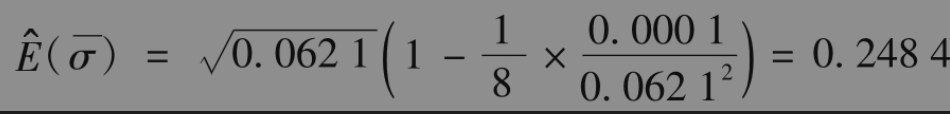

互换的价值为（以百万美元计）

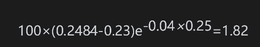

## 26.16.3 VIX指数

在式(26-6)中，对数函数ln可以由其级数展开的前两项来近似

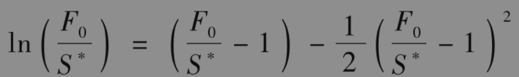

这意味着在风险中性的概率下，累积方差的期望值可由以下公式计算

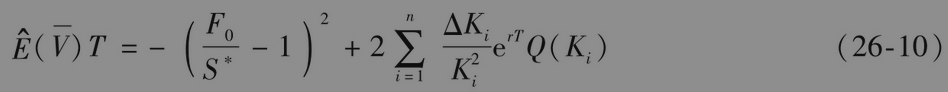

自2004年以来，VIX指数（见第15.11节）的计算一直是基于式(26-10)。计算过程是在任意一天，对于市场上交易的那些期限刚好大于30天和刚好小于30天的期权计算相应的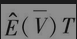。对以上所计算出的两个数值进行插值而得出在风险中性概率下30天的累计方差期望值，然后将其乘以365/30，并取根号来最终得出指数的值。具体计算细节可以在CBOE的网站上找到。

