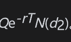
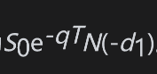

# 26.10 二元式期权

二元式期权(binary option)是具有不连续收益的期权。一个简单的例子是现金或空手看涨期权(cash-or-nothing call option)：在到期日T，如果标的资产价格低于执行价格，该期权的收益为0，但当标的资产价格高于执行价格时，该期权的收益为指定数量Q。在风险中性世界中，期权到期时标的资产价格高出执行价格的概率为N(d2)，因此，现金或空手看涨期权的价值为。现金或空手看跌期权(cash-or-nothing put option)的定义与现金或空手看涨期权类似：在到期日T，如果标的资产价格高于执行价格，该期权的收益为0，但当标的资产价格低于执行价格时，该期权的收益为规定数量Q。现金或空手看跌期权的价值为Qe-rTN(-d2)。

另一种二元式期权为资产或空手看涨期权(asset-or-nothing call)：在到期日T，如果标的资产价格低于执行价格，该期权的收益为0，但当标的资产价格高于执行价格时，该期权的收益为标的资产价格本身。采用常用的记号，我们可以得出资产或空手看涨期权的价格为。资产或空手看跌期权(asset-or-nothing put)的定义与资产或空手看涨期权类似：在到期日T，如果标的资产价格高于执行价格，该期权的收益为0，但当标的资产价格低于执行价格时，该期权的收益为标的资产本身。资产或空手看跌期权的价格为。

二元式期权的收益是非连续的。如果相关资产交易量小，导致相对较小的买入或卖出交易就能影响价格，这就会产生问题。考虑一笔现金或无现金的看涨期权，执行价为20美元，支付金额为100万美元。如果最终资产价格为19.99美元，则没有支付；如果是20美元或更多，则支付金额为100万美元。如果期权的有效期只剩下一天，而价格略低于20美元，那么对于现金或无现金期权的持有者来说，他们很有可能对标的资产发出买入指令，使其价格超过20美元。交易量小的资产的障碍期权也会出现类似的问题。如果标的资产的价格接近障碍，一方很可能会发出买入或卖出指令，以确保达到障碍。

一个普通的欧式看涨期权等于一个资产或空手看涨期权多头寸与一个现金或空手看涨期权空头寸的组合，其中现金或空手看涨期权的现金收益为执行价格。类似地，一个普通的欧式看跌期权等于一个现金或空手看跌期权多头寸与一个资产或空手看跌期权空头寸的组合，其中现金或空手看跌期权的现金收益等于执行价格。