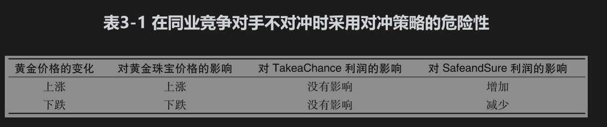

# 3.2 拥护与反对对冲的观点

支持对冲的观点非常明显，因此我们不再重述。大多数非金融公司的业务为制造业、零售业、批发业或服务业，这些公司并没有预见利率、汇率以及商品价格变化的特殊能力。（事实上，即使是专家也很难准确预测出这些变量。）因此，对于这些公司而言，对冲由这些市场变量所引起的风险很有意义，因为这样可以使公司集中精力发展自己的主要业务。通过对冲，公司可以避免由于商品价格急剧上涨而使购买费用增大所带来的收益波动。

在实际中，许多风险是不被对冲的。下面我们将探讨其中的原因。

## 3.2.1 对冲与股东

有一种观点认为，如果股东愿意的话，他们可以自己对冲所面临的风险，而不需要公司为他们做这些。但是，这一观点有所欠妥，因为它假定了股东与公司管理人对于公司所面临的风险有同样的了解。但在大多数情况下，事实并非如此。这一观点也忽略了手续费和其他交易费用。相对来讲，大型交易平均对冲1美元的费用要比小型交易低得多，因此由公司进行对冲要比个人更加便宜。

股东比企业做起来更容易的一件事是将风险分散化，一个持有充分分散投资组合的股东可以避开企业所面临的许多风险。例如，一个进行多样化投资的股东可能拥有铜生产公司和铜消费公司两家的股票，因此对于铜价没有太多的风险敞口。如果公司是代表多样化投资的股东利益，那么在许多情形下没有必要做对冲。在实际中，管理人员受这种观点影响的程度仍然值得商榷。

## 3.2.2 对冲与竞争者

在某些行业里，如果对冲并不是常规做法，这时一家公司选择与别人都不相同的做法也许没有太大意义。行业之间的竞争压力会迫使企业调整商品和服务价格来反映原材料价格、利率、汇率等的变化。因此，一家选择不对冲风险的企业可能期望利润率基本保持不变，而一家选择对冲风险的企业可能期望利润率会有很大的浮动。

为了说明这一点，我们考虑两家黄金珠宝加工商——SafeandSure（保守）公司与TakeaChance（冒险）公司。我们假定在这个行业中大多数公司不采用对冲措施，TakeaChance也不例外。但是SafeandSure却采用了与众不同的政策：公司决定利用期货合约来锁定未来18个月内的黄金价格。当黄金价格上涨时，经济压力会造成珠宝批发价格普遍上涨，这样一来，TakeaChance的利润会基本不受影响。与此相反，由于采用了对冲，SafeandSure公司的利润将会提高。而当黄金价格下跌时，经济压力会造成珠宝批发价格普遍下跌，从而TakeaChance公司的利润仍然不会受到太大影响，但SafeandSure公司利润却将会下降。在某些极端条件下，由于对冲的缘故SafeandSure利润可能会出现负值。在表3-1总结了此例。

这一例子强调了在对冲时一定要从全局出发，在设计对冲政策时一定要考虑价格变化对企业盈利的整体影响。

## 3.2.3 对冲

可能会使结果更糟我们应该认识到这样一个现实问题：与不采用对冲相比，采用对冲既可以增加也可以减少企业的利润。在以上讨论的原油生产商例子中，当原油价格下跌时，公司销售100万桶原油会有损失，但公司在期货交易中会得到收益，公司资金部门主管也因为有这样的业务远见而得到称赞。很显然，与不采用对冲相比，采用对冲给公司带来了更好的收益，公司的其他主管也会（希望如此）赞赏资金部的成就。但是当原油价格上升时，公司在销售中会盈利，对冲交易却带来损失，此时对冲比不对冲的结果要糟糕。即使对冲在最初被认为是一个明智的决策，此时资金部仍然难以说服他人当初为什么会采取对冲决策。假如原油价格每桶上涨到59美元，期货对冲的损失是每桶10美元。不难想象，资金部主管同公司总裁可能会有这样的对话：

总裁：真是太糟了，我们在过去3个月由于期货而损失了1000万美元！究竟是怎么回事？我需要解释。

资金部主管：我们承约期货交易是为了对冲原油价格变化带给我们的风险。对冲交易目的不是盈利。别忘记在原油价格上涨时，我们在销售中盈利了1000万美元。

总裁：这同我们的损失有什么关系？这就像在讲我们因为纽约的销售好，而不用去关心在加州的销售业绩。

资金部主管：假如原油价格要是下跌的话……

总裁：我不关心原油价格下跌后会怎么样，事实上，原油的价格上涨了。我真的不知道你原来是这样利用期货市场的。我们的股东希望看到我们在这一季度表现出色，我如何向股东解释因为你的行为而造成的1000万美元损失呢？恐怕今年你不会拿到分红。

资金部主管：这不公平，我这样做是因为……

总裁：不公平？你不被解雇就已经很幸运了，你毕竟损失了1000万美元。

资金部主管：这取决于你怎么看……

从这个例子中不难理解为什么公司资金部主管有时不太愿意进行对冲。对冲策略虽然可以缓解公司所面临的风险，但如果别人不理解对冲的内在意义，这一策略会增加资金部主管“本人”所面临的风险。解决这一问题的唯一方法就是在实施对冲策略之前一定要让公司的所有高级主管都理解对冲的内在含义，一个理想的做法是由公司董事会来制定对冲政策，并与公司管理层和股东之间进行充分的沟通（参见业界事例3-1中黄金矿业公司的对冲决策）。

### 业界事例

### 3-1黄金矿业公司的对冲决策

黄金矿业公司担心黄金价格会变化而采取对冲决策，这样做非常自然。通常黄金矿业公司需要花好几年时间来提炼金矿中的黄金。当一家企业准备开发一个金矿时，自然也就会对黄金价格有很大的风险敞口。一个表面看起来会盈利的金矿在黄金价格狂跌的情况下可能会变得亏损。

黄金矿业公司会很谨慎地向股东解释所采用的对冲决策，但有些黄金矿业公司不采取对冲，这样做可以吸引那些想在黄金价格上涨中盈利，同时在黄金价格下跌时能够接受损失的投资者。其他公司采取对冲来回避风险，这些公司对今后几年内的黄金月产量有一个大概的估计，然后通过期货空头或远期合约来锁定卖出黄金的价格。

假设你代表高盛公司(Goldman Sachs)与某黄金矿业公司签订了一个远期合约，合约规定你要以某一指定价格买入一笔很大数量的黄金，这时你将如何对冲风险呢？对这个问题的答案是：你会在中央银行借入黄金，然后将黄金在现货市场上变卖（许多国家的中央银行都有大量的黄金储备），并将所得资金以无风险利率进行投资。在远期合约期满时，你从黄金矿业公司那里买入黄金并偿还中央银行，这里所指定的黄金远期价格反映了你所能挣到的无风险利率以及你向中央银行支付的黄金租用利率。