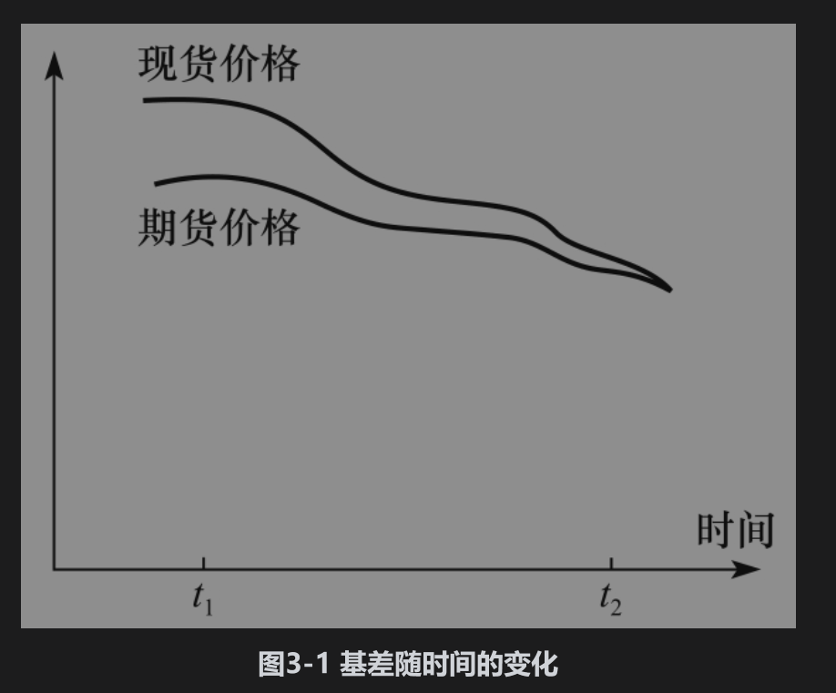

# 3.3 基差风险

到目前为止，我们所考虑的对冲例子都完美得令人难以置信。在这些例子中，对冲者可以确定将来买入资产的准确日期，从而可以利用期货合约来消除在那一天几乎所有由于资产价格变动而带来的风险。在实际中对冲常常没这么容易，部分原因如下：

(1)需要对冲价格风险的资产与期货合约的标的资产可能并不完全一样。

(2)对冲者可能无法确定买入或卖出资产的准确时间。

(3)对冲者可能需要在期货到期月之前将期货平仓。

这些问题就引起了所谓的基差风险(basis risk)。下面我们解释这一概念。

## 3.3.1 基差

在对冲意义下，基差(basis)的定义如下[注]

基差=被对冲资产的现货价格-用于对冲的期货合约价格

如果被对冲的资产与期货合约的标的资产相同，在期货到期时基差应当为0。在到期日之前，基差可正可负。

随着时间的变化，现货价格变化与特定月份期货的价格变化并不一定相同，因而会导致基差的变化。当基差变大时称为基差增强(strengthening of the basis)，当基差变小时称为基差减弱(weakening of the basis)。图3-1中的基差为正，图形展示了在期货到期之前基差随时间变化的形式。



为了讨论基差风险的性质，我们使用以下符号：

S1：在时刻t1的现货价格；

S2：在时刻t2的现货价格；

F1：在时刻t1的期货价格；

F2：在时刻t2的期货价格；

b1：在时刻t1的基差；

b2：在时刻t2的基差。我们假定在时刻t1建立对冲头寸，并在时刻t2平仓。

作为例子，我们考虑如下情形：在刚建立对冲时，现货和期货价格分别是2.50美元和2.20美元，在对冲平仓时，现货和期货价格分别是2.00美元和1.90美元。这意味着S1=2.50,F1=2.20,S2=2.00,F2=1.90。

由基差的定义

```python 

b1=S1-F1,b2=S2-F2

```

得出b1=0.30和b2=0.10。

首先考虑如下情形：对冲者已知将在时刻t2卖出资产，并在t1时持有了期货空头。资产所实现的价格为S2，期货的盈利为F1-F2。因此对冲后，卖出资产所得实际价格为

```python 

S2+F1-F2=F1+b2

```

在我们的例子中，上式等于2.30美元。在时刻t1已知F1的价格，如果在这个时刻也知道b2，那么这时可以构造完美对冲。对冲风险与b2的不确定性有关，此风险即为基差风险。考虑另外一种情形，公司知道在时刻t2将购买资产，因而在时刻t1进行了多头对冲。买入资产所付价格为S2，对冲的损失为F1-F2。实施对冲以后，买入资产支付的实际价格为

```python 

S2+F1-F2=F1+b2

```

这与前面的表达式一样，在本例中上式等于2.30美元。在时刻t1已知F1的价格，b2代表基差风险。

注意，基差风险可以使得对冲者的头寸得到改善或导致恶化。假设一家公司计划在将来卖出资产，并决定采用空头对冲，如果基差在意想不到的情况下增强（即增大），那么对冲者的头寸会有所改善，这是因为在考虑了期货的盈亏之后，卖出资产时会拿到更好的价格；如果基差在意想不到的情况下减弱（减小），那么对冲者的头寸会有所恶化。同样，假设一家公司计划在将来要买入资产，决定采用多头对冲，如果基差在意想不到的情况下增强，对冲者的头寸将会恶化，这是因为在考虑了期货的盈亏以后，买入资产时要支付更高的价格；如果基差在意想不到的情况下减弱，对冲者的头寸将会得到改善。

有时给对冲者带来风险的资产与用于对冲的合约标的资产并不一样，这种情形下的对冲叫交叉对冲(cross hedging)。在这种情况下，基差风险一般会更大。定义[注]为期货合约标的资产在时刻t2的价格。与上面相同，S2是被对冲资产在时刻t2的价格。通过对冲，公司确保购买或出售资产的价格为

```python 

S2+F1-F2

```
上式可变形为


[注]-F2和S2-[注]代表基差的两个组成部分：[注]代表当被对冲资产与期货合约标的资产一致时，对冲所产生的基差；[注]是由于被对冲资产与期货合约标的资产不一样而产生的基差。

## 3.3.2 对合约的选择

影响基差风险的一个关键因素是选择用来对冲的期货合约。这里的选择包括两部分：

(1)对期货合约标的资产的选择；

(2)对交割月份的选择。

如果被对冲的资产刚好与期货的标的资产相同，这里的第一个选择一般会很容易。在其他情形下，对冲者必须通过仔细分析来确定哪一种期权价格与被对冲资产的价格有最紧密的相关性。

交割月份的选择跟多个因素有关。在本章前面的例子中，当假定对冲的期限对应于某种期货的交割月份时，我们选择了对应于这个交割月份的期货合约。事实上，在这种情形下对冲者往往会选择一个在稍后月份交割的期货合约。因为在这种情况下，处于交割月份中的期货价格有时会很不稳定。同时，在交割月份多头对冲者会承受必须接受实物交割的风险，因为资产交割的花费很大，而且极不方便（多头对冲者一般喜欢将期货合约平仓，然后在常用的供应商处买入资产）。

一般来讲，当对冲的期限与期货交割月份之间的差距增大时，基差风险也会随之增大。一种经验法则是尽量选择与对冲期限最近，但在其之后的交割月份。假定某一资产上期货的到期月分别为3月、6月、9月和12月。对于在12月、1月、2月到期的对冲，应当选择3月的合约；对于在3月、4月、5月到期的对冲，应当选择6月的合约，等等。这种经验法则假设了所有满足对冲需要的合约都有足够的流动性。在实际中，首月短期限期货合约往往具有最强的流动性。因此在某些情形下，对冲者常常会倾向于采用短期合约，并且不断地将合约向前展期。我们将在本章后面的内容中讨论这一策略。

【例3-1】 假定今天是3月1日。一家美国公司预期将在7月底收入5000万日元。CME集团的日元期货交割月份分别是3月、6月、9月和12月。每份合约的交割数量为1250万日元。因此这家公司在3月1日承约4份9月日元期货空头。在7月底收到日元时，公司对其期货合约平仓。假设日元期货在3月1日的价格为每日元1.0800美分，而当期货被平仓时的现货价格与期货价格分别为1.0200美分和1.0250美分。

期货合约的盈利为每日元0.0550(=1.0800-1.0250)美分。合约被平仓时的基差为每日元-0.0050(=1.0200-1.0250)美分，购买日元（按美分计算）的实际价格等于最终现货价格加上从期货中所得的盈利

```python 

1.0200+0.0550=1.0750

```
这也可以写成最初的期货价格加上最后的基差

```python 

1.0800+(-0.0050)=1.0750

```

公司从5000万日元上所收的美元数量是50×0.01075（百万），即537500美元。

【例3-2】 假定今天是6月8日，一家公司知道在10月或11月需要买入20000桶原油。目前在CME集团纽约商品交易所(NYMEX)中，任何一个月交割的原油期货合约都有交易，每份合约的规模为1000桶原油。公司决定利用12月期货进行对冲，并买入了20份12月合约的多头。6月8日，期货价格是每桶48.00美元，公司在11月10日需要购买原油，因此在该天对期货合约平仓。在11月10日这一天，现货价格和期货价格分别是每桶50.00美元和每桶49.10美元。

期货的盈利是每桶1.10(=49.10-48.00)美元，期货平仓时的基差是每桶0.90(=50.00-49.10)美元。买入原油所付实际价格是（每桶按美元计）最后现货价格减去在期货上的盈利，即

```python 

50.00-1.10=48.90

```

这也可以由最初的期货价格加上最后的基差来计算

```python 

48.00+0.90=48.90

```

公司购买原油所付的总价格是48.90×20000=978000美元。