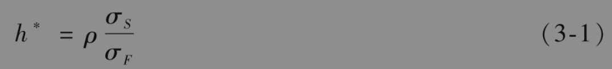
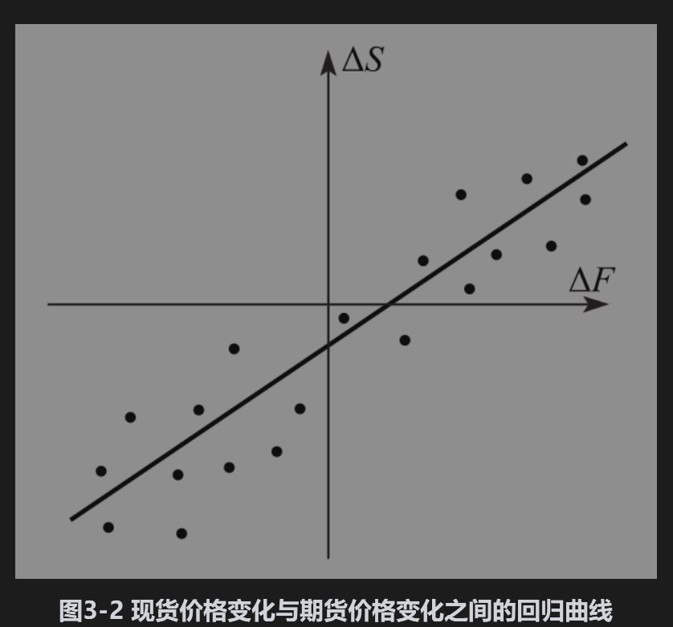
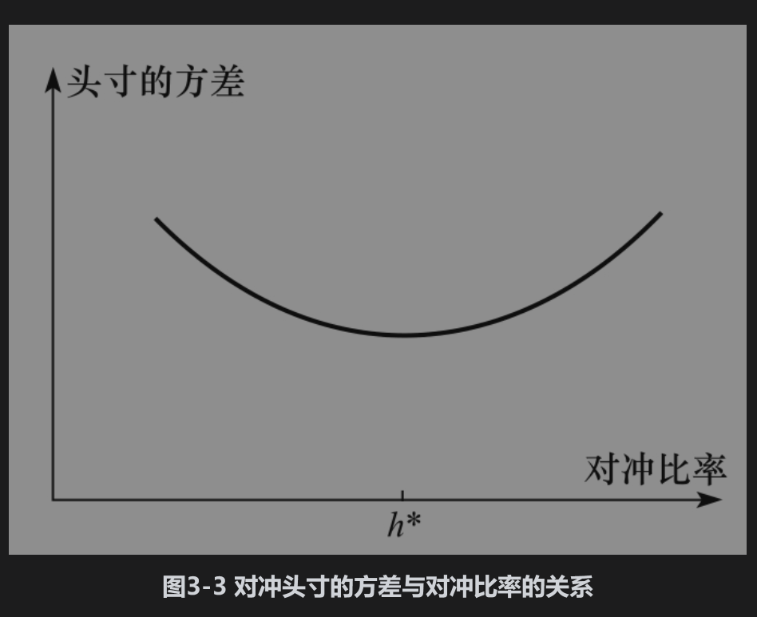
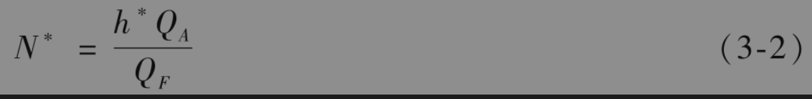
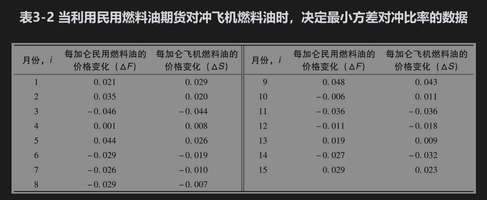
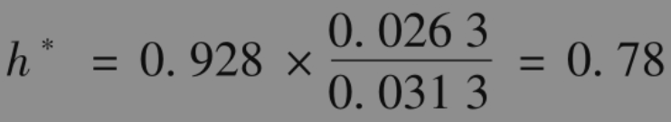
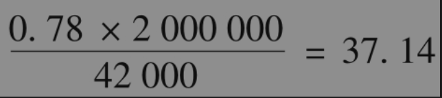
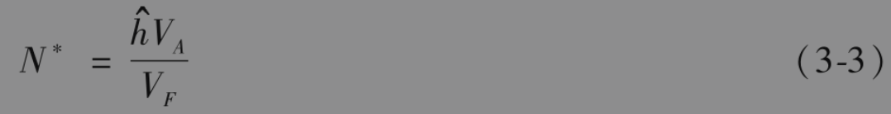

# 3.4 交叉对冲

在例3-1和例3-2中，对冲时所用期货的标的资产与被对冲的资产是一样的。当两种资产不同时就会出现交叉对冲。例如，某家航空公司对飞机燃料油的未来价格有些担心，但是由于没有飞机燃料油的期货，这家公司也许会利用民用燃料油期货合约来对冲风险。

对冲比率(hedge ratio)是指持有期货合约的数量与资产风险敞口数量的比率。当期货标的资产与被对冲资产一样时，对冲比率当然应该取为1.0。这正是我们在以上所有例子中所采用的对冲比率。例如，在例3-2中，对冲者的风险敞口为20000桶原油，期货所对应的资产交割数量刚好与这个头寸相等。

当采用交叉对冲时，将对冲比率取为1.0并不一定是最优的选择。对冲者采用的对冲比率应当使被对冲后头寸价格变化的方差达到极小。我们现在考虑对冲者如何能做到这一点。

## 3.4.1 计算最小方差对冲比率


我们首先提出一个假设：期货市场没有每日结算制度。最小方差对冲比率取决于现货价格的变化与期货价格变化之间的关系。我们采用以下符号：

ΔS：在对冲期限内，现货价格S的变化；

ΔF：在对冲期限内，期货价格F的变化。假设ΔS与ΔF之间为近似线性关系（见图3-2），可以表示为：

```python 

ΔS=a+bΔF+ε

```

其中a和b是常数项，ε是误差项。假设对冲比率是h（即，现货风险敞口S的百分比h通过期货对冲）。那么，现货价格每变动1单位，头寸价值的变化为：

```python 

ΔS-hΔF=a+(b-h)ΔF+ε

```

通过设定h=b使该标准差最小（右侧第二项等于0）。

我们用h*表示最小方差对冲比率，我们已经设定h*=b，根据线性回归中的斜率式可知：



其中σS是ΔS的标准差，σF是ΔF的标准差，ρ是两者之间的相关系数。

式(3-1)显示最佳对冲比率等于ΔS与ΔF之间的相关系数乘以ΔS的标准差与ΔF的标准差之间的比率。图3-3说明了对冲头寸的方差与对冲比率的关系。





如果ρ=1和σF=σS，则对冲比率h*为1.0，因为这时期货价格变化正好等于现货价格的变化，这一结果正是我们所预期的。如果ρ=1和σF=2σS，则最佳对冲比率h*为0.5，因为这时期货价格的变化幅度是现货价格变化幅度的两倍，这一结果也正好是我们所预期的。对冲效率(hedge effectiveness)可以定义为对冲所消除的方差量占总方差的比例，这正是将ΔS对ΔF进行线性回归的$R^2$系数，等于$\rho^2$。

式(3-1)中的参数ρ、σF和σS通常是通过ΔS和ΔF的历史数据来估计的（这里所隐含的假设是从某种意义上，历史反映未来）。在计算中要选择一定数量的长度相等而且互不重叠的时间区间，然后在每个区间观测ΔS和ΔF的值，理想的做法是将时间区间选成与对冲的期限相同。在实际中，这种做法有时会严重地限制可以利用的观察值的数量，因此在计算过程中一般会选用比较小的时间区间。

## 3.4.2 最优合约数量

为了计算对冲所用的合约数量，定义：

$Q_A$：被对冲头寸的数量（单位数量）；

$Q_F$：一份期货合约的规模（单位数量）；

N*：用于对冲的最优期货合约数量。期货合约应当是关于h*QA单位的资产，因此所需要的期货合约份数为



例3-3说明了一家航空公司是如何将这一节中的结果用于对冲购买燃料油的风险的。[注]

【例3-3】 某航空公司预计在一个月后需要购买200万加仑飞机燃料油，并决定利用民用燃料油期货来对冲。我们假设表3-2给出了连续15个月每加仑飞机燃料油价格变化ΔS，以及用于对冲的民用燃料油期货价格的相应变化ΔF。利用通常计算标准差和相关系数的公式，我们可以得出σF=0.0313，σS=0.0263，ρ=0.928。



由式(3-1)可以得出最小方差对冲比率h*为



每份CME集团的民用燃料油期货是关于42000加仑民用燃料油的，由式(3-2)，最优合约的数量为



近似到最近的整数，合约数量为37。

## 3.4.3 每日结算的影响

如果我们用来对冲的是远期合约，那么上面的分析是正确的。当利用期货进行对冲时，合约的每日结算意味着有一系列的一天对冲（而不是只有一个对冲）。定义：

现货价格每天百分比变化的标准差；

期货价格每天百分比变化的标准差；

期货价格和现货价格每天百分比变化之间的相关系数。

现货价格和期货价格变化的标准差分别为$`\hat{\sigma}_S S`$

和$`\hat{\sigma}_F F, \hat{\rho}`$是两者的相关性。从式(3-1)可知，期限为1天的最优对冲比率为

$`h^*=\hat{\rho} \frac{\hat{\sigma}_S S}{\hat{\sigma}_F F}`$

因此，从式(3-2)中得出用于对冲的最优期货合约数量为

$`h^*=\hat{\rho} \frac{\hat{\sigma}_S S Q_A}{\hat{\sigma}_F F Q_F}`$

式(3-1)中的对冲比率是现货价格实际变化对于期货价格实际变化做线性回归时的最优拟合直线的斜率。另一种对冲比率$`\hat{h}`$可以通过计算现货价格每天百分比变化对期货价格每天百分比变化做线性回归时的最优拟合直线的斜率得出：

$`\hat{h}=\hat{\rho} \frac{\hat{\sigma}_S}{\hat{\sigma}_F}`$

然后



其中$V_A$=SQA是被对冲的头寸的价值，$V_F$=FQF是期货价格与一份期货合约数量的乘积。

考虑另一种情况，利用民用燃料油期货对冲200万加仑飞机燃料油。假设现货价格和期货分别为每加仑1.10和1.30美元，这时$V_A$=2000000×1.10=2200000,$V_F$=42000×1.30=54600。如果$`\hat{\rho}`$=0.8，期限为1天的最优合约数量为


取整数后最优合约数量为32。从理论上讲，当现货价格和期货价格变动时应当调整合约的数量，但在实际中最优头寸在每天中的变化很小，常常忽略不计。

通过通盘考虑对冲剩余期限内所得或付出的利息后，可以进一步改进上面的分析。假设在时间t时可以计算从t到对冲结束这段时间里所得或付出的利息为5%，且对冲的剩余期限为1年，在时间t时应当将N*除以1.05。

由于每日结算的影响而对式(3-2)所做的改善称为尾随对冲(tailing the hedge)。
