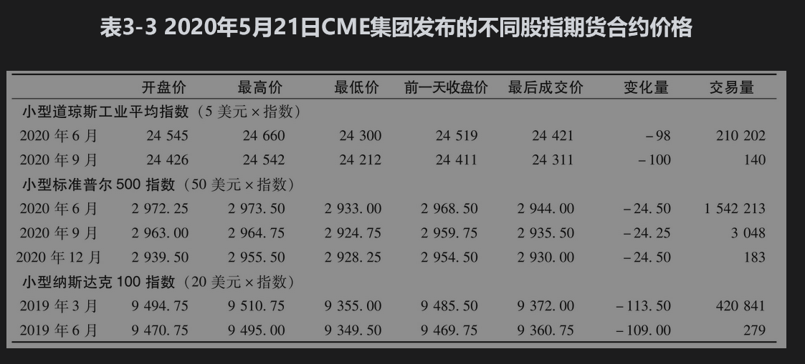
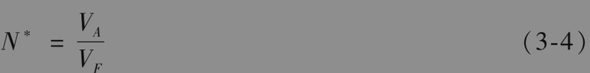
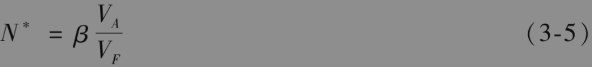
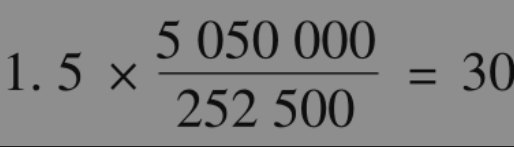
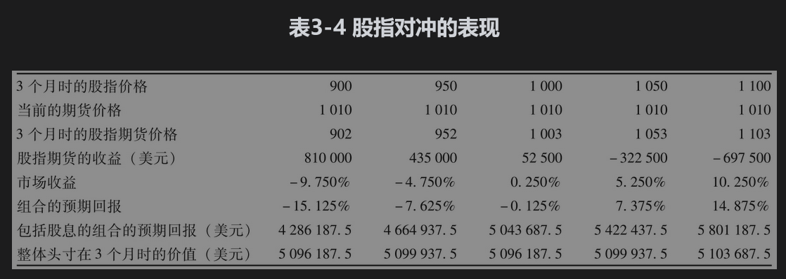
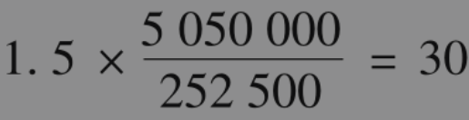

# 3.5 股指期货

我们接下来考虑股指期货，以及如何将其用于对冲或管理与股票价格有关的风险敞口。

股指(stock index)跟踪一个虚拟股票组合的价值变化，每个股票在组合中的权重等于股票组合投资于这一股票的比例。在很短的一段时间区间中，股指上升的百分比被设定为该虚拟组合价值变化的百分比。在计算中，通常不包括股息，因此股指是用于跟踪在这一组合上投资的资本增值/亏损(capital gain/loss)。[注]

如果虚拟股票投资组合保持不变，组合中每个股票的权重不一定不变。当组合中某只股票的价格比其他股票的涨幅要大得多时，这只股票的权重就会自动增大。有些指数的建立是在一些股票中各取1股，这时股票的权重与其市场价格成比例，当股票分股时做适当调整。另一些股指的构造使得权重与股票的市场资本总价值（股票价格×发行的数量）成比例，这时股票组合会对股票的分股、股票形式的股息和新股发行自动进行调整。

## 3.5.1 股指

表3-3展示了在2020年5月21日CME集团发布的3个不同股指的期货合约价格。

道琼斯工业平均指数(Dow Jones Industrial Average)是基于30个美国蓝筹(blue-chip)股票所组成的股票组合，权重与股票价格成比例。CME集团有两种关于这个指数的合约：一种期货的标的变量是10美元乘以指数值；另一种(Mini DJ Industrial Average)是5美元乘以指数值，Mini合约在市场上交易最活跃。

标准普尔500指数(S&P 500)是基于一个包括500种股票的组合，这500种股票的组成为：400种工业股、40种公共事业股、20种交通业股以及40种金融股。在任何时刻，股票的权重与该股票的总市值成比例。这些股票都是在NYSE Euronext或Nasdaq OMX上市。CME集团有两种关于标准普尔500指数的期货合约：一种是关于250美元乘以指数；另一种(Mini S&P 500 contract)是关于50美元乘以指数，Mini合约在市场上交易最活跃。

纳斯达克100指数(Nasdaq 100)是基于在纳斯达克交易所交易的100只股票所组成的组合，权重与市值成比例。CME集团交易所交易两种与这个指数有关的合约：一种是关于100美元乘以指数；另一种(Mini Nasdaq 100 Contract)是关于20美元乘以指数，Mini合约在市场上交易最活跃。

在美国之外的一些指数上的期货合约也有很活跃的交易，例如，沪深300指数(CSI 300)是由300家中国股票通过按市值加权平均而设计的指数。在中国金融期货交易所(CFFEX)有关于这个指数的期货交易。

如第2章所述，股指期货合约采用现金交割（而不是实际交割标的资产）。在最后一个交易日，所有的合约必须以最后一个交易日的开盘价或收盘价来结算，然后头寸算是已经平仓。例如，对于标准普尔500指数期货的平仓是按标准普尔500指数在交割月第3个星期五的开盘价来结算的。

## 3.5.2 股票组合的对冲

股指期货可用于对冲风险分散良好的股票投资组合。定义：

VA：股票组合的当前价值；

VF：一份期货的当前价值（定义为期货价格乘以期货规模）。

如果组合是为了跟踪股票指数，这时的最优对冲率h*为1.0，由式(3-3)得出需要持有的期货空头合约数量为

例如，某股票组合的价值为5050000美元，组合跟踪的是一个风险分散很好的股票指数。股指期货的目前价格为1010，每期货的规模是250美元乘以股指。这时，VA=5050000,VF=1010×250=252500。因此，对冲者应该持有20份期货空头合约来对冲这个股票组合。

当股票组合不跟踪股指时，我们可以采用资本资产定价模型（CAPM，见本章附录）。资本资产定价模型中的参数β是将组合超过无风险利率的收益与指数超过无风险利率的收益进行回归所产生的最佳拟合直线的斜率。当β=1.0时，组合收益往往跟踪市场收益；当β=2.0时，组合超过无风险利率的收益等于股票市场超过无风险利率的收益的两倍；当β=0.5时，组合超过无风险利率的收益等于股票市场超过无风险利率的收益的一半，等等。

一个β值等于2.0的组合对市场的敏感度是一个β值等于1.0的组合的两倍。因此，为了对冲这一组合，我们将需要两倍数量的合约。类似地，一个β值等于0.5的组合对市场的敏感度是一个β值等于1.0的组合的一半，因此我们只需要一半数量的合约来对冲风险。一般来讲

在这个公式中，我们假设期货合约的到期日与对冲期限很近。将式(3-5)与式(3-3)比较，可以得出$`\hat{h}`$=β，该等式对我们来讲并不意外，对冲比率$`\hat{h}`$是将组合价值在一天内的百分比变化对于股指期货价格在一天内的百分比变化做线性回归时的最优拟合直线的斜率，β是组合变化对股指变化做线性回归时的最优拟合直线的斜率。

我们通过例子来说明利用这个公式做对冲时的效果很好。假定利用4个月期限的期货合约来对股票组合在今后3个月内的价值进行对冲。假设：

    股指当前值=1000股指

    期货价格=1010

    组合价值=5050000（美元）

    无风险利率=4%（每年）

    股指券息收益率=1%（每年）

     组合的β=1.5

一份期货合约是交割250美元乘以股指，因此，VF=250×1010=252500。由式(3-5)得出对冲组合所需要持有的空头期货合约数量为

假定股指在3个月后为900，期货价格为902，期货空头的收益为

      30×(1010-902)×250=810000（美元）

股指的亏损为10%。股指每年支付1%的股息收益率，或每3个月0.25%。因此，将股息考虑在内时，股指投资者在3个月里的收益为-9.75%。由于组合的β是1.5，由资本资产定价模型得出

     组合的期望收益-无风险利率=1.5×（股指收益-无风险利率）

3个月期的无风险利率大约为1%，因此，当3个月期的股指收益率为-9.75%时，组合在3个月内的期望收益(%)为

     1.0+[1.5×(-9.75-1.0)]=-15.125

组合在3个月后价值的预期值（包括股息）为

     5050000×(1-0.15125)=4286187.5（美元）

在考虑对冲收益后，对冲者头寸价值的预期值为

     4286187.5+810000=5096187.5（美元）

表3-4总结了这些计算，同时也对股指在到期时可能取的其他数值进行了类似的计算。我们可以看出，在3个月后，对冲者的头寸几乎与股指的点数无关。如果对冲合理，这会是期望的结果。

在这个例子中，我们还没有讨论期货价格与现货价格之间的关系。在第5章中，我们将看到这里所假设的当前期货价格1010美元与我们假设的利率和股息率是一致的。这一结论对于表3-4中3个月后的期货价格也适用。

## 3.5.3 对冲股权组合的理由

表3-4显示，实施对冲策略以后，对冲者在3个月后的头寸价值大约比在对冲开始时的头寸价值高1%，这一结果并不奇怪，因为无风险利率为每年4%，或每3个月1%。实施对冲后使得对冲者的头寸按无风险利率增长。

人们自然要问，为什么要采用期货合约来对冲呢？要是只为了取得无风险利率的收益，对冲者只需要变卖资产，并将得到的资金投放于类似短期国债之类的无风险产品即可。

这个问题的一个答案是，如果对冲者认为组合中的股票选取得很好，那么实施对冲是有道理的。在这种情况下，对冲者对市场的整体风险不很确定，却确信组合中的股票收益会高于市场的收益（对组合β值进行调整之后）。对冲者可以采用股指期货来消除因市场变动而触发的风险，从而使对冲者仅仅暴露于股票组合与市场的相对表现中。稍后我们将对此做进一步的讨论。另一个原因是对冲者计划在很长一段时间内持有股票组合，但需要在短时间内对市场的不确定性进行保护。将资产变卖并在将来买回的做法可能会触发太高的交易费用。

## 3.5.4 改变组合的β

在表3-4所示的例子中，对冲者的β值被降低到0，因此对冲者的期望收益几乎与指数的表现无关。有时也可以利用期货合约将组合的β调整到非零的值。继续以上的例子：

      标准普尔500指数股指当前取值=1000

      股指期货价格=1010

      组合价值=5050000（美元）

      组合的β=1.5

同上，VF=250×1010=252500。进行完美对冲时需要持有空头的合约数量为

为了将组合的β从1.5转变为0.75，我们需要持有空头的合约数量应当为15，而不是30；若要将组合的β由1.5转变为2.0，需要持有10个期权的多头，等等。通常来讲，当将组合的beta从β变为β*时，如果β>β*，所持期货空头的数量应当为

$`\left(\beta-\beta^*\right) \frac{V_A}{V_F}`$

如果β<β*，所持期货多头的数量应当为

$`\left(\beta^*-\beta\right) \frac{V_A}{V_F}`$

## 3.5.5 锁定所选股票的优势

假设你擅长挑选比市场表现更好的股票。你拥有一只股票或一个小的股票组合。你不知道在今后几个月内股票市场的表现将会如何，但你非常确认你持有的股票将比市场表现要好，你这时该如何做呢？

你应该持有数量等于βVA/VF的股指期货合约空头，其中β为你所持有股票的beta值，VA为持有的股票价值，VF为一份股指期货合约的价值。如果你的股票投资组合比一个具有同样β，但风险分散很好的组合表现要好，你这时就会赚钱。

考虑某投资者在4月持有20000只某公司股票，每股价格为100美元。投资者认为在今后3个月内市场会有剧烈变动，但该公司股票很可能比市场表现要好。投资者想在今后3个月内利用8月的小型标准普尔500指数期货合约来对冲市场变化。公司股票的β值为1.1，8月小型标准普尔500指数期货的当前价格为2100，每一份合约是50美元乘以指数，这时VA=20000×100=2000000,VF=2100×50=105000，因此应当持有的股指期货空头数量为

近似为整数，对冲者应承约21份股指期货空头，并在7月平仓。假定公司股票价格在一个月后降至90美元，小型标准普尔500指数期货价格降至1850，投资于公司股票的损失为20000×(100-90)=200000，但在期货上的收益为21×50×(2100-1850)=262500美元。

在这个例子中，投资者的总体收益为62500美元，这是因为公司股票并没有像β=1.1而且风险完全分散的组合那样下跌。如果市场价格上升，公司股票上升的幅度会大于β=1.1的组合，这时投资者还是赚钱的（正如投资者预期的那样）。