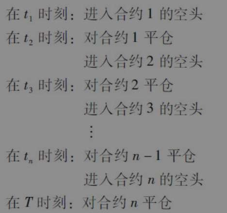
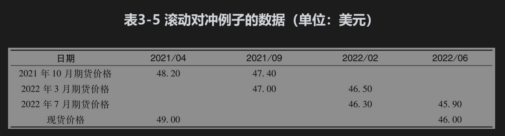

# 3.6 向前滚动对冲

有时对冲的期限要比所有能够利用的期货期限更长，这时对冲者必须对到期的期货进行平仓，同时再进入具有较晚期限的合约。这样可以将对冲向前滚动很多次。这种做法称为向前滚动对冲(stack and roll)。考虑某家公司，它希望利用期货空头来减少在将来时刻T收到某个资产时所带来的风险。如果在市场上存在期货合约1,2,3,…,n（并不一定目前都存在），其到期日一个比一个更晚。公司可以采用以下策略：

假设在2021年4月，一家公司意识到在2022年6月将卖出100000桶原油，并决定按1.0的对冲比率来对冲风险（在该例中，我们不进行像第3.4节中所描述的尾随对冲调整）。当前原油现货价格为49美元，虽然交割期限长达几年的期货在市场都有交易，我们假设只有最近6个月的合约具有足以满足公司要求的流动性。因此公司承约了100份2021年10月合约的空头。在2021年9月，将对冲向前滚动到2022年3月的合约。

在2022年2月，将对冲向前滚动到2022年7月的合约。表3-5展示了一种可能出现的结果，2021年10月刚建立空头时期货价格为48.20美元，平仓时价格为47.40美元，因此盈利为每桶0.80美元；2022年3月刚建立空头时期货价格为47.00美元，平仓时价格为46.50美元，因此盈利为每桶0.50美元；2022年7月刚建立空头时期货价格为46.30美元，平仓时价格为45.90美元，因此盈利为每桶0.40美元，最终的即期价格为46美元。

持有期货空头所得盈利为每桶

    (48.20-47.40)+(47.00-46.50)+(46.30-45.90)=1.70（美元）

原油价格从每桶49美元降至每桶46美元，每桶跌价3美元，而期货的补偿只有每桶1.70美元，这看起来不太令人满意。但是，当期货价格低于现货价格时，我们不能期望得到全部的补偿。假如2022年6月的期货交易活跃的话，这时最好的结果是将价格锁定在该期货的价格上。

在实际中，公司通常在每个月中对标的资产都有风险敞口，并且利用一个月的期货合约来对冲，因为这样的短期限合约流动性较强。在最初时，公司会承约足够多的头寸（即将合约叠在一起）来覆盖所有在对冲持有期内的风险敞口。一个月过后，公司将所有期货合约平仓，并向前滚动，即承约新的一个月期合约来应对新的风险敞口，等等。

如业界事例3-2所示，在20世纪90年代初，德国金属公司(Metallgesellschaft)曾按这种方式对冲自己由于提供固定价格商品而带来的风险。在商品价格下跌时，公司运作产生困难，原因是承约短期期货所带来的损失要立即支付保证金，而所期望的长期收益却无法马上实现。被对冲产品所产生的收益和对冲产品所带来损失的时间不匹配，因此给公司带来了无法克服的流动性困难。这一事例的警示是，当制订对冲计划时，我们一定要将流动性会产生的潜在问题考虑在内。

### 业界事例3-2

### 德国金属公司对冲的失误

有时采用向前滚动对冲的方式会对公司现金流造成压力。20世纪90年代初，这一问题在一家德国公司，即德国金属（简称MG）身上体现得淋漓尽致。

MG公司以高于市场价6～8美分的固定价格向其客户卖出了大量的5～10年民用燃料油和汽油合约，然后采用短期期货合约的多头来对冲其风险敞口，在对冲过程中，将这些短期合约向前滚动。随后原油价格下跌，因持有期货，MG需要补充保证金，这给公司造成了短期现金流的压力。公司内设计这一对冲策略的人员认为这些短期现金流可以被长期固定价格合约的现金流抵消，然而公司高管与贷款银行对这笔巨额现金的流出十分担心，最后公司只好对所有对冲交易进行平仓，同时同意客户的要求而放弃了固定价格的合约。结果MG损失了13.3亿美元。