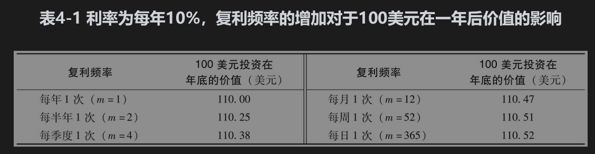
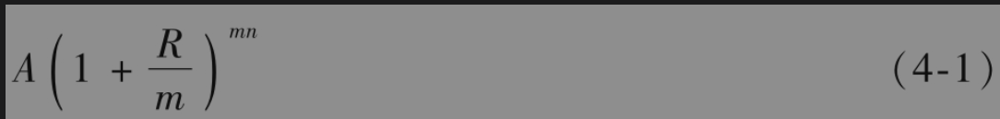
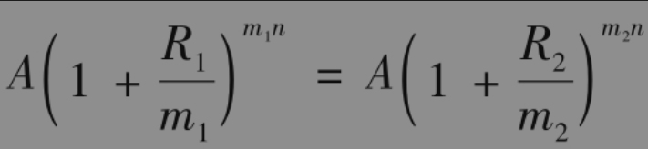
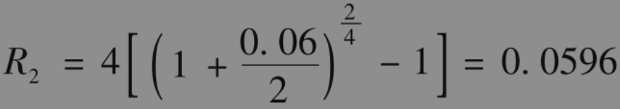
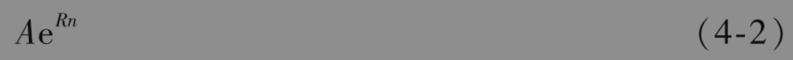
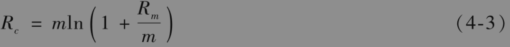
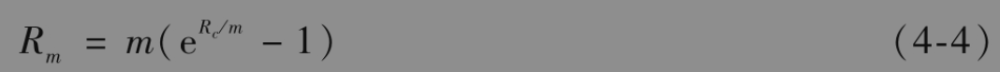
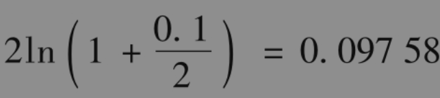

# 4.4 利率的度量

银行注明一年的储蓄利率为10%，这句话听起来虽然非常直接并且含义清楚，但事实上这句话的精确含义依赖于利率的计算方式。

如果利率计算方式是一年复利一次，银行所说的10%利率是指100美元在年终会增长为

              100×1.1=110（美元）

如果利率的计算方式为每半年复利一次，这表示每6个月会赚取5%的利息，而且利息也被用于再投资，这时100美元在一年后将会增长为

               100×1.05×1.05=110.25（美元）

如果利率计算方式为每季度复利一次，银行所说的利率是指每3个月会赚取2.5%的利息收入，而且所得利息均用于再投资，这样100美元在一年后将会增长为

$`100 \times 1.025^4=110.38 \text { (美元) }`$

表4-1列出了复利频率增长的影响。

复利频率定义了在计算利率时的时间单位。一年复利一次的利率可以被转换成按不同频率复利的等价利率。例如，由表4-1我们可以看到一年复利一次10.25%利率与一年复利两次10%利率等价，利率在不同计息频率下的关系可以与英里同千米之间的关系相比，它们代表的是不同的计量单位。

为了推广以上结果，我们假设将数量为A的资金投资n年。如果利率是按年复利，那么投资的终值为

$`A(1+R)^n`$

如果利率是一年复利m次，投资终值为

当m=1时所对应的利率有时称为等值年利率(equivalent annual interest rate)。假设$`R_1`$是每年复利m1次的利率，$`R_2`$是与其等价但每年复利m2次的利率，由式(4-1)可知，如果

价值为A的投资在n年后相同。因此

作为应用这个公式的例子，假设按半年复利的利率是6%，令$`m_1`$=2,$`R_1`$=0.06,m2=4就可以得出与此等价的按季度复利利率：

即5.96%。

连续复利复利频率m趋于无穷大时所对应的利率叫连续复利(continuous compounding)利率。在连续复利情况下，可以证明数量为A的资金投资n年时，投资的终值为

其中e=2.71828。

大多数计算器中都有计算指数函数ex的功能，所以计算表达式(4-2)时不会产生任何麻烦。在表4-1的例子中，A=100,n=1，R=0.1，按连续复利时数量为A的资金在投资一年后将增长到

$`100 e^{0.1}=110.52 \text { (美元) }`$

这个精确到小数点后两位的数值与用每天复利所得的结果一样。在大多数的实际情况下，我们可以认为连续复利与每天复利等价。对一笔资金以利率R连续复利n年相当于乘上$`\mathrm{e}^{R n}`$项。而对一笔在第n年后的资金以利率R按连续复利进行贴现，其效果相当于乘上$`\mathrm{e}^{-R n}`$。

在本书中，除非特别指明，利率将按连续复利来计算。习惯于按每年、每半年、每季度或其他复利频率的读者可能在开始时会感到别扭。但是，在衍生产品定价中，连续复利利率的应用非常广泛，所以应当习惯它的使用。

假设Rc是连续复利利率，$`R_m`$是与之等价的每年m次复利利率。由表达式(4-1)与式(4-2)，我们得出

$`A \mathrm{e}^{R_c n}=A\left(1+\frac{R_m}{m}\right)^{m n}`$

和

$`\mathrm{e}^{R_c}=\left(1+\frac{R_m}{m}\right)^m`$

这就是说

和

这些式子可以将每年m次复利的利率转换为连续复利的利率，反之亦然。自然对数函数lnx是指数函数的反函数：如果y=lnx，那么$`x=\mathrm{e}^y`$。大多数计算器都有计算这个函数的功能。

【例4-1】 假设利率报价为每年10%按半年复利。因此m=2,$`R_m`$=0.1，由式(4-3)得出，与之等价的连续复利利率为

即每年9.758%。

【例4-2】 假设某贷款人对贷款利率的报价为每年8%，连续复利，利息每季度支付一次，因此m=4，$`R_c`$=0.08。由式(4-4)得出，与之等价的按季度复利的利率为

$`4 \times\left(e^{0.08 / 4}-1\right)=0.0808`$

即每年8.08%。这意味着，对于1000美元的贷款，每季度支付利息为20.20美元。