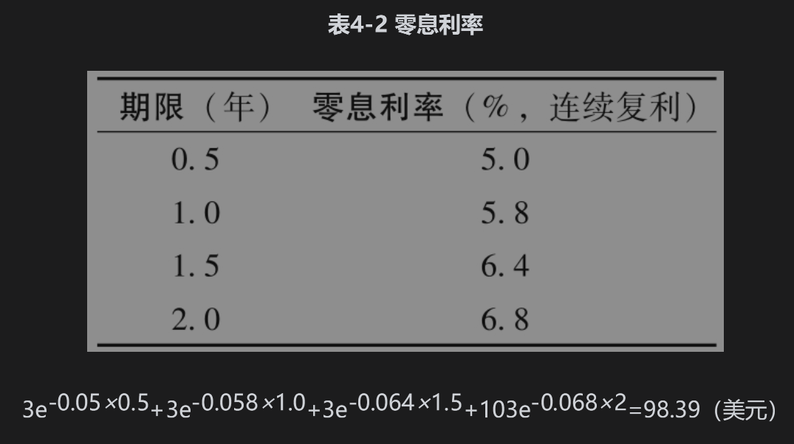

# 4.6 债券定价

大多数债券提供周期性的券息，债券发行人在债券满期时将债券的本金（有时也称为面值）偿还给投资者。债券的理论价格等于对债券持有人在将来所收取的现金流贴现后的总和。有时债券交易者用单一贴现率对债券的所有现金流进行贴现，但更精确的办法是对不同现金流采用不同的零息贴现率。

为了说明这一点，假设零息利率由表4-2给出（在后面我们将说明如何计算这些值），表中的利率是按连续复利。假设一个两年期债券的本金为100美元，券息为6%，每半年付息一次。为了计算第1个3美元券息的现值，我们用5.0%的6个月贴现率贴现；为了计算第2个3美元券息的现值，我们用5.8%的1年贴现率，依此类推。因此债券的理论价格为

## 4.6.1 债券收益率

债券收益率是指将此收益率用于对债券所有的现金流进行贴现后，所得现值等于债券的市场价格。假设我们上面考虑的债券理论价格也是其市场价格，即98.39美元（这里的债券市场价格与表4-2中的数据完全一致）。如果y表示按连续复利的债券收益率，我们有

$`3e-y×0.5+3e-y×1.0+3e-y×1.5+103e-y×2=98.39`$

这一方程式的解可以通过迭代的方式（“反复试验”）得出，其解为y=6.76%。[1]

## 4.6.2 平价收益率

对应于具有某一期限的债券平价收益率(par yield)是使债券价格等于面值的券息率。债券通常每半年支付一次券息。假定债券每年支付的券息为c（或每6个月c/2）。采用表4-2中的零息利率，当以下方程成立时债券价格等于其面值，即100

$`\frac{c}{2} \mathrm{e}^{-0.05 \times 0.5}+\frac{c}{2} \mathrm{e}^{-0.058 \times 1.0}+\frac{c}{2} \mathrm{e}^{-0.064 \times 1.5}+\left(100+\frac{c}{2}\right) \mathrm{e}^{-0.068 \times 2.0}=100`$

我们可以直接计算这一方程的解：c=6.87。两年期的平价收益率为6.87%每年。

一般地讲，如果d为债券到期时收到1美元的贴现值，A为一个年金（annuity，即在每个券息日支付1美元）现金流的现值，m为每年券息支付的次数，那么平价收益率满足

$`100=A \frac{c}{m}+100 d`$

因此

$`c=\frac{(100-100 d) m}{A}`$

在我们的例子中，$`m=2, d=\mathrm{e}^{-0.068 \times 2}=0.87284`$ 以及 

$`A=\mathrm{e}^{-0.05 \times 0.5}+\mathrm{e}^{-0.058 \times 1.0}+\mathrm{e}^{-0.064 \times 1.5}+\mathrm{e}^{-0.068 \times 2.0}=3.70027`$

这个公式证实了平价收益率为每年6.87%，以此作为券息率并且每半年支付一次的债券价格等于其面值。