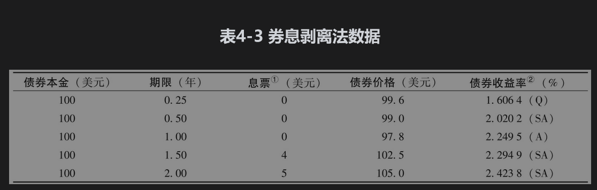
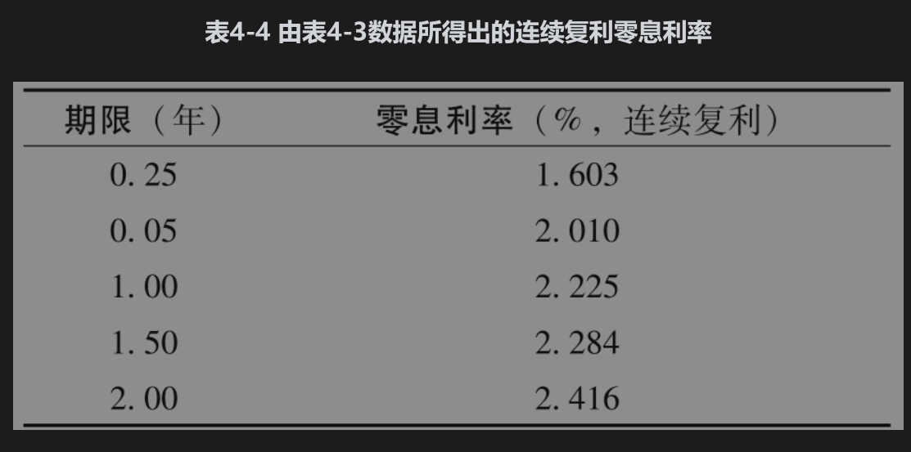
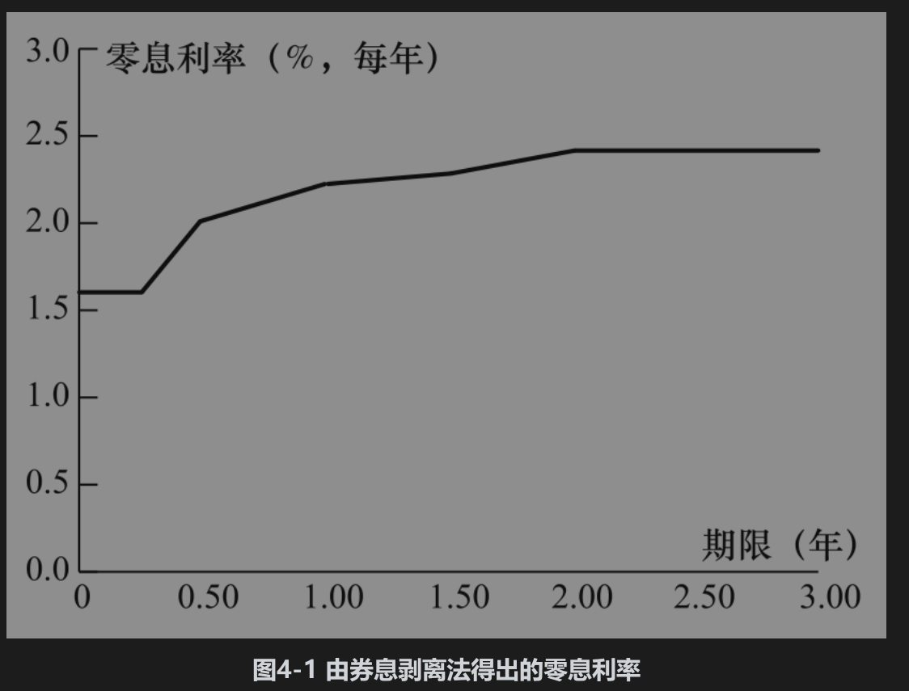

# 4.7 确定零息利率

本节将描述一种称为券息剥离法(bootstrap method)的步骤来确定零息利率。

考虑表4-3中有关5个债券价格的数据。因为前3个债券不支付券息，所以很容易计算对应于这些债券期限的零息利率。第1个债券的结果是将99.6的投资在第3个月后变成100，因此3个月的连续复利利率R满足

$`100=99.6 \mathrm{e}^{R \times 0.25}`$

即每年1.603%。类似地，6个月的连续复利利率R满足

$`100=99.0 \mathrm{e}^{R \times 0.5}`$

即每年2.010%，类似地，1年的连续复利利率R满足

$`100=97.8 \mathrm{e}^{R \times 1.0}`$

即每年2.225%。

①券息的一半每6个月支付一次。

②复利频率对应于支付频率：Q=按3个月复利，SA=按半年复利，A=按年复利。

第4个债券的期限为1.5年，券息和本金支付如下：

6个月时：2美元

1年时：2美元

1.5年时：102美元

由前面的计算，对于在6个月后支付的利息应采用贴现率2.010%，对于在1年后支付的利息应采用贴现率2.225%。我们知道债券价格为102.5，它必须等于债券持有人所有收入现值的总和。假定在1.5年所对应的零息利率为R，那么

$`2 \mathrm{e}^{-0.02010 \times 0.5}+2 \mathrm{e}^{-0.02225 \times 1.0}+102 \mathrm{e}^{-R \times 1.5}=102.5`$

以上方程可被简化为

$`\mathrm{e}^{-1.5 R}=0.96631`$

即

$`R=-\frac{\ln (0.96631)}{1.5}=0.02284`$

因此1.5年所对应的零息利率为2.284%。这是唯一与6个月期限、1年期限以及表4-3数据一致的零息利率。2年期的零息利率也可以通过类似的方法由6个月、1年以及1.5年的零息利率来求得：假定R为2年期的零息利率，我们有

$`2.5 \mathrm{e}^{-0.02010 \times 0.5}+2.5 \mathrm{e}^{-0.02225 \times 1.0}+2.5 \mathrm{e}^{-0.02284 \times 1.5}+102.5 \mathrm{e}^{-R \times 2.0}=105`$

由此得出R=0.02416，即2.416%。

表4-4总结了计算的结果，表示零息利率与期限关系的图形叫零息利率曲线(zero curve)。在由券息剥离法所得数值节点之间，一般假定零息利率曲线为线性（这意味着在我们的例子中1.25年的零息利率等于0.5×2.225+0.5×2.284=2.255%）。通常还假定在零息利率曲线上第1个节点之前的利率和超出最后一个节点的利率为水平。图4-1就是建立在这些假设下的零息利率曲线。采用期限更长的债券，我们可以将零息利率曲线更精确地确定到2年以上。

在实际中，一般在市场上并没有期限正好等于1.5年、2年、2.5年等的债券。分析员通常的做法是在计算零息利率曲线之前首先对债券价格数据进行插值。例如，如果已知在2.3年到期、券息为6%的债券的价格为108，以及在2.7年到期、券息为6.5%的债券的价格为109，分析员可能会假定在2.5年到期的、券息率为6.25%的债券价格为108.5。还有一种更一般的方法（在下面OIS利率的例子中将使用这种方法）如下。定义$`t_1，t_2,…,t_n`$为用来计算利率的债券价格，首先假定一个在这些时间之间为线性的曲线。利用“反复试验”的迭代方法确定在时间$`t_1`$与第1个债券价格相匹配的利率，然后通过类似的步骤确定在时间$`t_2`$与第2个债券相匹配的利率，依此类推。对任何试验利率，通过插值确定作为券息的利率。

更复杂的方式是对所有i在$`t_i`$和$`t i+1`$之间的利率使用多项式或指数函数（而非线性函数）。选取函数时使所有债券的价格都能正确地确定，并且零息利率曲线的每个ti的坡度都不变。这种方法称为以样条函数表示零息利率曲线。