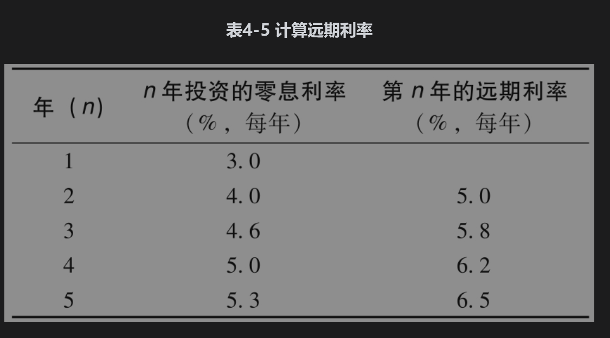
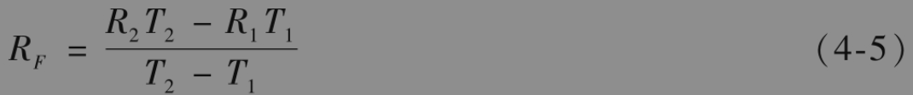
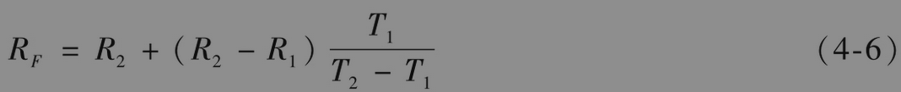

# 4.8 远期利率

远期利率(forward interest rate)是由当前零息利率所隐含的对应于将来时间段的利率。为了说明远期利率的计算方式，我们假设如表4-5中第2列所示的一组零息利率。假设这些利率是按连续复利，因此，1年期、3%年利率意味着今天投资100美元，在一年后投资者将得到$`100 e^{0.03 \times 1}=103.05 \text { 美元 }`$；2年期、4%年利率意味着今天投资100美元，在2年后投资者会得到$`100 e^{0.04 \times 2}=108.33 \text { 美元 }`$，等等。

表4-5中第2年的远期利率为每年5%。这是由第1年年末与第2年年末的零息利率隐含在第2年之间的利率，即由1年期、每年3%的零息利率与2年期、每年4%的零息利率计算得出的。这个用于第2年内的利率与第1年的利率结合将会得出2年期的利率4%。为了说明正确答案为每年5%，假定你投资100美元。第1年利率是3%和第2年利率是5%将意味着在第2年年末的收益是

$`100 e^{0.03 \times 1} e^{0.05 \times 1}=108.33`$

将投资连续以4%利率投资两年得出的收益为

$`100 e^{0.04 \times 2}`$

也是108.33美元。这个例子说明了一个一般的结论：当按连续复利表达利率时，将相互衔接的时间段上的利率结合在一起，整个时间区间上的等价利率为各个时段利率的平均值。在我们的例子中，把第1年利率3%和第2年利率5%平均将会得到2年的利率4%。对于非连续复利的利率，这一结论只是近似地成立。

第3年的远期利率是由2年期的零息利率4%与3年期的零息利率4.6%隐含而出的，结果为每年5.8%。这是因为以4%利率投资两年以后再以5.8%利率投资1年将得出3年期平均利率为每年4.6%。用类似的方法可以计算其他远期利率，结果如表4-5中第3列所示。一般来讲，如果$`R_1`$和$`R_2`$分别对应期限为$`T_1`$和$`T_2`$的零息利率，$`R_F`$为$`T_1`$与$`T_2`$之间的远期利率，那么

为了说明这一公式，考虑表4-5中第4年的远期利率：$`T_1=3, \quad T_2=4, \quad R_1=0.046, \quad R_2=0.05`$，公式给出$`R_F`$=0.062。式(4-5)可以写成

这一公式说明如果零息利率曲线在$`T_1`$与$`T_2`$之间呈上升趋势，即$`R_2＞R_1`$，那么$`R_F＞R_2`$（在T2结束的时间段上远期利率大于期限为$`T_2`$的零息利率）。类似地，如果零息利率曲线呈下降趋势，即$`R_2＜R_1`$，那么$`R_F＜R_2`$（远期利率小于期限为T2的零息利率）。在式(4-6)中令$`T_2`$接近于$`T_1`$，并将共同值记为T，我们得到

$`R_F=R+T \frac{\partial R}{\partial T}`$

其中R是期限为T的零息利率，以这种方式得到的RF称为T的瞬时远期利率(instantaneous forward rate)。这是用于在T开始的一段很短的时间里的远期利率。定义P(0,T)为在时刻T到期的零息债券的价格，因为$`P(0, T)=\mathrm{e}^{-R T}`$，瞬时远期利率的方程也可以写成

$`R_F=-\frac{\partial}{\partial T} \ln P(0, T)`$

假如表4-5给出了大型金融机构借入与借出资金的利率，这时金融机构可以锁定远期利率。例如，假设金融机构借入100美元，利率是3%，期限为1年，然后以4%的利率将资金投资两年。结果现金流是在第1年年末流出$`100 e^{0.03 \times 1}=103.05`$美元，在第2年年末收入$`100 e^{0.04 \times 2}=108.33 \text { 美元 }`$。因为$`108.33=103.05 e^{0.05}`$ ，所以在第2年的收益等于远期利率为5%时的收益。也可以按5%的利率借入100美元，期限为4年，并同时以4.6%利率投资3年。在第3年年末收入$`100 \mathrm{e}^{0.046 \times 3}=114.80 \text { 美元 }`$ ，在第4年年末流出$`100 e^{0.05 \times 4}=122.14 \text { 美元 }`$ 。因为$`122.14=114.80 e^{0.062}`$，所以资金在第4年的借款利率为远期利率6.2%。

如果投资者认为将来的利率会与今天的远期利率不同，那么投资者就会发现市场上有许多交易策略非常具有吸引力（见业界事例4-1）。其中一种做法是利用远期利率合约(forward rate agreement)，我们接下来会讨论这种合约的运作机制和定价方式。

###  业界事例4-1

### 奥兰治县对收益曲线的赌博

假设一个大型投资者可以按表4-5所示的利率借出或借入资金，并认为在今后5年内1年期的利率不会有太大的变化。这个投资者可以借入1年期的资金并将资金投资5年。1年期借款可以在第1年年末、第2年年末、第3年年末和第4年年末向前滚动一年。如果利率确实保持不变，这种投资策略会大约每年盈利2.3%，这是因为收入的利率为5.3%而支出的利率为3%。这种投资方式叫作收益曲线赌博(yield curve play)。投资者认为将来的利率会与今天所观察到的远期利率很不相同，并对此观点进行投机（在我们的例子中，今天观察到的4个1年期远期利率分别为5%、5.8%、6.2%和6.5%）。

1992年和1993年，美国奥兰治县资金部主管罗伯特·希特伦非常成功地利用了以上的投机方式。希特伦所做交易的盈利对奥兰治县的财政预算做出了巨大贡献，而他本人也因此得以连任（在选举中有人指出这一投资方式风险太大，但没有人听取这一反对意见）。

在1994年希特伦进一步扩大了这种方式的投机，他选用了大量反向浮息债券(inverse floaters)，这种债券的券息为某一固定利率同某一浮动利率之间的利差，他通过在再回购市场上借入短期资金的方式进一步加大了杠杆效应。假如短期利率保持不变或下降的话，他依然会保持很好的收益。但在1994年利率急剧上涨，在1994年12月1日奥兰治县宣布其投资组合损失了15亿美元。在几天之后，奥兰治县宣布寻求破产保护。

