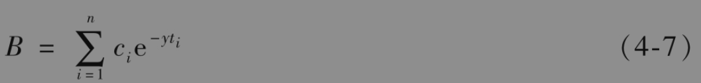
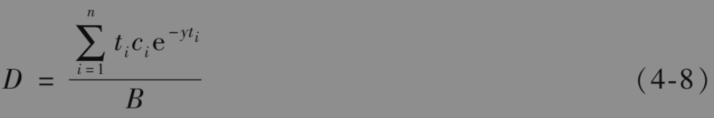
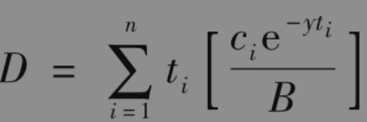
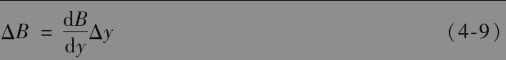
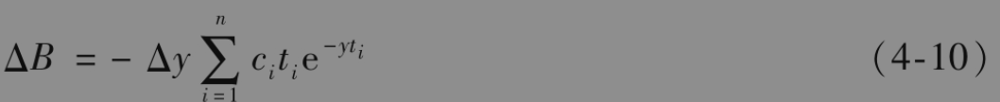
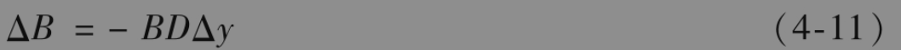
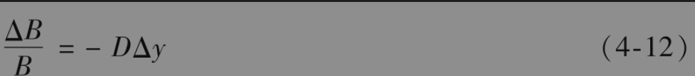
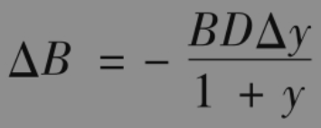
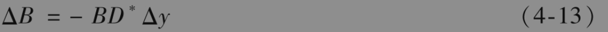

# 4.10 久期

顾名思义，债券的久期(duration)是指投资者收到所有现金流所要等待的平均时间。一个n年期零息债券的久期为n年，而一个n年带券息(coupon-bearing)债券的久期小于n年，这是因为持有人在n年之前就已经收到一些现金付款。

假定债券在ti时刻给持有人提供的现金流为ci，1≤i≤n。债券价格B与收益率y（连续复利）之间的关系式为

债券久期D的定义是

也可以写为

以上方括号中的项为ti时刻债券支付的现金流现值与债券价格的比率，而债券价格等于所有将来支付的现值总和，因此久期是付款时间$`t_i`$的加权平均，其中对应于$`t_i`$的权重等于$`t_i`$时刻的支付现值与债券总值的比率，这里的所有权重相加等于1。

注意为了定义久期，所有的贴现均采用债券收益率y（我们没有像在第4.6节描述的那样对于不同的现金流采用不同的零息利率）。

当收益率有微小变化时，以下公式近似成立

由式(4-7)，上式可以写成

（注意B与y之间呈反向关系：当收益率增加时，债券价格降低；当收益率减小时，债券价格增加。）由式(4-8)和式(4-10)，我们可以得出下面关于久期的重要公式

或写成

式(4-12)是关于债券价格百分比变化同收益率之间的一个近似关系式，这个公式非常易于使用，这也是麦考利(Macaulay)最初在1938年提出久期概念以后被广泛采用的原因。

考虑一个面值为100美元、券息为10%的3年期债券。该债券按连续复利的年收益率为12%，即y=0.12。债券每6个月付息一次，券息值为5美元。表4-6显示了有关债券久期的计算步骤，在计算中将收益率作为贴现率，计算出的现值列在表中的第3列（例如第1次付息的现值为$`5 e^{-0.12 \times 0.5}=4.709`$），第3列数字之和等于债券价格94.213。将第3列中的数字除以94.213即可得到久期的权重，第5列数字之和等于久期，即2.653年。

DV01对应于当所有利率都变化一个基点时，价格的变化。gamma对应于利率变化一个基点时，DV01的变化。以下例子验证了久期关系式(4-11)的精确性。

【例4-4】 由表4-6所描述的债券价格为94.213，久期为2.653，根据式(4-11)

$`\Delta B=-94.213 \times 2.653 \times \Delta y`$

即

       ΔB=-249.95×Δy

当收益率增加10个基点(=0.1%)，即Δy=+0.001后，久期公式给出ΔB的近似结果为

          ΔB=-249.95×0.001=-0.25

由久期公式所预计的债券价格会下降到94.213-0.25=93.963，为了检验这个结果的准确性，我们计算当收益率增加10个基点到12.1%时的债券价格

$`\begin{gathered}
5 \mathrm{e}^{-0.121 \times 0.5}+5 \mathrm{e}^{-0.121 \times 1.0}+5 \mathrm{e}^{-0.121 \times 1.5}+5 \mathrm{e}^{-0.121 \times 2.0}+5 \mathrm{e}^{-} \\
0.121 \times 2.5+105 \mathrm{e}^{-0.121 \times 3.0}=93.963
\end{gathered}`$

这一数值同我们用久期公式预计的变化相同（精确到小数点后第3位）。

## 4.10.1 修正久期

以上的分析建立在收益率y为连续复利的前提之下。如果y为一年复利一次的利率，可以证明这时的相应近似公式(4-11)为

在y为一年m次复利的一般情形下

$`\Delta B=-\frac{B D \Delta y}{1+y / m}`$

由

$`D^*=-\frac{D}{1+y / m}`$

定义的变量D*称为债券的修正久期(modified duration)。久期关系式可以简化为

其中y是以每年复利m次所表示的收益率，以下的例子验证了修正久期的精确性。

【例4-5】 由表4-6描述的债券价格为94.213，久期为2.653。按每年复利两次的收益率为12.3673%，修正久期为

$`D^*=\frac{2.653}{1+0.123673 / 2}=2.4985`$

由式(4-13)我们得出

         ΔB=-94.213×2.4985×Δy

或

         ΔB=-235.39×Δy

当收益率（一年复利两次）增加10个基点(0.1%)，即Δy=+0.001时，由久期关系式估计的债券价格变化为ΔB为-235.39×0.001=-0.235，因此债券价格下降到94.213-0.235=93.978。这个结果的精确度有多高呢？通过与前面例子相同的计算，我们可以得出当收益率增加10个基点到12.4673%时，债券的价格为93.978。这说明当债券收益率变化很小时，修正久期的计算公式是非常精确的。

另外一个常用的名词为绝对额久期(dollar duration)，这一变量为修正久期与债券价格的乘积，因此$`\Delta B=-D \$ \Delta y \text { ，其中 } D \$ \text {. }`$ 为绝对额久期。

## 4.10.2 债券组合

债券组合的久期D可以定义为构成债券组合中每一个债券久期的加权平均，其权重与相应债券价格成正比。式(4-11)～式(4-13)在这里仍然适用，其中B为债券组合的价值。这些方程可以用来估计当所有债券收益率都有一个微小变化Δy时，对债券组合价值的影响。

当将久期的概念用于债券组合时，我们隐含地假设了所有债券的收益率变化都大致相同，认识到这一点是很重要的。当债券有不同的期限时，只有当零息利率曲线的变化是平行移动时，情形才会是这样。因此我们应将式(4-11)～式(4-13)理解为当零息利率曲线有微小的平行移动Δy时，对于债券组合价值的估计。

通过确保资产久期等于负债久期来对冲所面临的利率风险（即净久期为0），金融机构可以消除由于收益率曲线微小平行移动所带来的风险，尽管这样，大的平行移动与非平行移动仍然存在风险敞口。