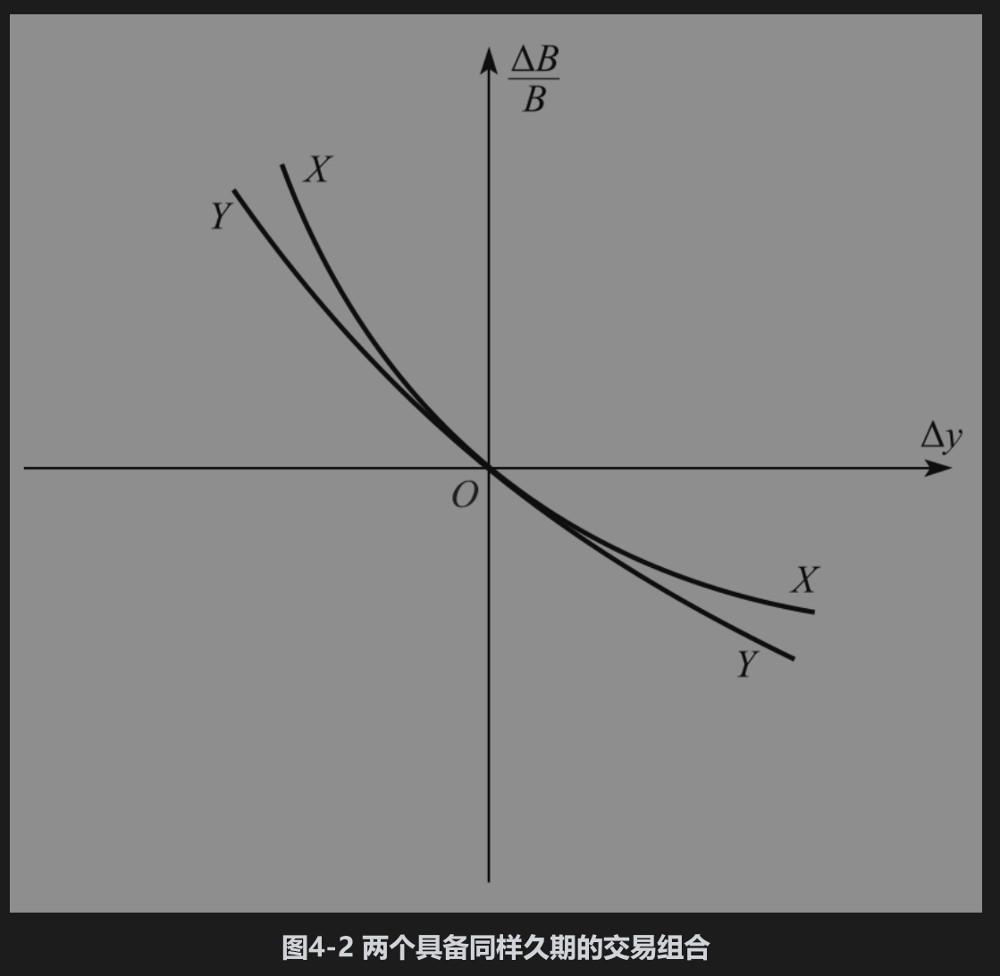
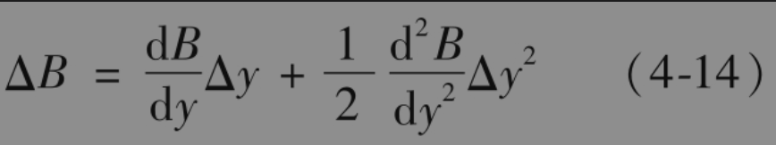

# 4.11 凸性

久期仅适用于收益率变化很小的情形。图4-2显示了两个具有相同久期的交易组合价值百分比变化与收益率变化之间的不同形式。这两条曲线在原点的斜率相同，这意味着，当收益率的变化很小时，两个交易组合价值变化的百分比相同，这与式(4-12)一致。但当利率变化较大时，两个组合价值变化不同。组合X与收益率之间关系的凸性比组合Y要大。一种叫作凸性(convexity)的变量可以用来衡量曲线的弯曲(curvature)程度，它可以用来改善式(4-12)的精确性。

测量凸性的一种方式是

$`C=\frac{1}{B} \frac{\mathrm{d}^2 B}{\mathrm{~d} y^2}=\frac{\sum_{i=1}^n c_i t_i^2 \mathrm{e}^{-y t_i}}{B}`$

利用泰勒阶数展开，我们可以得到一个比式(4-9)更精确的表达式

由此可以得出

$`\frac{\Delta B}{B}=-D \Delta y+\frac{1}{2} C(\Delta y)^2`$

对于给定的久期，当债券组合提供的收入均匀地分布在很长时间的区间上时，组合的凸性一般是最大的；当收入都集中在某一个时间附近时，凸性会最小。通过选择使净久期与净凸性为0的资产与负债组合，金融机构可以使自身对零息利率曲线相对较大的平行移动所引起的风险得到免疫，然而组合仍含有零息利率曲线非平行移动所带来的风险。