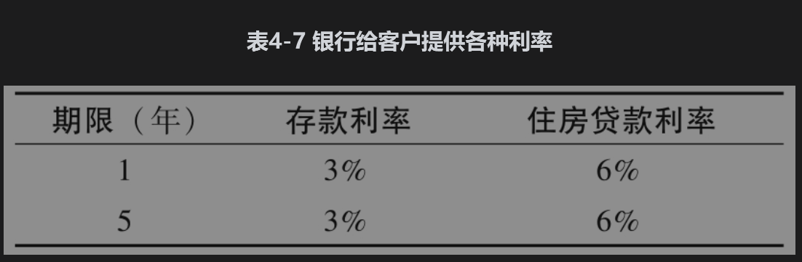
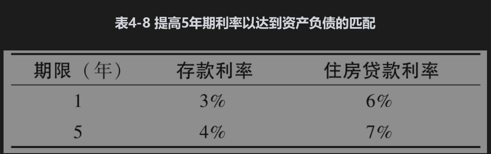

# 4.12 利率期限结构理论

我们很自然地会问是什么因素决定了零息利率曲线的形状。为什么有时曲线呈上升形状，有时呈下降形状，而有时会部分呈上升形状部分呈下降形状？关于这种现象有几种理论，其中最简单的是预期理论(expectations theory)，这个理论假设长期利率应该反映所预期的将来的短期利率。更精确地讲，这一理论认为对应于将来某一段时间的远期利率等于这一段时间在未来的预期即期利率。另外一种理论是市场分割理论(market segmentation theory)，这个理论认为短期、中期以及长期利率之间没有任何关系。在这个理论中，类似于大型退休金等投资者只投资于某些期限的债券，并不会改变期限。短期利率由短期债券市场的供需关系来决定，中期利率由中期市场的供需关系来决定，依此类推。

最有说服力的是流动性偏好理论(liquidity preference theory)，这个理论的基本假设是投资者喜欢保持资金的流动性，并因此将资金投资于较短的期限。此外，借款人一般喜欢借入较长期限的固定利率。流动性偏好理论造成了远期利率高于预期将来零息利率的情形，这与所观察到的收益率曲线常常是向上升形状（而不是下降形状）的实证结果是一致的。

## 4.12.1 净利息收入管理

为了理解流动性偏好理论，我们考虑银行吸收存款和发放贷款时所面临的利率风险。净利息收入(net interest income)是指利息收入与利息支出的差，银行必须对净利息收入进行妥善管理。

为了展示利息收入的不同变化，我们假定某银行给客户提供1年与5年的存款利率，同时又给客户提供1年与5年的住房贷款利率，这些利率如表4-7所示。为了简化分析，我们假设将来的预期1年期利率同今天市场上的1年利率相同。不严格地讲，这意味着市场认为利率上涨与利率下降有相同的可能性，由此我们可以说由表4-7显示的利率是“公平”的，因为它们正确地反映了市场的期望（也就是对应于预期理论）。将资金投放1年然后再投资4年会同一个5年的投资带来相同的回报。类似地，以1年期借入资金然后在接下来的4年每年都再进行融资，这样同一个5年期的贷款会带来一样的融资费用.

假定你将资金存入银行，并且你认为利率上涨与利率下降有相同的可能性，你此时是会将资金以3%的利率存入1年期还是会以3%的利率存入5年期？你此时往往会将资金存入1年期，因为将资金锁定在较短期限里会给你带来许多方便，而且只在较短的时间内锁定你的资金。

现在假定你需要住房贷款，你仍然认为利率上涨与下降的可能性相同，你此时是会选一个1年期、6%的住房贷款还是会选一个5年期、6%的住房贷款？这时你往往会选择一个5年期的住房贷款。因为这样做会将你的借款利率锁定在今后5年，从而你会面临较低的再融资风险。

当银行提供如表4-8所示的利率时，大多数存款客户会选择1年期存款，同时大多数住房贷款客户会选择5年期贷款。这样一来，银行的资产与负债就会产生不匹配的现象，从而对净利息收入产生风险敞口。利息降低时不会产生问题，银行的贷款收入仍为6%，而支撑贷款的存款利息低于3%，因此利息收入会增加。但当利率上涨时，银行贷款收入仍为6%，存款费用高于3%，由此使银行净利息收入降低，当1年利率上涨幅度达到3%时，净利息收入会变为0。

资产负债管理部门的职责就是将带来收入的资产期限与带来利息费用的负债期限进行匹配。一种手段是提高5年的存款与住房贷款利率。例如，我们可以将利率调节为表4-8的形式，这时5年期的存款利率为4%，5年期的贷款利率为7%。这样做会将5年期存款与1年期住房贷款变得相对来讲更有吸引力，一些选择表4-7中1年期存款的投资者会将自己的资金转入到表4-8中所示的5年期存款；一些选择表4-7中5年期住房贷款的投资者会选择1年期住房贷款。这样所带来的效果可以使资产和负债得以匹配。如果投资者仍然过多地选择1年期存款和5年期住房贷款而造成资产负债的不平衡，我们可以进一步提高5年期存款和贷款利率，这样会逐渐消除资产负债的失衡。

如果所有银行均按以上所描述的方式进行资产负债管理，其效果是长期利率比预期的将来短期利率要高，这一现象就是所谓的流动性偏好理论。在大多时候收益率曲线都是呈上升形状，只有当市场预期短期利率会剧烈下跌时才会出现下降形状。

许多银行都已经建立了一套用来检测客户业务决策行为的完善系统，当看到资产与负债有不匹配现象时，他们可以对利率稍微调整。有时利率互换（在第7章中将会讨论）等衍生产品也会被用来管理利率风险敞口，这样能使银行保证利息收入的稳定并达到降低风险的目的。但并不是所有的银行都能做到这一点。在美国，20世纪80年代一些信贷公司和1984年大陆伊利诺伊国民银行破产的原因在很大程度上是由资产和负债的不匹配所引起的，这些失败都给美国的纳税人造成了巨大的损失。

## 4.12.2 流动性

除了以上描述的问题外，投资组合期限的不匹配还会造成流动性困难。考虑一家金融机构，其5年期的固定利率贷款由3个月的批发存款来支撑。金融机构认识到自身对利率上升的风险敞口，因此对利率风险进行了对冲（一种做法是利用前面提到过的利率互换）。这样做以后，金融机构仍然会有流动性风险。批发存款人有可能会对金融机构失去信心，因此不愿意再将资金借给金融机构，即使有足够多的股权资本的金融机构仍会深陷流动性的泥潭，甚至遭遇破产。如业界事例4-2所示，这一类流动性问题是在2007年开始的金融危机中一些金融机构破产的主要原因。

### 业界事例4-2

### 流动性和2007～2009年金融危机

在2007年7月开始的信用危机中，有一种安全投资转移(flight to quality)现象，这是指金融机构和投资者不愿承担信用风险，只进行安全投资。依赖于短期融资的金融机构遭遇流动性困难。英国的北岩(Northern Rock)银行就是一个例子。北岩银行的按揭贷款资金依赖于批发存款，这些存款的期限只有3个月。2007年9月，忧心忡忡的贷款人不愿意再将贷款续借给北岩银行，即在3个月后不愿将资金继续存在北岩银行。这造成了北岩银行对自身资产失去了资金支持。英国政府在2008年年初接手了北岩银行。在美国，一些像贝尔斯登(Bear Stearns)和雷曼兄弟(Lehman Brothers)这样的银行也遭遇了类似的流动性困难，这些金融机构同样利用短期批发存款作为融资来源支撑机构的部分运作。