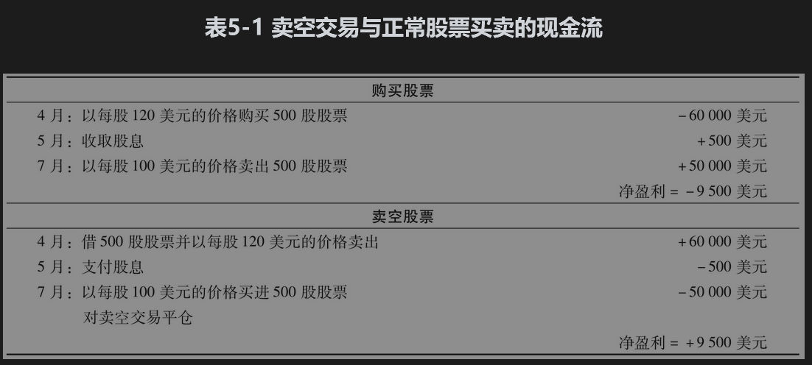

# 5.2 卖空交易

本章所讨论的套利策略有时会涉及卖空(short selling)。这种交易是指卖出并不拥有的资产。有些投资资产是可以卖空的，但并不是所有投资资产都可以卖空。我们用卖空股票来说明如何进行这种交易。

假设某投资者想通过经纪人来卖空500股X公司的股票，经纪人往往是通过借入其他客户的股票，并将股票在市场上卖出来执行投资者的指令。在此之后，投资者需要从市场上买入500股X公司的股票来对自己的头寸进行平仓，这些买入的股票是用于偿还在此之前借入的股票。当股票价格下跌时，投资者将会盈利，而当股票价格上涨时，投资者则会亏损。如果经纪人在卖空交易平仓之前不能再借到股票，此时无论投资者是否愿意，都必须对其头寸进行平仓，也就是说，此时投资者必须马上偿还所借的股票。有时空头方为借入股票和其他证券而需要支付一定的费用。

在卖空交易中，持有卖空头寸的投资者必须向经纪人支付被卖空资产的所有收入，像股票的股息和债券的券息等（这些收入是在一般情况下被卖空资产应得的收入），经纪人会将这些收入转入证券借出方的账户。假设某投资者在4月股价为120美元时卖空500股股票，在7月价格为100美元时，对头寸进行平仓。假定股票在5月支付了每股1美元的股息。在4月交易开始时，投资者收到500×120=60000美元，5月，投资者付出500×1=500美元，在7月交易平仓时投资者要支付500×100=50000美元。投资者的净收益为

          60000-500-50000=9500（美元）

在这里我们假设无须对所借入的股票支付费用。表5-1展示了这个例子。我们可以看到，在卖空交易中投资者的现金流就如同在4月买入并在7月卖出的一笔正常股票交易现金流的镜像反射（假设没有借贷费用）。

在卖空交易中，卖空方需要在经纪人那里开一个保证金账户(margin account)，并在这个保证金账户中存入一定数量的现金或其他有价证券，以保证在股票价格上涨时投资者不会违约。这与第2章中讲过的期货保证金是类似的。在账户刚刚开立时，投资者要存入一定的初始保证金，当市场变化对投资者不利时，即当借入股票的价格上涨时，投资者可能会需要提供追加保证金。如果投资者没有提供追加保证金，卖空交易可能会被平仓。投资者投入的保证金并不代表投资费用，这是因为经纪人会按投资者账户上的金额数量支付利息，如果支付的利率对投资者来讲不可接受，投资者可以在保证金账户中存入有价证券（像国债）来满足要求。卖出这些资产时的收入属于投资者，而且一般会作为初始保证金的一部分。

随着时间推移，关于卖空交易的监管条例也在不断完善。1938年首先引入了证券价格报升(uptick)规则。在报升规则下，证券只有在最近一次交易时，价格变动是上升时才被允许卖空。2007年7月，SEC取消了报升规则，但在2010年2月引进了另类报升(alterna tive uptick)规则：当某一股票价格在某一天的跌幅超过10%时，在这一天与下一天，对于这一股票的卖空交易将会受到限制。这些限制是股票被卖空的价格要高于当时市场上最好的出价。有时也会暂时禁止卖空活动，2008年一些国家实行了这一规则，因为监管当局认为卖空交易助长了当时市场上出现的剧烈波动。