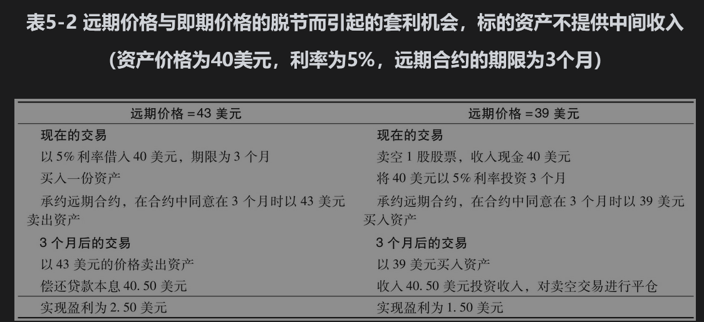
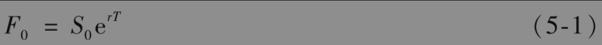

5# .4 投资

资产的远期价格最容易定价的远期合约是既不提供任何中间收入，又不需要任何存储费用的投资资产上的合约。无股息股票和零息债券都属于这一类资产。

考虑一个购买1股无股息股票上的3个月期远期合约。假定股票的当前价格为40美元，3个月期的无风险利率为每年5%。

首先假定远期价格相对较高，为43美元。套利者能够以5%的无风险利率借入40美元来购买1股股票，并同时承约3个月期远期合约的空头（即在远期合约中将卖出股票）。在3个月后偿还贷款的现金总额为

$`40 e^{0.05 \times 3 / 12}=40.50 \text { (美元) }`$

通过这一策略，套利者在3个月结束时获得的盈利为43-40.50=2.50美元。

接下来我们假定远期的价格相对较低，为39美元。这时，一个套利者可以卖空1股股票，将所得资金以5%利率投资3个月，并同时承约一个3个月期远期合约的多头。卖空股票资金的投资在3个月后会涨至40e0.05×3/12=40.50美元。在3个月后，套利者支付39美元，按照远期合约买进股票，并将股票用于卖空交易的平仓。套利者在3个月后的盈利为40.50-39=1.50美元。表5-2是对以上两个交易策略的总结。

在什么情况下表5-2所显示的套利机会就不再存在了呢？第1种套利在远期价格大于40.50美元时成立，第2种套利在远期价格小于40.50美元时成立。因此我们可以得出，为了保证无套利机会，远期价格必须正好为40.50美元。

## 5.4.1 推广

为了推广上面的例子，我们考虑一个投资资产上的远期价格，资产的当前价格为$`S_0`$，并且不提供任何中间收入。采用我们前面的符号：T为期限，r为无风险利率，$`F_0`$为远期价格。$`F_0`$与$`S_0`$的关系式为

如果$`F_0>S_0 e^{r T}`$，套利者可以通过买入资产并承约远期合约的空头来进行套利；如果$`F_0<S_0 \mathrm{e}^{r T}`$，套利者可以通过卖空资产并承约远期合约的多头来进行套利。[1]在我们的例子中，$`S_0`$=40,r=0.05，T=0.25。因此，由式(5-1)得出

 $`F_0=40 e^{0.05 \times 0.25}=40.50 \text { (美元） }`$

这同以上的计算结果一致。

远期合约多头与即期购买的结果都是在时间T拥有一份资产。远期价格高于即期价格的原因是即期购买资产时，对远期合约期限内购买资产会产生融资费用。1994年基德·皮博迪公司(Kidder Peabody)忽视了这一点，从而产生了很大的费用（见业界事例5-1）。

### 业界事例5-1

### 基德·皮博迪公司令人难堪的失误

投资银行业开发了一种产品叫作剥离零息债券(strip zero-coupon bond)，其方法是将带息长期国债的每个现金流都当成一个单独的个体来出售。券商基德·皮博迪公司的交易员约瑟夫·吉特(Joseph Jett)有一个非常简单的交易策略：买入剥离零息债券，并在期货市场上将其卖出。如式(5-1)所示，不提供收入的债券在期货市场的价格永远比即期价格高。例如，假设3个月期的利率是每年4%，剥离零息债券的即期价格是70美元，那么剥离零息债券上3个月期的远期价格是

$`70 e^{0.04 \times 3 / 12}=70.70 \text { 美元。 }`$

基德·皮博迪公司的计算机系统对吉特的每笔交易的利润都显示成等于远期价格高于即期价格的部分（在我们的例子中是0.70美元）。事实上，这项所谓的利润只不过是购买剥离零息债券所用的融资成本。但是通过将每一笔远期进行延续，吉特防止了将这笔费用累积到他的头上。

基德·皮博迪公司的系统将吉特所做的交易盈利显示成1亿美元（吉特也为此得到了一大笔奖金），但事实上这笔交易的实际损失为3.5亿美元。这个例子显示出一家大型金融机构也可能会将简单的事情弄错。

【例5-1】 考虑一个4个月期限的远期合约，这个合约的多头持有者可以在4个月后买入从今天起1年后到期的零息债券（这意味着当远期合约到期时，债券的剩余期限为8个月）。债券的当前价格为930美元，我们假定4个月期限的无风险利率为每年6%（连续复利）。因为零息债券不提供中间收入，我们可以采用式(5-1)，参数为T=4/12，r=0.06，$`S_0`$=930。远期价格$`F_0`$为

$`F_0=930 e^{0.06 \times 4 / 12}=948.79 \text { (美元) }`$

## 5.4.2 不允许卖空时会怎么样

并不是所有的投资资产都可以用于卖空交易，而且有时在卖空时需要对所借的资产付出一定的费用。但这些情形对以上结果并没有影响。为了推导式(5-1)，我们并不需要卖空资产，所需要的假设是只要有些投资者拥有这种资产的唯一目的是投资（由定义我们知道，对于投资资产这一假设永远是正确的）。如果远期价格太低，投资者会卖出资产并承约远期合约的多头。

假定某标的资产没有贮存费用与中间收入。如果$`F_0>S_0 \mathrm{e}^{r T}`$，那么投资者可以采取以下交易策略：

• 按利率r借入$`S_0`$美元，期限为T；

• 买入一单位资产；

• 承约出售一单位资产的远期空头合约。

在时刻T，卖出资产的价格为F0，这时偿还贷款所需资金为$`S_0 \mathrm{e}^{r T}`$ ，投资者的盈利为$`F_0-S_0 \mathrm{e}^{r T}`$。

接下来假定$`F_0<S_0 \mathrm{e}^{r T}`$，这时拥有资产的投资者可以采取以下交易策略：

• 以$`S_0`$的价格卖出资产；

• 将所得资金以收益率r进行投资，期限为T；

• 承约购买一单位资产的远期多头合约。在时刻T，现金投资会涨至$`S_0 \mathrm{e}^{r T}`$。投资者以$`F_0`$价格买入资产，这个投资者同一直保存资产的投资者相比，所得盈利为$`S_0 \mathrm{e}^{r T}-F_0`$。

类似于以上考虑的无股息股票，我们可以期望远期价格将会得以调整，从而使以上所述的两种套利机会都不再存在。这意味着式(5-1)必须成立。