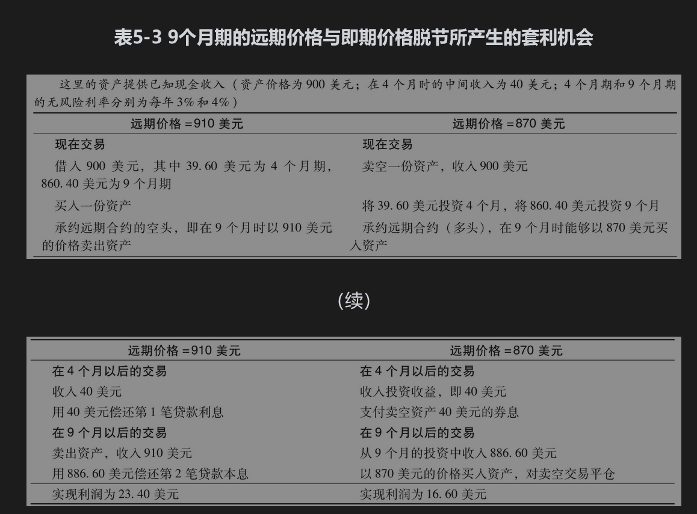
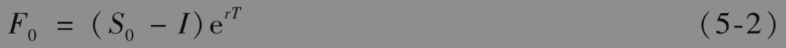

# 5.5 已知收入

在这一节中，我们考虑当资产给持有者提供完全可以预测的收入时的远期价格。这样的例子包括提供已知股息的股票以及带券息债券。我们采取与上节相似的方式首先考虑数值例子，然后再进行正式讨论。

考虑一个买入当前价格为900美元的带息债券远期合约的多头。假定远期合约的期限为9个月，我们假定在4个月后将有40美元的券息付款，并且假定4个月期和9个月期的利率（连续复利）分别是3%和4%。

首先假定远期价格比较高，为910美元。一个套利者可以借入900美元来买入债券，并且承约远期合约的空头。券息的现值为40e-0.03×4/12=39.60美元。在900美元的价格中，其中有39.60美元所对应的利率为每年3%，期限为4个月，而这笔资金在4个月时可用券息来偿还，其他部分资金（即860.40美元）所对应的利率为9个月期的利率（即4%）。这笔资金在9个月后变为860.4e0.04×0.75=886.60。按照远期合约条款，套利者在远期合约中卖出证券可以收入910美元，因此盈利为

           910-886.60=23.40（美元）

接下来假定远期价格相对较低，为870美元。一个套利者可以卖空债券并同时承约远期合约的多头，以870美元的价格购买债券。在卖空交易所得的900美元资金中，将其中39.60美元以3%的利率投资4个月，在4个月时这笔资金足够可以偿还债券的券息。剩余的860.40美元以4%投资9个月，在到期时这笔资金变为886.60美元。根据远期合约，投资者能够以870美元买入债券，然后将卖空交易进行平仓，投资者的收入为

            886.60-870=16.60（美元）

表5-3总结了以上两种套利策略。第1种策略在远期价格大于886.60美元时会产生套利盈利，第2种策略在远期价格小于886.60美元时会产生套利盈利。因此，在没有套利机会的情况下，远期价格必须为886.60美元。

## 推广

我们可以将以上例子推广：当投资资产在远期合约期限内提供的收入贴现值为I时，我们有以下关系式

在我们的例子中，$`S_0=900.00, l=40 \mathrm{e}^{-0.03 \times 4 / 12}=39.60, r=0.04, T=0.75`$，因此

$`F_0=(900-39.60) \mathrm{e}^{0.04 \times 0.75}=886.60 \text { (美元) }）`$

这与我们以上的计算结果一致。式(5-2)适用于任何提供已知收入的投资资产。

如果$`F_0>\left(S_0-\Lambda\right) \mathrm{e}^{r T}`$，套利者可以通过买入资产并且承约远期合约的空头来取得盈利；如果$`F_0<\left(S_0-\Lambda \mathrm{e}^{r T}\right.`$，套利者可以通过卖空资产并且承约远期合约的多头来获得盈利。如果不能卖空交易，拥有资产的投资者可以卖出资产，并同时承约远期合约的多头来获得盈利。[2]

【例5-2】 考虑某股票上10个月期限的远期价格，股票的当前价格为50美元。我们假定对于所有期限，按连续复利的无风险利率为8%。我们还假定在3个月、6个月、9个月后股票会各支付0.75美元的股息。股息的现值I为

$`I=0.75 \mathrm{e}^{-0.08 \times 3 / 12}+0.75 \mathrm{e}^{-0.08 \times 6 / 12}+0.75 \mathrm{e}^{-0.08 \times 9 / 12}=2.162`$为10个月，因此式(5-2)中的远期价格$`F_0`$为

$`F_0=(50-2.162) \mathrm{e}^{0.08 \times 10 / 12}=51.14 \text { (美元) }`$

如果远期价格小于以上价格，套利者能够以即期价格卖空股票并且承约远期合约多头。如果远期价格大于以上价格，套利者可以承约远期合约的空头并且以即期价格买入股票。