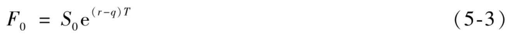

# 5.6 收益率为已知的情形

我们现在考虑远期合约标的资产支付已知的收益率（而非现金收入的情形），这意味着在中间收入的数量是当时资产价格的百分比。假定某资产预计所支付的收益率为每年5%，这可能是指每年支付一次中间收入，数量是当时资产价格的5%，这时收益率为5%按年复利；它也可能是指对收入的支付是一年两次，每次支付收入的数量等于当时资产价格的2.5%，而这时收益率为每年复利两次。在第4.4节中我们曾指出，一般采用按连续复利的形式来对利率进行计算，类似地，我们也采用按连续复利的形式来计算收益率，转换不同复利频率收益率的计算公式与第4.4节中关于利率的公式是一样的。

定义q为资产在远期期限内的平均年收益率，如果将所得收益再用于购买资产，所持资产的数量将会以q的速度增长：在时刻0的1单位资产将在时间T增长到eqT。考虑以下策略：

• 在时间0借入S0并用来购买一单位资产；

• 承约远期空头合约，在时间T按F0的价格卖出eqT单位资产；

• 在时间T对远期合约平仓，卖出eqT单位资产。

该策略的盈利应当是0，因此

$`S_0 \mathrm{e}^{r T}=\mathrm{e}^{q T} F_0`$

或者

【例5-3】 考虑一个6个月期限的远期合约，合约的标的资产在期限内预计提供一次数量等于资产价格2%的收入。按连续复利的无风险利率为10%。资产价格为25美元。这时$`S_0`$=25，r=0.10,T=0.5。收益率为每年4%（半年复利一次）。由式(4-3)得出，这一收益率在连续复利情形下为3.96%。因此q=0.0396。由式(5-3)得出远期价格为

$`F_0=25 \mathrm{e}^{(0.10-0.0396) \times 0.5}=25.77 \text { (美元) }`$

